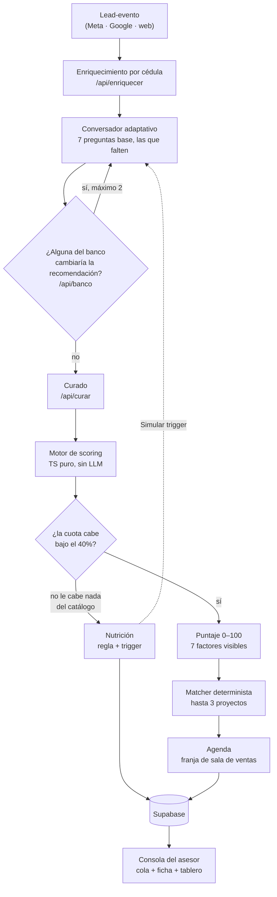

# Perfilamiento inteligente de leads de vivienda

**Reto Vivienda · Hackathon Colsubsidio × 30X (julio 2026)**

Un workflow que hace que los leads de pauta lleguen al asesor tan calificados como los orgánicos: conversan con un perfilador estilo WhatsApp que pregunta solo lo que falta, un motor transparente los califica contra el tope legal, un matcher les recomienda hasta 3 proyectos del catálogo real y les agenda cita. Y a quien hoy no le alcanza no se le descarta: queda en nutrición con el número exacto que lo destrabaría.

### ▶️ Demo en vivo: **https://mvp-reto-vivienda.vercel.app**

Se recorre solo, con un clic, sin narración y sin instalar nada. Empieza en la portada, elige un personaje, conversa, y termina en la consola del asesor.

---

## Para el jurado, en 30 segundos

| | |
|---|---|
| **Quién sufre hoy** | El lead de pauta (nadie le dice si le alcanza) y el asesor (no sabe a quién llamar primero). |
| **Qué construimos** | Ingesta → enriquecimiento por cédula → conversación adaptativa → scoring por reglas → match + cita → consola del asesor. Punta a punta, funcionando. |
| **Lo que no vas a encontrar** | Una caja negra. Cada decisión (el puntaje, el corte, el proyecto elegido, el trigger de recontacto) muestra sus factores, su aritmética y su fuente. |
| **La regla que manda** | Primera cuota ≤ 40% del ingreso del hogar. No es heurística nuestra: es el [Decreto 583 de 2025](https://minvivienda.gov.co/normativa/decreto-0583-2025). |
| **El hallazgo del dato real** | **27,1%** de los 4.142 compradores históricos no son afiliados, casi el triple del 10% que permite la regla 90/10. Y **los 18 proyectos del catálogo ya van por encima del cupo**. El sistema no lo esconde: recomienda igual y le avisa al asesor que valide cupo antes de separar. |

---

## El problema

Colsubsidio vende vivienda con un mandato regulatorio: **90% de las ventas deben ser a afiliados** (la regla 90/10). Invierte en pauta digital y llegan muchos leads, pero al fondo del embudo pocos tienen capacidad real de compra y buena parte no son afiliados. El costo es doble: el CPL pagado más las horas del equipo comercial persiguiendo gente que no va a cerrar. Los leads orgánicos, en cambio, convierten bien porque llegan mejor calificados.

Los dos momentos de tensión que ataca este MVP:

- **El lead**, en el minuto siguiente al clic. Quiere saber si esto es para él y no tiene idea de si le alcanza. Hoy ese minuto se llena de silencio o de un formulario que lo trata como a todos los demás. Si lo interrogan, se va; si lo ignoran, también.
- **El asesor**, frente a la cola. No sabe a quién llamar primero y quema horas en quien no puede comprar.

---

## Qué hace la herramienta

1. **Entra el lead** con esquema estándar (nombre, celular, cédula, proyecto de interés y `fuente`: Meta / Google Ads / web). Cualquier canal futuro emite el mismo evento.
2. **Se enriquece antes de hablarle.** Con la cédula se consulta la base de identidades: si hay match, ya se sabe afiliación, ciudad, segmento, rango de ingreso y rango de edad.
3. **Conversa lo justo.** Pide autorización de tratamiento de datos, dice qué ya sabe y **no repregunta nada de eso**. El set y el orden de preguntas dependen del perfil: no es un guion fijo.
4. **Califica, matchea y agenda.** El motor aplica reglas explícitas y produce una de 3 salidas. Si pasa, recomienda hasta 3 proyectos con su porqué y ofrece franjas de sala de ventas.
5. **Todo aterriza en el asesor.** Listos y no listos caen a la misma base. El asesor ve una cola priorizada y, al abrir un lead, su ficha completa.

### Las 3 salidas del corte

| Salida | Quién | Qué pasa |
|---|---|---|
| **Listo** | Afiliado que pasa el gate del 40% | Match + cita + tope de la cola |
| **Listo con restricción de cupo** | No afiliado que pasa el gate | Mismo tratamiento, marcado contra el cupo 10% del proyecto |
| **Nutrición** | Quien no pasa el gate | Regla que falló + trigger de recontacto derivado de su propio dato |

**No existe el estado "descartado".** Es una decisión de producto, no un olvido: contradice el propósito social del reto. La afiliación tampoco manda a nadie a nutrición; el no afiliado que pasa el gate sale *Listo con restricción de cupo*.

---

## El recorrido del demo

| Pantalla | Qué muestra |
|---|---|
| **Portada** (`/`) | Tres personajes pre-sembrados, un clic arranca su conversación. Más un botón **"soy yo"** con formulario libre para conversar desde cero con datos propios. |
| **La conversación** | Sara (el perfilador) pide autorización, dice qué ya sabe, pregunta lo que falta, y cierra recomendando proyectos con el link para verlos y **agendando cita** en la sala de ventas. |
| **Consola del asesor** (`/asesor`) | La bandeja en dos grupos ("pueden comprar hoy" / "todavía no"). Al abrir un lead, **la ficha**: el puntaje con su aritmética factor por factor, el porqué, los proyectos con su razón, la cita, o el trigger. Es el clímax. |
| **Métricas** (`/asesor/tablero`) | Ocho cifras operativas, cada una diciendo de dónde sale: leads de hoy y de la semana, % que pasa el corte, **% de no afiliados contra el 10% de la regla 90/10**, puntaje promedio, cuántos en nutrición con trigger, proyecto más pedido y canal que más trae. Más la serie diaria de 14 días. |

### Los tres personajes, y por qué son tres

No son decorado: cada uno hace visible un criterio de aceptación distinto.

- **Diana Marcela Ríos** (afiliada, entra por Meta a LA ARBOLEDA, Bogotá). Está en la base y es afiliada, así que se sabe su ciudad, su rango de ingreso y su edad: **el conversador no le pregunta ninguno de los tres**. Es el criterio 1 en vivo.
- **Carlos Andrés Muñoz** (no afiliado, entra por Google a PAYANDÉ, Ricaurte). Está en la base pero no es afiliado, así que solo se sabe su ciudad: a él **sí** se le pregunta el ingreso. Pasa el gate en **39,3%**, apenas por debajo del 40%, y eso explica que su puntaje de prioridad sea bajo aunque esté listo.
- **Yuliana Andrea Pérez** (sin match, entra por web a LA MACARENA, el proyecto más barato del catálogo). No se sabe nada de ella, así que se le pregunta todo. Hoy no le cabe ni el más económico, y eso es lo que hace honesto su mensaje de nutrición.

Los personajes **se declaran por lo que teclean**, no por sus respuestas ya resueltas: el guion se corre contra el conversador real, así que el personaje sembrado y ese mismo personaje conversado en vivo por el jurado producen el mismo lead y el mismo puntaje.

---

## Cómo funciona por dentro



### 1. Ingesta y enriquecimiento

El lead-evento entra con cédula, que es la llave. `/api/enriquecer` la busca en una base de **303 identidades sintéticas** (~100 KB, vive server-side y nunca viaja al navegador) y devuelve el `PerfilConocido`. **Sin match no es un error**: es el otro camino del demo, el lead que se perfila desde cero.

### 2. El conversador

Chat con estética WhatsApp, con un disclaimer visible de que en producción corre sobre WhatsApp Business API.

**Las 7 preguntas base** (se hacen solo las que el enriquecimiento no resolvió): si ya tiene vivienda · con quién la compartiría · ingreso del hogar · subsidios · rango de edad · situación crediticia · ciudad o municipio de interés.

**Y hasta 2 más del banco.** Al agotarse las base, un selector server-side (`/api/banco`) mira el catálogo y el matcher y decide si alguna pregunta más **cambiaría la recomendación de este lead concreto**: alcobas, amenidades, espacio o momento de compra. Si ninguna vale la pena, no pregunta nada y el lead ni se entera. El modelo **escoge un id de esa lista de cuatro; no la escribe**. Las cuatro se eligieron midiendo los 18 brochures: alcobas discrimina durísimo (solo 3 de 18 proyectos tienen tipología de 3), zona de niños está en 18 de 18 y por eso preguntarla no cambiaría nada. La conversación son **7 a 9 turnos**.

**Cómo se entiende lo que la persona escribe**, en tres capas que fallan hacia lo seguro:

1. **Interpretación determinista** (regex puros, un módulo por campo). Es la que resuelve casi todo.
2. **Intérprete de IA de respaldo** (`/api/interpretar`), solo cuando la anterior no entendió. Clasifica dentro del mismo menú cerrado, **ve un solo mensaje** (nunca el historial, para que no deduzca de algo dicho tres turnos antes y lo entregue como un hecho sobre la vida de alguien), tiene 3 s de límite y **falla cerrada**: sin credencial, por timeout o por un valor fuera del menú devuelve nada y la conversación repregunta. `null` es una respuesta legítima suya: significa "yo tampoco sé".
3. **Repreguntar**, una sola vez por pregunta. A la segunda se sigue, porque insistir es interrogar.

**Y tres cosas más que están en el chat:**

- **Dictado por voz.** El navegador transcribe y el texto cae en el campo, que la persona puede corregir antes de enviar. No es una nota de voz: ningún audio se sube ni se guarda. Es inclusión, no adorno: quien contesta desde una obra o con poca práctica escribiendo, puede hablar. Si el navegador no lo soporta, el botón no se pinta y el chat funciona idéntico.
- **Desvíos.** Si la persona pregunta algo fuera del guion ("¿cuánto vale?") o pide hablar con un asesor, el chat lo detecta y responde en vez de tragarse el texto como si fuera el dato pedido. La detección es TS puro y conservadora: ante la duda, no desvía.
- **Guardrails de salida.** Lo que el modelo propone pasa por una función determinista antes de que el lead lo lea. Si se pasa de la raya (una cifra que nadie calculó, por ejemplo), el lead ve el texto que TypeScript ya tenía redactado. Perder el pulido cuesta tono; dejar pasar un número inventado en la compra de una vida cuesta mucho más.

**Reglas de redacción que ningún linter chequea**, y que separan conversar de encuestar: cada pregunta **dice para qué sirve** antes de preguntar, cada respuesta **recibe un acuse** antes de la siguiente, y el **campo de texto nunca desaparece** (los chips son atajo, jamás la única salida). En ingreso y zona no hay chips a propósito: la lista sesga y deja gente por fuera.

### 3. El motor de scoring

**TypeScript puro, determinista, sin LLM y sin red.** El veredicto no depende de que un modelo esté vivo. Dos capas:

**Capa 1, el gate legal.** Primera cuota estimada / ingreso mensual del hogar ≤ **40%**. Es lo único que bloquea. La cuota no se estima con un porcentaje plano sino con la fórmula de anualidad real: **13% E.A.** (promedio del mercado colombiano 2026), **20 años**, y LTV del **70%** en no VIS / **80%** en VIS, que fija el mismo decreto. Ojo con la consecuencia contraintuitiva: la VIS permite financiar más, así que a igual precio su cuota mensual es más alta.

Y desde el ticket 023, **la capacidad se resuelve antes que el proyecto**: si el proyecto por el que el lead entró no le cabe pero otro del catálogo sí, se recalifica contra el más económico que sí le quepa, **diciéndolo en la ficha**. Antes, quien entraba por un proyecto caro caía a nutrición aunque 13 de los 18 le cupieran.

**Capa 2, el puntaje 0-100** que ordena la cola del asesor. Suma ponderada, y cada factor expone su peso, su señal normalizada y su aporte en puntos, así que `puntaje = Σ aportes` se puede verificar a mano en pantalla:

| Factor | Peso | Qué mide |
|---|---|---|
| Holgura de capacidad | **0,45** | Qué tan por debajo del 40% cae la cuota. Manda |
| Similitud con compradores reales | 0,20 | Fit con la distribución real de compradores de ese proyecto |
| Subsidio | 0,15 | Qué fracción de la cuota cubre el subsidio |
| Sin vivienda | 0,10 | Propósito social: priorizar a quien no tiene |
| Situación crediticia | 0,05 | Señal autorreportada, no verificación |
| Cupo 90/10 (afiliación) | 0,05 | **Desempate**, no criterio |
| Afiliación | *sin peso* | Se muestra, marca la salida, no puntúa |

Dos decisiones que vale la pena defender ante el jurado:

- **La afiliación es desempate, no criterio.** Pesaba 0,20 y decidía la cola sola. Eso contradice al mentor, que fue textual: *"la prioridad siempre son los afiliados, pero siempre va a ser la prioridad de los ingresos"*. Bajó a 0,05 (alcanza para romper un empate, no para reordenar) y los 0,15 liberados se fueron íntegros a la capacidad de pago.
- **"Holgura plena" es 30%**, y no es un número a dedo: era el tope legal anterior (Decreto 145 de 2000, que el 583 de 2025 subió al 40%). Significa algo defendible: *la cuota le cabría incluso bajo la norma más estricta que regía hasta el año pasado*.

### 4. Match y agenda

El matcher es **determinista y sin LLM**: elige y deja la traza de por qué. Filtra por precio máximo (el que sale de la capacidad) y por ciudad, devuelve **hasta 3** proyectos, y si hace falta completa con máximo 2 alternativas fuera de zona **marcadas como tales**. El orden se decide con bonos que tienen nombre y número visible: VIS con subsidio declarado (+0,15), barrio exacto nombrado (+0,10), alcobas suficientes (+0,12), amenidades pedidas (+0,08), área acorde (+0,06).

Lo que pidió en el banco entra como **bono, nunca como filtro**. Solo 3 de los 18 proyectos tienen tipología de 3 alcobas: filtrar duro dejaría a las familias grandes sin nada que ver, que es peor que mostrarles algo apretado diciéndoselo.

La agenda ofrece franjas de la sala de ventas del proyecto recomendado, desde un catálogo generado a partir de los 18 proyectos reales. Solo la franja **elegida** se persiste.

### 5. Nutrición y recursos

Quien no pasa el gate recibe **la regla exacta que falló y un trigger derivado de su propio dato**, no una plantilla. El trigger no se inventa: es el gate despejado. Para un lead con ingreso declarado, dice literalmente cuánto ingreso hace que esa misma cuota quepa, cuánto le falta, y las otras dos rutas (un subsidio que baje la cuota, o un proyecto nuevo en el catálogo que sí le quepa).

En la ficha del asesor hay un botón **"Simular trigger"** que lo re-engancha en la conversación, para que el jurado pueda ver ese camino cerrarse.

Aparte y de forma ortogonal corre la **capa de recursos**: hasta 2 recomendaciones de servicios de Colsubsidio (afiliación, subsidios, compra de cartera, guía de subsidios, educación financiera para el hábitat, ahorro programado) disparadas **a nivel de factor**, no de puntaje, y cada una citando el factor que la activó. Un lead listo con cita también puede recibir una. Nunca reemplazan al asesor.

### 6. La consola del asesor

- **La cola** (`/asesor`) en dos grupos, "pueden comprar hoy" y "todavía no", ordenada por puntaje.
- **La ficha** (`/asesor/[leadId]`) en el orden en que el asesor necesita la información: quién es → el veredicto en una frase → **por qué**, con todos los factores y su aporte → qué hacer (proyectos, cita, o el trigger). Trae también el hilo completo de la conversación, la fuente por la que entró y los recursos recomendados.
- **El tablero** (`/asesor/tablero`) con las 8 métricas y la serie diaria. Cada métrica imprime debajo de la cifra de dónde sale: sin fuente, no entra.

### Dónde vive la IA, y dónde no

Esto es el corazón de la promesa de "cero caja negra", así que conviene decirlo sin ambigüedad.

| La IA **sí** | La IA **no** |
|---|---|
| Pule el tono de lo que el lead lee, en streaming | Decide el puntaje |
| Reintenta interpretar una respuesta que el regex no entendió, dentro de un menú cerrado | Decide si el lead pasa el corte |
| **Escoge** cuál de las 4 preguntas del banco vale la pena | Elige los proyectos |
| Redacta el porqué de proyectos **ya elegidos** (pulido opcional, fuera del camino crítico) | Escribe preguntas nuevas |

Si el proveedor de IA se cae en mitad del demo, **la conversación sigue y el veredicto no cambia**: cada pieza tiene su camino determinista y ese camino es el que se pinta. El porqué que ve el asesor se redacta determinista desde los factores que el motor ya calculó, y eso se dice como ventaja, no como parche.

---

## Los datos: qué es real y qué es derivado

**La data real de Colsubsidio no está en este repo y nunca va a estarlo.** Es una restricción no negociable del proyecto, no un descuido: los insumos originales viven solo en local, fuera de git. Lo que se versiona es sintético o derivado.

| Qué se versiona | Qué es |
|---|---|
| `data/sintetica/identidades.json` | **303 identidades sintéticas**, generadas a partir de las distribuciones reales de 4.142 compradores. Simulan el "ya te conocemos" por cédula: la data real es anónima y no trae cédulas. |
| `data/sintetica/proyectos.json` | Los **18 proyectos reales** del catálogo, con precio, ciudad, VIS y cupo 90/10 **derivados** del insumo. Sin nombres de personas ni de empresas. |
| `data/sintetica/proyectos-detalle.json` | Tipologías, área privada y amenidades, extraídas de los 18 brochures públicos. Es lo que hace útil el banco de preguntas. |
| `data/sintetica/distribuciones.json` | Agregados estadísticos del histórico de 4.142 compradores. De aquí sale el 27,1%. |
| `data/sintetica/buyer_personas.json` | Perfiles de comprador, para el factor de similitud. |
| `data/sintetica/slots.json`, `db/seed.sql` | Franjas de sala de ventas y los 3 personajes sembrados. |

Trampas del Excel real que el motor limpia antes de usarlo, y que vale la pena conocer: `VLR_VIVIENDA` traía 4 ceros de más; no hay columna "afiliado" (se infiere de `PERIODO_AFILIADO`); segmento y categoría vienen anonimizados con **letras griegas**, así que **ante el jurado se tratan como clusters anónimos**, nunca como las categorías del brief.

**Cinco archivos son generados y no se editan a mano**: `db/seed.sql`, `data/sintetica/slots.json`, `data/sintetica/buyer_personas.json`, `data/sintetica/proyectos-detalle.json` y las fixtures derivadas de `lib/fixtures/`. Sus generadores viven en `scripts/`, y hay un test que compara el archivo en disco contra su generador y falla si quedó viejo. La razón es cara y conocida: el seed se copiaba a mano y se rompió dos veces sin que nadie lo notara.

---

## Stack y cómo correr

**Next.js 16** (App Router, TypeScript) + **React 19** + **Tailwind 4** + **Vercel** + **Supabase** (Postgres) + **Google Gemini** en streaming. Registrado en el [ADR 0002](docs/adr/0002-stack-mvp.md).

Detalles que importan:

- **Todo lo que el lead lee va en streaming**, con primer token bajo 2 s. No es preferencia: evita el límite de tiempo de funciones en Vercel y hace el chat creíble.
- **El modelo depende del modo de auth**, porque la disponibilidad no es la misma en los dos backends: `gemini-2.5-flash` sobre Vertex AI, `gemini-3.5-flash` sobre AI Studio. Versiones fijas, nunca el alias `-latest`, para que el modelo no cambie solo en mitad del demo.
- **Las credenciales solo viven server-side.** El repo es público. `lib/supabase.ts` importa `server-only`, así que el build **falla** si alguien lo importa desde un componente de cliente. Las 3 tablas tienen RLS activado sin policies: solo la clave secreta pasa, y el navegador nunca habla con Supabase directo.
- **La base son 3 tablas** (`leads`, `conversaciones`, `citas`) más la vista `cola_asesor`, con CHECK constraints que defienden los criterios de aceptación desde el motor de Postgres ([ADR 0003](docs/adr/0003-esquema-db-leads.md)).

```bash
npm install
cp .env.example .env.local   # llenar credenciales (las notas están dentro del archivo)
npm run dev
```

Para la base de datos: pegar `db/schema.sql` en el SQL Editor de Supabase (es idempotente) y después `db/seed.sql` para los 3 personajes.

**Sin `.env.local` la app igual arranca.** Cae a fixtures, muestra los 3 personajes desde el código y lo avisa en pantalla. Lo que no funciona en ese modo es la cadena completa: sin base de datos no se persiste el lead ni se ofrece la cita, y sin credencial de IA la conversación corre por su camino determinista.

Los tres feedback loops, los mismos que corre cualquiera antes de commitear:

```bash
npm test && npx tsc --noEmit && npm run lint
```

⚠️ **Nunca correr `npm run build` con `npm run dev` encendido.** Ambos escriben en `.next` y el dev server queda colgado reteniendo el puerto 3000 sin responder. El síntoma engaña (pantalla en blanco, que se lee como "la app se rompió"). Antes de sospechar del código: `curl -o /dev/null -w "%{http_code}" http://localhost:3000/` → un `000` es servidor caído, no bug.

### Las rutas de API

| Ruta | Qué hace | ¿LLM? |
|---|---|---|
| `GET /api/enriquecer` | Busca la cédula en las 303 identidades | no |
| `POST /api/chat` | Pule el tono de lo que el lead lee, en streaming | sí |
| `POST /api/interpretar` | Segundo intento de entender una respuesta, menú cerrado | sí |
| `POST /api/banco` | Decide qué pregunta extra vale la pena, o ninguna | sí |
| `POST /api/curar` | Califica + matchea + redacta el porqué + persiste | no |
| `POST /api/match` | Elige proyectos (reglas puras) | no |
| `POST /api/explicacion` | Pulido opcional del porqué, en streaming | sí |
| `GET/POST /api/citas` | Sirve franjas y persiste la elegida | no |
| `GET/POST /api/leads`, `GET /api/leads/:id` | La cola del asesor y el detalle | no |

`{ id: null }` de `/api/banco` y `{ valor: null }` de `/api/interpretar` son **respuestas normales, no errores**: significan "ninguna vale la pena" y "no entendí".

---

## Estado del build

Los **4 criterios de aceptación están construidos y son recorribles en el demo**, uno por cada tramo del video de 2 minutos:

1. **No repreguntar lo conocido.** La intersección entre lo que se pregunta y lo que el enriquecimiento ya trajo es vacía, y se le dice al lead. Hacérselo saber no es recitarle su ficha: se *usa* lo que se sabe (buscar en su ciudad) en vez de enumerarlo. El ingreso no se le menciona nunca.
2. **Cero caja negra en el score.** El conteo de factores que el motor evaluó es igual al conteo de factores visibles en la ficha.
3. **Nadie se descarta.** Todo lead termina en una de las 3 salidas, y todo lead en nutrición tiene razón y trigger no vacíos.
4. **El lead listo llega cerrable.** Hasta 3 proyectos con su porqué, una franja de cita registrada, y aparece en la cola con esos tres elementos visibles.

**888 tests en 46 archivos**, verdes, más typecheck y lint limpios en el último corte. El motor de scoring, el matcher, la interpretación y las conversaciones completas se testean sin red. Hay una red de tests de escenario que **congela el comportamiento actual** de la conversación: si uno falla, es que un refactor cambió comportamiento.

> Nota honesta sobre un test: `selector-banco` incluye un caso que afirma la **ausencia** de credencial de Gemini. En una máquina que la tenga exportada al shell, ese caso hace una llamada real y falla. Es un falso rojo del entorno, no una regresión del producto.

### Qué NO hace este MVP

Decirlo es parte del entregable. Del brief oficial quedan fuera la estrategia de pauta y la integración real con CRM (Salesforce), DataCrédito o el bot actual del contact center; tampoco hay aprobación de crédito, promesa de compraventa ni gestión documental. Y por decisiones de alcance del equipo:

- **No corre sobre WhatsApp real.** Chat web con estética WhatsApp y disclaimer visible.
- **No hay webhook real de Meta Lead Ads.** La ingesta es un lead-evento con esquema estándar; el multicanal se demuestra por diseño, no construyendo canales.
- **No hay integración de calendario.** Las franjas son slots simulados; un slot elegido no se bloquea para otros.
- **No hay analítica de pauta** (funnel, CPL, cohortes). El tablero es operativo, no de marketing.
- **La situación crediticia es autorreportada**, y así se dice en la ficha: es señal, no verificación.
- **El subsidio declarado sin monto verificado no baja la cuota estimada ni suma puntos**, y el factor lo explica en vez de callarlo.

---

## Estructura del repo

| Ruta | Qué es |
|---|---|
| [`AGENTS.md`](AGENTS.md) | **Empieza aquí si vas a trabajar en el repo.** El contrato de ingeniería: orden de lectura, restricciones no negociables, convenciones y feedback loops. Tool-neutral; `CLAUDE.md` es solo un puntero que lo importa. |
| [`docs/spec.md`](docs/spec.md) | **El contrato de producto**: qué hace y qué no hace el MVP, en 7 bloques, con los 4 criterios de aceptación. |
| [`docs/specs/`](docs/specs/README.md) | El detalle **por componente** (ingesta · conversador · scoring · match+agenda · nutrición · consola), cada uno con su diagrama. Antes de tocar una parte, se lee su spec. |
| [`docs/adr/`](docs/adr/) | Las decisiones de arquitectura y su porqué. El [0002](docs/adr/0002-stack-mvp.md) es el stack; el [0005](docs/adr/0005-afiliacion-cupo-y-explicacion.md) gobierna el motor y la ficha. |
| [`docs/agents/handoff.md`](docs/agents/handoff.md) | Memoria del build: qué se hizo, cuándo y qué se aprendió rompiéndolo. |
| [`docs/URGENTE-Y-NOTICIAS.md`](docs/URGENTE-Y-NOTICIAS.md) | Lo que cambia el rumbo del equipo. El doc más corto y concreto. |
| [`docs/agents/context.md`](docs/agents/context.md) | Glosario del dominio (afiliado, 90/10, curado, holgura de capacidad, nutrición). |
| [`PRODUCT.md`](PRODUCT.md) + [`DESIGN.md`](DESIGN.md) | La verdad de producto y el design system de Colsubsidio. **Antes de tocar UI se lee `DESIGN.md`.** |
| [`docs/tasks/`](docs/tasks/README.md) | Los tickets del build, cada uno citando el criterio de aceptación que sirve. |
| [`docs/reto/`](docs/reto/) | El brief oficial de Colsubsidio y el digest de la charla con el mentor. |
| [`docs/pitch/`](docs/pitch/) | El guion del video de 2 minutos. |
| `lib/` | El motor, el matcher, la conversación y los recursos. TypeScript puro, testeado sin red. |
| `app/` | Las pantallas y las rutas de API. |
| `db/` · `scripts/` | El esquema de Postgres y su seed · los generadores de data sintética. |

Los documentos superados llevan un banner `🔁 HISTÓRICO` en su primera línea que dice cuál es el vigente. Si un doc no lo tiene, está vivo y su contenido cuenta.

---

## Entregables de la hackathon

1. **Link a demo funcional**, recorrible por el jurado sin el equipo: **https://mvp-reto-vivienda.vercel.app**
2. **Video pitch + demo de 2 minutos** (problema → solución → demo → impacto).
3. **Este repo público.**

Cierre: **domingo 26 de julio de 2026, 11:30 a.m. hora Colombia.**
