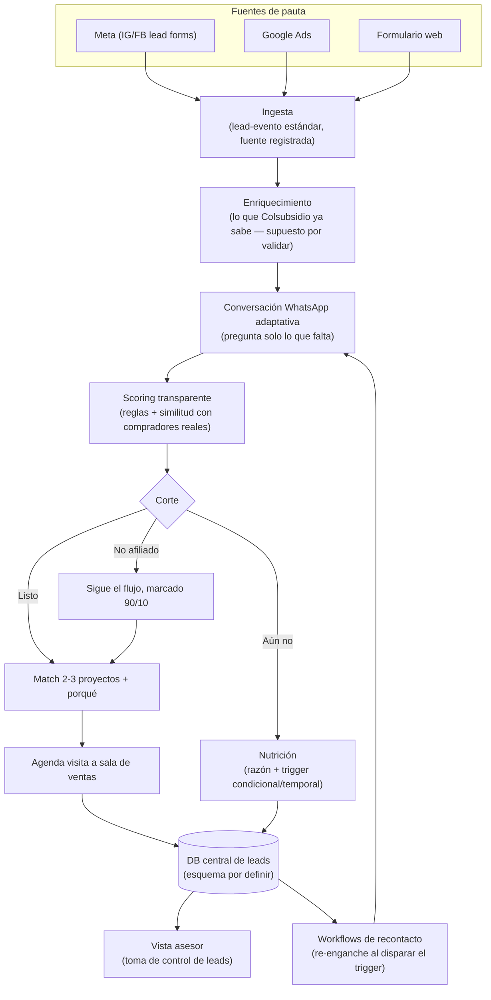

# MVP Vivienda — Layout macro de la solución

> Output del grill de scope (2026-07-23, Mani + Claude). Es el **layout general, sin tecnicismos**, que sirve de base para crear el repo del MVP y bajar a specs, tasks y diagramas definitivos. Lo cerrado aquí no se re-litiga sin razón nueva; lo abierto está marcado y se resuelve con el equipo o los mentores.

## 1. La apuesta (borrador — cerrar en kickoff)

Un **workflow de curado de leads** que hace que los leads pagos se parezcan a los orgánicos: el lead entra por pauta, conversa con un perfilador estilo WhatsApp que pregunta solo lo que falta, un motor transparente lo califica y matchea con 2-3 proyectos, y al asesor le llega un **lead curado con cita agendada y el porqué** — listo solo para cerrar. Los que hoy no pueden comprar no se botan: quedan calificados en nutrición con la condición que los volvería listos.

Borrador de frase de apuesta: *"Un interesado en vivienda que llega por pauta logra llegar al asesor tan calificado como un lead orgánico —con proyecto, capacidad validada y cita— sin sentirse interrogado ni perderse si aún no puede comprar."* **(a cerrar con el equipo, máx. 10 min)**

## 2. Decisiones cerradas de scope

| # | Decisión | Por qué |
|---|----------|---------|
| 1 | **Demo = viaje completo, clímax en el asesor.** El jurado vive el inicio de la conversación y cómo se desencadena, y termina en la vista del asesor con el lead curado. | La transformación lead crudo → lead listo es la estrella; el brief define el endpoint como "un lead que el asesor pueda cerrar" ([brief:41](reto/perfilamiento-leads-03.md)). |
| 2 | **Canal simulado estilo WhatsApp + disclaimer.** Chat web con estética WhatsApp; disclaimer visible: "en producción corre sobre WhatsApp Business API". Video del flujo en WhatsApp real = nice-to-have, no indispensable. | El jurado debe recorrer el demo solo con un clic; WhatsApp real mete riesgo de verificación Meta y fricción de sandbox. |
| 3 | **Nutrición demostrada ligera, triggers no solo temporales.** El lead no listo cae a un bucket con su razón + un trigger de recontacto que el propio workflow de calificación infiere (ej. "con subsidio X aplicable", "cuando complete N meses de afiliación", o un plazo estimado). En demo, un botón "simular el trigger" dispara el re-enganche. | El brief lo pide literal: los que aún no pueden comprar "entran a un flujo de nutrición para volver más adelante", no se descartan ([brief:21,35-36](reto/perfilamiento-leads-03.md)). |
| 4 | **Scoring v1 = reglas transparentes + similitud + LLM explica.** Factores explícitos derivados de los datos del reto (afiliación/90-10, relación cuota/ingreso ≤40%, subsidio aplicable, ya-tiene-vivienda, segmento vs buyer persona) + similitud con los 4.142 compradores reales como evidencia + LLM redacta el porqué en lenguaje natural. **Cero assumptions pesadas**: cada factor debe estar fundamentado en los insumos. No es estático: se prevé medir su performance (ver abiertas). | "Cero caja negra" fue el criterio repetido en los 4 retos (analisis-retos.md:13, en plan-research); la constante del handoff: la explicación pesa tanto como la recomendación. |
| 5 | **Conversación adaptativa.** Las preguntas dependen de lo que ya se conoce del lead; no son las mismas para todo el mundo. | Brief: "con la data que tenga a mano y preguntando lo que falte, sin sentirse como un interrogatorio" ([brief:20](reto/perfilamiento-leads-03.md)); el área lo repitió en el live: "no preguntar lo que ya se sabe". |
| 6 | **Endpoint del lead listo: cita agendada + insight al asesor.** El bot agenda la visita a sala de ventas **para que el asesor cierre él mismo**, con la mayor seguridad de que la conversación es solo de cierre; el asesor recibe cita + score desglosado + porqué + proyecto para continuar el contacto. | Brief: la conversación del asesor debería ser "prácticamente de cierre y agendamiento de visita a sala de ventas" ([brief:42](reto/perfilamiento-leads-03.md)). |
| 7 | **El no afiliado sigue el flujo (lado 10%).** No se descarta: se perfila igual, queda marcado por la regla 90/10, y post-calificación **todos** los leads caen a una DB central que alimenta la vista del asesor; desde ahí operan los workflows de nutrición/posposición o reapertura de conversación. | El 10% existe y se vende; distinguir afiliado temprano es el gancho regulatorio del ADR 0001. |
| 8 | **Arquitectura: workflow orquestado, IA en puntos específicos.** El pipeline es determinista y auditable; la IA vive en (a) el conversador adaptativo y (b) un "experto en vivienda Colsubsidio" grounded en los 3 insumos, que valora el perfil y redacta el porqué. Las decisiones de corte (listo / nutrición / cupo) son reglas transparentes. | Demoable, auditable ante el jurado y fácil de repartir entre 5 personas en 3.5 días. |

## 3. El workflow macro (borrador — el team lo cura y concreta)

> ⚠️ **Strawman, no definitivo.** Este diagrama existe para que la discusión del equipo arranque de algo concreto; sentarse a curarlo es tarea del kickoff.

## 4. Componentes del workflow

| Componente | Qué hace | Insumo del reto | ¿IA? | Estado |
|---|---|---|---|---|
| **Ingesta** | Recibe leads de cualquier fuente como evento estándar con su fuente registrada | — | No | Cerrado (macro); convergencia a WhatsApp: abierta |
| **Enriquecimiento simulado** | Anexa lo que Colsubsidio ya sabría del lead (afiliación, segmento…) | Excel + buyer personas (base sintética derivada) | No | Abierto: qué se conoce en real (preguntar) |
| **Conversador adaptativo** | Pregunta solo lo que falta, natural, sin interrogatorio | Lo que entregue el enriquecimiento | Sí (LLM) | Cerrado (macro) |
| **Motor de scoring** | Califica con factores explícitos y auditables; corte listo / aún-no | Excel 4.142, buyer personas, reglas 90/10 y 40% | No (reglas); LLM solo explica | Cerrado v1; métricas de performance: abiertas |
| **Matcher de proyectos** | Recomienda 2-3 proyectos acordes al perfil, con el porqué | Brochures + buyer personas por proyecto | Sí ("experto vivienda Colsubsidio" grounded) | Cerrado (macro) |
| **Agendador** | Ofrece y registra la cita a sala de ventas | — | No | Cerrado |
| **DB central de leads** | Fuente única post-calificación; alimenta vista asesor y recontacto | — | No | **Abierto: esquema (definir la info más relevante para el reto)** |
| **Workflow de nutrición** | Guarda al no-listo con razón + trigger condicional; re-engancha al dispararse | Salida del scoring | Parcial (razón/mensaje) | Cerrado (macro) |
| **Vista asesor** | Cola priorizada + detalle del lead curado; posible dash de toma de control | DB central | Idea: valoración por agente AI entrenado en vivienda Colsubsidio | **Abierto: definir con el equipo** |
| **Entrada del demo** | Cómo el jurado recorre los 3 caminos solo | — | — | **Abierto: definir con el equipo** |

## 5. El demo de 2 min mapeado al workflow

| Tramo | Qué ve el jurado | Criterio que ataca |
|---|---|---|
| Inicio | Cómo entra un lead de pauta y cómo arranca la conversación (natural, no interrogatorio) | Innovación (uso inteligente de IA) |
| Transformación | La conversación desencadena el perfilamiento: el sistema infiere, pregunta lo que falta, califica | Ejecución técnica |
| Clímax | La vista del asesor: lead curado con score desglosado, porqué en lenguaje natural, proyecto matcheado, cita — posible dash de toma de control | Impacto + ejecución |
| Nutrición (~15 seg) | Un lead que aún no puede: su razón, su trigger, y el re-enganche simulado | Impacto (nadie se descarta, propósito social) |

Reglas que gobiernan todo: **recorrible por el jurado solo, sin narración; cero caja negra; "feo pero funciona" > "bonito pero falso"**.

## 6. Qué NO entra (no-goals)

Del brief ([brief:47-50](reto/perfilamiento-leads-03.md)):
- Estrategia de pauta o marketing.
- Integración real con CRM (Salesforce), DataCrédito o el bot actual del contact center.
- Aprobación de crédito hipotecario, promesa de compraventa, gestión documental.

Del grill:
- WhatsApp real en el link evaluable (solo video opcional).
- Dashboard analítico completo (funnel/CPL protagonista).
- Más de un canal conversacional construido: la escala multi-canal se demuestra por diseño (ingesta estándar), no construyendo canales.

## 7. Preguntas para mentores / WhatsApp del reto

1. **Convergencia multi-canal → WhatsApp:** ¿es válido que todas las fuentes converjan a una sola conversación de WhatsApp, o esperan tratamiento por canal? (Sigue ambiguo en el reto; también es decisión de producto del team.)
2. **¿Qué info ya se conoce del lead que llega?** Supuesto de trabajo: si es afiliado lo conocen, si no, no. Averiguar cómo se sabría en real y qué campos trae un lead de pauta.
3. **Cruces Ministerio de Vivienda / buró:** ¿demostrados o basta inferirlos/simularlos? (Ya estaba en `URGENTE-Y-NOTICIAS.md`.)

## 8. Supuestos a validar y realidades del Excel real

Hallazgos del análisis del Excel real (`docs/recursos-reto/hackathon_VIVIENDAv2.xlsx`, ver handoff 2026-07-23):

- **Munición de impacto ya validada:** 27,1% de los compradores históricos NO son afiliados (vs. el 10% permitido) y los 16 proyectos con ubicación conocida incumplen el límite 90/10. El problema que ataca el workflow es real y medible — usar en pitch y en la vista del asesor.
- **No hay columna "afiliado" explícita**: se infiere de `PERIODO_AFILIADO` vacío/lleno.
- **`VLR_VIVIENDA` trae 4 ceros de más**: ÷10.000 para el precio real.
- **`SEGMENTO_POBLACIONAL`/`CATEGORIA`/`PIRAMIDE_NUEVA` vienen anonimizados con letras griegas** (no Básico/Medio/Alto/Joven): decidir si se infiere el mapeo cruzando contra los % del PPT o se tratan como clusters anónimos (item del roadmap).
- **Base sintética de identidades**: la data real es anónima (sin cédulas); el "ya te conocemos" del demo se simula con una base generada a partir de las distribuciones reales del Excel/buyer personas.

## 9. Siguiente paso

1. **Kickoff con todo el equipo**: cerrar la frase de apuesta, curar el mermaid, y resolver las decisiones abiertas (esquema DB, vista asesor, entrada del demo, métricas de scoring).
2. Bajar este layout a `spec.md` (7 bloques) + tasks (Día 1 del [agenda-evento.md](agenda-evento.md)).
3. Crear el **repo público del MVP** (después del inicio del evento) y arrancar el scaffold.
