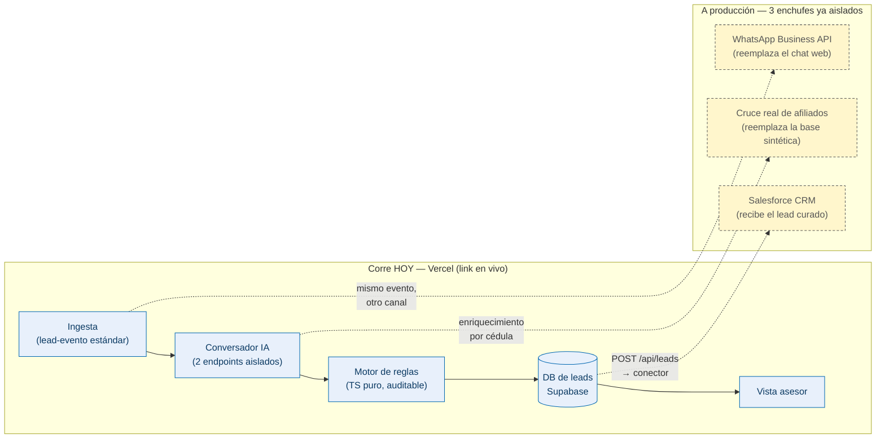

# Guion del video — 2 min

> **Entregable con pre-filtro.** Hay revisión por video antes del pitch en vivo ([agenda-evento.md](../agenda-evento.md)), así que este video es la mitad de la nota. Regla: muestra el **producto real corriendo** sobre https://mvp-reto-vivienda.vercel.app, voz en off, ≤ 2:00. Cero animaciones, cero edición sofisticada.
>
> Se graba **el sábado p.m., después de la integración total** ([ticket 014](../tasks/014-recorrido-criterio-4.md)): grabar antes es grabar algo que va a cambiar. Este doc es el guion; la grabación es el paso 5 del rol.

> ⚠️ **Dos frases que NO se pueden decir, y las dos se dijeron en la sala del sábado** ([discusión de workflow](../agents/discusion-workflow-2026-07-25.md)):
> 1. **"El que no está afiliado entra a nutrición."** Falso: el no afiliado que pasa el gate del 40% sale **listo con restricción de cupo**, con sus proyectos y su advertencia. La única causa de nutrición es la cuota sobre el 40%. Decirlo al revés contradice la pantalla del beat 3, donde Carlos aparece con 3 proyectos.
> 2. **"74 sobre 100."** El techo alcanzable hoy es **75** (el subsidio aporta 0 a todo lead real y la similitud aporta la mitad fija), así que Diana con 74 está a un punto del máximo. Se dice el techo, o no se dice la fracción.

## Presupuesto de tiempo (120 s duros)

| # | Tramo | En pantalla | Criterio / gancho | Seg |
|---|---|---|---|---|
| 0 | **El hueco** | La página orgánica real de Colsubsidio (`colsubsidio.com/vivienda`) — sin formulario, sin proyectos | Problema | 0:00–0:15 |
| 1 | **Entra el lead** | Diana entra por pauta (Meta) → chat WhatsApp, da consentimiento + cédula, el bot **ya la conoce** y se lo dice | Criterio 1 (no repreguntar) | 0:15–0:32 |
| 2 | **Se transforma** | El bot pregunta solo lo que falta; el motor transparente califica y matchea 2-3 proyectos + agenda cita | Ejecución técnica | 0:32–0:52 |
| 3 | **Clímax: el asesor** | Ficha del lead curado: score factor por factor, el porqué citando el Decreto 583, proyectos y cita. Se abre Carlos (no afiliado) → alerta de cupo 90/10 | Criterios 2 y 4 + impacto | 0:52–1:22 |
| 4 | **Nadie se descarta** | Yuliana no pasa el corte → razón + trigger; clic en "simular trigger" → vuelve a la conversación | Criterio 3 (nutrición) | 1:22–1:37 |
| 5 | **Esto se implementa** | Diagrama de implementabilidad (abajo) | Premio 1er lugar | 1:37–2:00 |

## Voz en off (leída, cronometrada)

Escrita para ~2,3 palabras/seg en español. Total ≈ 275 palabras. Los `[corchetes]` son señas de lo que pasa en pantalla, no se leen. Lo marcado _(cuttable)_ se sacrifica primero si el reloj aprieta.

**[0:00 — El hueco]**
> Esta es la página de vivienda de Colsubsidio hoy. No hay formulario. No hay proyectos. El lead que llega por pauta cae en el vacío. Y cuando sí compra: **el 27% de los compradores históricos no son afiliados** — cuando la regla 90/10 solo permite el 10%. Los 16 proyectos con ubicación conocida ya la incumplen. El problema no es de marketing: es que **no existe el embudo**.

**[0:15 — Entra el lead]**
> Diana llega por un anuncio. En vez de un formulario, un chat estilo WhatsApp. Autoriza el tratamiento de datos, da su cédula… y el sistema **ya sabe** que es afiliada, su ciudad y su rango de ingreso. No se lo vuelve a preguntar, y se lo hace saber. _(cuttable: "Un lead pago que se siente como uno orgánico.")_
>
> ⚠️ **Ojo con este plano:** el chat **no le recita los datos a Diana** — le dice que no le hará repetir nada y arranca buscando en su ciudad ([spec 02, nodo 3](../specs/02-conversador.md)). Quien enumera afiliación, ciudad e ingreso es **la ficha del asesor**, en el beat 3. La voz en off puede nombrarlos aquí porque le habla al jurado, no a Diana; si el video promete que el bot los recita, no coincide con la pantalla.

**[0:32 — Se transforma]**
> Solo pregunta lo que falta para calificar. Detrás, un motor de reglas —no una caja negra— la califica, la cruza con proyectos que le caben, y le agenda la visita a sala de ventas. En un mensaje pasó de clic en un anuncio a lead listo para cerrar.

**[0:52 — Clímax: el asesor]**
> Y esto es lo que recibe el asesor. No un nombre y un teléfono: la ficha completa. El score **factor por factor** —afiliación, la cuota bajo el 40% que exige el Decreto 583, subsidio aplicable— cada uno con su valor. El porqué, en español, citando la norma. Los proyectos y la cita, ya agendada. _(cuttable)_ Y cuando el lead es no afiliado, como Carlos, el asesor ve la **alerta de cupo 90/10** del proyecto antes de mover un dedo.

**[1:22 — Nadie se descarta]**
> Yuliana todavía no puede comprar. No se bota: queda en nutrición con la **regla exacta** que falló y el trigger que la volvería lista. Cuando ese trigger se cumple —aquí lo simulamos— vuelve sola a la conversación.

**[1:37 — Esto se implementa]**
> Todo esto corre hoy, en vivo, en este link. A producción son tres enchufes que ya dejamos aislados: el canal a **WhatsApp Business API**, la salida al **CRM Salesforce**, y el cruce **real de afiliados**. No es una maqueta: es el embudo que a Colsubsidio le falta, listo para conectar.

## Notas de grabación (críticas)

- **🎬 Calentar el lambda antes de dar REC.** Vercel enfría la función de IA tras unos minutos sin tráfico; en frío tarda ~7 s y a veces tira 500 (ver [handoff 2026-07-24 11:30](../agents/handoff.md)). Justo antes de grabar: abrir el chat y mandar un mensaje de calentamiento, para que en la toma responda en 1-2 s y se vea el pulido del LLM. Grabar de corrido; si se corta varios minutos, recalentar.
- **El fallback es red de seguridad, no el plan.** Si aun caliente la IA falla, el texto determinístico mantiene el flujo — pero el video se ve mejor con el stream real. Preferir la toma con IA viva.
- **Los 3 caminos, sí o sí.** Diana (afiliada lista), Carlos (no afiliado, cupo) y Yuliana (nutrición) tienen que verse. Son los 3 personajes sembrados en la landing; un clic arranca cada uno.
- **✍️ Al menos una respuesta hay que ESCRIBIRLA, no tocarla.** Desde el 2026-07-24 el chat acepta texto libre en todos los pasos y reacciona a lo que la persona contesta ([spec 02 D4](../specs/02-conversador.md)). Si en la toma solo se ven dedos tocando botones, el video cuenta justo lo que el mentor rechazó ("ese prototipo de chatbot donde la gente se enreda"). Escribir el ingreso en la toma —"4.500.000", con sus puntos— es el plano que demuestra que no es un formulario. La voz en off puede apoyarlo en el beat 2: *"le explica para qué le pregunta, y la deja contestar como quiera"*.
- **🎙️ Y una respuesta se puede DICTAR** (nuevo, 2026-07-25). Hay micrófono al lado del campo: se toca, se habla y el texto aparece transcrito. Es un plano de ~6 segundos que responde algo que el mentor puso sobre la mesa —*"otras prefieren mandar notas de voz"*— y que además se lee como inclusión: contestar desde una obra o manejando.
  - **Cuidado con la palabra.** En la voz en off es *"o se lo dicta"*, **no** "manda una nota de voz": lo que hay es transcripción en el navegador, no audio guardado. La frase segura para el pitch, si el jurado pregunta: *"en producción WhatsApp entrega el audio y se transcribe igual; entra por el mismo punto del flujo"*.
  - **Antes de grabar:** conceder el permiso del micrófono en el navegador **fuera de cámara**, o la toma se come el diálogo de permisos de Chrome. Y grabar en Chrome, Edge o Safari — Firefox no soporta la API y el botón, honestamente, no aparece.
- **Sin narración humana en pantalla.** El demo es autogestionado (restricción no-negociable). La voz en off cuenta la historia; la pantalla se recorre sola.
- **No nombrar proyectos específicos en la voz en off:** los nombres del catálogo pueden cambiar con el [ticket 001](../tasks/001-personajes-canonicos.md). La narración habla de "proyectos que le caben", la pantalla muestra los reales.

## Tramo de implementabilidad (ticket 020)

30 seg que contestan la pregunta del jurado: *¿esto se lleva a producción o es una maqueta de hackathon?* Usa solo lo que **ya es verdad** de la arquitectura ([ADR 0002](../adr/0002-stack-mvp.md)) — cero código nuevo. La clave: los puntos de integración **ya están aislados**, así que producción es conectar, no reescribir.

**Los 3 puntos de integración y por qué ya están listos:**

1. **Canal → WhatsApp Business API.** La ingesta es un lead-evento estándar; cualquier canal futuro emite el mismo evento ([spec §4](../spec.md)). El chat web se cambia por WhatsApp sin tocar el resto.
2. **DB → Salesforce (CRM).** Nadie escribe a la base directo: todo pasa por `POST /api/leads` con un `LeadCurado` completo. Ese único punto se enchufa a Salesforce.
3. **Enriquecimiento → cruce real de afiliados.** Hoy la cédula consulta una base sintética derivada de las distribuciones reales; en producción consulta el padrón real de Colsubsidio. Es cambiar la fuente detrás de la misma llave (la cédula).

Lo que **queda fuera** (no-goals del [mvp-layout §6](../mvp-layout.md)): aprobación de crédito, promesa de compraventa, DataCrédito, estrategia de pauta. El video no promete eso.
