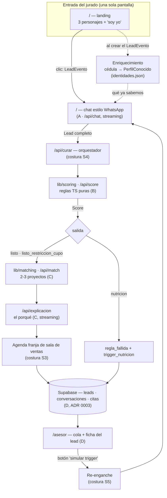
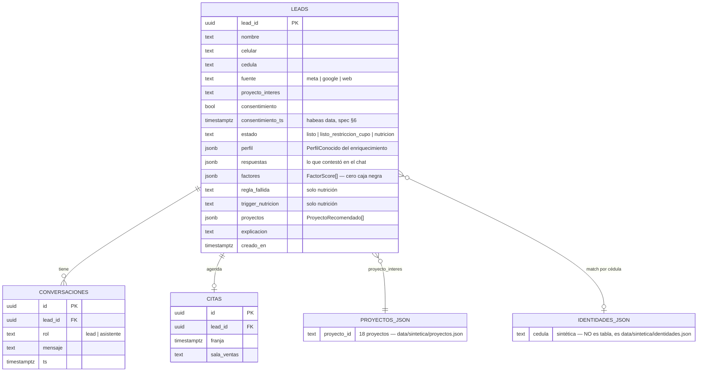

# plan — el build del MVP Vivienda

> Baja [`spec.md`](spec.md) a orden de construcción. **No reemplaza a [`reparto-inicial.md`](reparto-inicial.md)** (qué hace cada track) ni a los [prompts de arranque](prompts/): este documento se ocupa de lo que el reparto **no cubre** — las costuras entre tracks, la secuencia hasta el freeze y la trazabilidad criterio → pieza.
>
> Escrito el 2026-07-23 (jueves), con el scaffold aún sin existir y los 4 tracks arrancando. Los tickets finos salen de aquí sólo después del checkpoint humano.

---

## 1. La app en un diagrama

Cada caja tiene dueño en [`reparto-inicial.md`](reparto-inicial.md) **salvo las marcadas como costura** (§3).

## 2. Modelo de datos

Propuesta derivada del spec §6 y de los contratos de `lib/types.ts`. **El ADR 0003 del Track D es el que la cierra** — esto es el insumo, no la decisión.

Regla del ADR 0002 que gobierna la forma: **sólo lo que muta va a Supabase**. Identidades, proyectos y distribuciones son JSON versionados, no tablas.

## 3. Las costuras (lo que el reparto no le asignó a nadie)

Esto es el aporte real de este plan. Cada costura vive **entre** dos tracks, y por eso ninguna aparece en un prompt de arranque. Sin dueño explícito, todas aterrizan el sábado a las 3 a.m.

| # | Costura | Por qué existe | Dueño propuesto | Cuándo |
|---|---|---|---|---|
| **S1** | **Enriquecimiento real** (`lib/enriquecimiento.ts`: cédula → `PerfilConocido` contra `identidades.json`) | A lo consume por fixture, B produce el JSON, nadie escribe la función. El **criterio 1** no se puede verificar sin ella | **B** (es dueño del JSON) | Vie a.m. |
| **S2** | **Capacidad de compra como función compartida** (`lib/scoring/capacidad.ts`) | B calcula la cuota ≤40% contra el `proyecto_interes`; C tiene que filtrar **otros** proyectos por el mismo 40%. Sin función compartida, C reimplementa la norma y las dos versiones se van a desviar | **B** exporta, **C** importa | Vie a.m. (bloquea a C) |
| **S3** | **Agendador** (ofrecer franjas en el chat + persistirlas) | El reparto dice "la cita la agrega D o A". "D o A" = nadie. El **criterio 4** exige cita registrada | **A** (UI de franjas sobre `data/sintetica/slots.json`), **D** persiste | Vie p.m. |
| **S4** | **Orquestador** `/api/curar`: fin de la conversación → score → match → explicación → persistir | Cada track está verde solo; la cadena no es de nadie. Es el mayor riesgo del proyecto | **A** | **Viernes, no sábado** |
| **S5** | **Re-enganche de nutrición** (qué ve el lead al volver al chat) | D construye el botón y el cambio de estado; el mensaje de reentrada es del chat, que es de A. El **criterio 3** sólo se verifica de punta a punta | **D** dispara, **A** recibe | Sáb a.m. |
| **S6** | **Los 3 personajes canónicos** (`lib/fixtures/personajes.ts`: cédula, ingreso, proyecto, afiliación exactos) | Hoy los 4 tracks los inventan por separado (fixtures de A, identidades de B, explicaciones de C, `LeadCurado` de D). Si el ingreso del "afiliado listo" no coincide entre A y B, el demo se contradice a sí mismo en pantalla | **A** los fija en el scaffold; el kickoff ratifica los números; B/C/D los importan | **Hoy, en el scaffold** |
| **S7** | **Shell de navegación** (que el jurado salte de `/` a `/asesor` sin escribir la URL) | Restricción no-negociable "demo autogestionado". A es dueño de `/`, D de `/asesor`, nadie del layout | **A** | Vie p.m. |
| **S8** | **Deploy verificado en producción** (env vars en Vercel, los 3 personajes corriendo en la URL pública, no en localhost) | `.env` local no despliega. Un demo que sólo corre en la máquina de alguien no existe | **A**, verificación al cierre de cada día | Diario |
| **S9** | **Guion + video del pitch de 2 min** | No es de ningún track y es la mitad de la nota. Con 4 personas codeando, se hace de madrugada | **Sin asignar — decidir en el kickoff** | Sáb p.m. |

## 4. Secuencia hasta el freeze

| Cuándo | Qué tiene que estar | Gate |
|---|---|---|
| **Jue (hoy) ~1h** | Scaffold en `main` + `lib/types.ts` + **S6** (personajes canónicos) | Los 3 feedback loops en verde y el deploy vacío carga |
| **Jue tarde** | A: chat mock + landing · B: limpieza del Excel · C: explicaciones de referencia · D: ADR 0003 + SQL | — |
| **Jue noche** | **`data/sintetica/` publicada** (B) | C reemplaza su fixture de proyectos |
| **Kickoff** (cuanto antes) | Frase de apuesta, números de los 3 personajes, umbral del corte, reglas de subsidio, dueño de S9 | Sin esto B implementa sobre supuestos propios |
| **Vie a.m.** | **S1**, **S2**, motor de scoring con tests | `npm test` verde en `lib/scoring/` |
| **Vie p.m.** | **S4** (orquestador), **S3**, **S7**, matcher y experto de C, `/asesor` contra fixtures | Un personaje recorre la cadena completa **en la URL pública** |
| **Sáb a.m.** | Integración: fuera todas las fixtures, los 3 personajes de punta a punta + **S5** | Los 4 criterios de aceptación verificados a mano |
| **Sáb p.m.** | Video, README público, pulido de lo que se ve. **Freeze de features** | Nada nuevo entra |
| **Dom 11:30 a.m.** | **Deadline duro** | — |

Después de la integración del sábado aplica la regla de congelamiento de [`AGENTS.md`](../AGENTS.md): sólo se termina lo que se ve en el demo.

## 5. Trazabilidad: criterio de aceptación → pieza

| Criterio (spec §5) | Piezas que lo sirven | Cómo se verifica |
|---|---|---|
| **1 — No repreguntar lo conocido** | S1 (enriquecimiento real) + lógica adaptativa de A | Test: intersección vacía entre campos preguntados y campos enriquecidos |
| **2 — Cero caja negra** | `lib/scoring` (B) + ficha de `/asesor` (D) + explicación de C | Test: `factores.length` del motor == factores renderizados en la ficha |
| **3 — Nadie se descarta** | Salida `nutricion` de B + botón de D + **S5** | Test: ningún `Score` sin salida; todo lead en nutrición con `regla_fallida` y `trigger_nutricion` no vacíos. Manual: el clic devuelve al chat |
| **4 — El lead listo llega cerrable** | Matcher de C + **S3** (cita) + cola de D + **S4** | Recorrido manual de punta a punta en la URL pública, sin narración |

Los tres tests marcados no están en ningún prompt de arranque. Son baratos y son la defensa del pitch: **cada uno se escribe junto con la pieza que verifica.**

## 6. Lo que este plan deja abierto

Bloquea trabajo si no se resuelve en el kickoff:

- **Reglas concretas de subsidio** (spec §7). B tiene el factor en su lista pero nadie tiene las reglas. Sin ellas el factor existe y no calcula, y la explicación de C no lo puede citar.
- **Umbral del corte y pesos.** B construye parametrizado y propone; el kickoff ratifica.
- **Números exactos de los 3 personajes** (S6). Es el insumo de 4 tracks a la vez.
- **Dueño de S9** (pitch y video).

No bloquea, decidir cuando toque:

- **Orden dentro de cada bucket de la cola del asesor.** `Score` no trae puntaje numérico (a propósito: es corte por reglas). O se ordena por bucket + recencia, o `Score` gana un `puntaje` que la ficha también tendría que explicar.
- **Trigger de nutrición con plazo vs. flow de revisión periódica** (spec §7).
- **Códigos griegos**: v1 clusters anónimos, el mapeo inferido queda como mejora documentada.
- **Panel de impacto** (27,1% / 90/10): opcional, entra sólo si sobra el sábado.

## 7. Riesgos con mitigación barata

| Riesgo | Mitigación |
|---|---|
| **Claude falla mientras el jurado recorre el demo** (autogestionado: nadie está ahí para reintentar) | Fallback scripteado para los 3 personajes: si `/api/chat` falla, la conversación sigue con el guion pre-escrito y el demo no se cae |
| **Las cifras de los 3 personajes no cuadran entre tracks** | S6, hoy, en el scaffold |
| **La cadena se arma el sábado y no cierra** | S4 el viernes, con un personaje de punta a punta |
| **Ramas fuera de convención** (`mani-TrackC` y `Track-B` conviven con `feature/matching` y `feature/scoring`) | Acordar una sola por track hoy, antes del primer merge |
| **`lib/types.ts` cambia sin aviso** | Ya es regla del reparto. Los cambios que este plan propone (§8) se anuncian **una vez**, en el kickoff |

## 8. Cambios propuestos a los contratos

Los contratos de [`reparto-inicial.md`](reparto-inicial.md) tienen dos huecos que aparecen al recorrer la cadena completa. Se ratifican o se descartan en el kickoff, **antes** de que alguien construya encima:

1. **`Score` necesita un número, no sólo texto.** `FactorScore.valor` es `string` (legible, correcto para la ficha), pero C tiene que **filtrar proyectos por precio**. Propuesta: `Score` gana `precio_maximo: number` (el precio máximo cuya primera cuota cabe en el 40% del ingreso declarado), calculado por S2.
2. **`/api/match` recibe `Lead` + `Score`, no sólo `Score`.** El matcher necesita la zona de interés y el ingreso, que viven en `Lead`. Alternativa: subir esos campos a `Score`, pero duplicar datos entre contratos es peor.

---

**Siguiente paso:** checkpoint humano. Con este plan acordado (y las costuras con dueño), se fragmenta en tickets `docs/tasks/NNN-slug.md` — uno por costura y uno por test de criterio, que es lo que hoy no tiene ni dueño ni ticket.
