# Spec 00 — El MVP completo

> Borrador v1 · lee primero las [convenciones](README.md#las-dos-capas-de-cada-spec-leer-esto-antes-que-nada).
>
> **Supersede el workflow strawman de [`mvp-layout.md §3`](../mvp-layout.md)**, que siempre estuvo marcado como borrador a curar. Aquel diagrama se queda allá como registro histórico.

## El camino feliz, en 8 pasos

1. Alguien ve un anuncio de un proyecto y escribe. Llega como un **lead-evento** con su cédula, su canal y el proyecto por el que entró.
2. Se le pide **autorización de tratamiento de datos**. Sin eso no hay nada más.
3. Con la cédula se consulta quién es: **si es afiliado, ya sabemos ciudad, segmento y rango de ingreso** y no se lo volvemos a preguntar.
4. Conversa. El agente **pregunta solo lo que falta** y lo dice en voz alta: *"ya sabemos X, no te lo voy a volver a preguntar"*.
5. El motor lo califica con **siete factores visibles**. Uno solo bloquea: que la cuota estimada no supere el **40% del ingreso**, porque así lo fija el Decreto 583 de 2025.
6. Si pasa, se le recomiendan **2-3 proyectos** que puede pagar y que respetan el cupo 90/10, cada uno con su porqué.
7. Elige uno, **agenda una franja** en sala de ventas.
8. El asesor lo ve en su bandeja con **el score desglosado, el porqué, los proyectos y la cita**. Y si no pasó el corte, también lo ve — con la razón exacta y qué lo traería de vuelta.

**Nadie se descarta en ningún punto.**

## El diagrama

```mermaid
flowchart LR
    subgraph S1["① Ingesta — spec 01"]
        direction TB
        FUENTES["Meta lead form · click-to-WhatsApp<br/>BTL · web .com"] --> AUTOR{"¿autoriza<br/>sus datos?"}
        AUTOR -->|"no"| FUGA["Fuga registrada<br/>caída #1 del área"]
        AUTOR -->|"sí"| CEDULA{"¿la cédula está<br/>en la base?"}
        CEDULA -->|"sí"| PERFIL["Ya sabemos afiliación,<br/>ciudad, segmento, ingreso"]
        CEDULA -->|"no"| NADA["No sabemos nada:<br/>se pregunta todo"]
    end

    subgraph S2["② Conversación — spec 02"]
        direction TB
        PREG["Pregunta solo lo que falta<br/>y dice en voz alta qué ya sabe"] --> COMPLETO{"¿datos<br/>completos?"}
        COMPLETO -->|"no"| PREG
        COMPLETO -->|"pide asesor · no pudo cotizar<br/>no pudo agendar"| HUMANO["Handoff a<br/>asesor humano"]
    end

    subgraph S3["③ Motor — spec 03"]
        direction TB
        GATE{"¿cuota ≤ 40% del ingreso?<br/>Decreto 583/2025"}
        GATE -->|"sí"| PUNTAJE["Puntaje 0–100<br/>7 factores visibles"]
    end

    subgraph S4["④ Match y agenda — spec 04"]
        direction TB
        FILTRA["Filtra por precio<br/>y por cupo 90/10"] --> HAY{"¿queda algún<br/>proyecto?"}
        HAY -->|"sí"| CITA["2-3 proyectos con su porqué<br/>+ franja agendada"]
    end

    subgraph S5["⑤ Nutrición — spec 05"]
        direction TB
        RAZON["Razón exacta + trigger<br/>fecha solo si es derivable"] --> DISPARO["Trigger disparado<br/>nunca a contacto frío"]
    end

    subgraph S6["⑥ El asesor — spec 06"]
        direction TB
        BANDEJA["Bandeja priorizada<br/>propenso / no propenso"] --> FICHA["Ficha: los 7 factores, el puntaje<br/>con su aritmética, el porqué,<br/>los proyectos y la cita"]
        TABLERO["Tablero de la operación"]
    end

    PERFIL --> PREG
    NADA --> PREG
    COMPLETO -->|"sí"| GATE
    PUNTAJE --> FILTRA
    GATE -->|"no — lo ÚNICO que bloquea"| RAZON
    HAY -->|"no — hoy el cupo está copado en los 18"| RAZON
    DISPARO -->|"retoma sin repreguntar"| PREG

    CITA --> DB
    RAZON --> DB
    HUMANO --> DB
    DB[("DB central<br/>listos y no listos, juntos")]
    DB --> BANDEJA
    DB --> TABLERO

    WA(["WhatsApp Business API<br/>fuera de alcance"]) -.->|"en producción"| PREG
    DB -.->|"en producción"| CRM[("CRM Salesforce<br/>fuera de alcance")]

    classDef futuro stroke-dasharray: 5 5
    class CRM,WA futuro
```

### Cómo leer el diagrama

- **Un solo rombo tiene poder de rechazar: el del 40%.** Todos los demás enrutan, ninguno descarta.
- **Todo desemboca en la misma base de datos**, listos y no listos. Es lo que hace posible que nadie se pierda.
- **La flecha que vuelve de nutrición a la conversación** es el ciclo que convierte "no calificas" en "todavía no".
- **Punteado = fuera del alcance del reto**, no pendiente nuestro: WhatsApp real y Salesforce son los dos enchufes a producción, y el brief los excluye explícitamente.

## Lo que hoy NO está conectado

El diagrama describe el contrato. Esto es lo que falta para que exista de punta a punta:

| Tramo | Estado | Dónde |
|---|---|---|
| ② → ③ | 🟢 **Cerrado el 2026-07-24.** `/api/curar` encadena conversación → motor → matcher → DB, y guarda también el hilo de mensajes | [Ticket 006](../tasks/006-orquestador.md) |
| ② | 🟢 **Cerrado el 2026-07-24.** El ingreso ya se obtiene como número (parseo del texto libre + punto medio del rango conocido) y la situación crediticia sale como enum. **Sigue faltando el monto del subsidio**, así que el subsidio aún no baja la cuota | [Spec 02](02-conversador.md), brechas 1-3 |
| ④ | 🔴 El chat nunca ofrece franjas; los IDs de slots no coinciden con el catálogo real | [Ticket 005](../tasks/005-agendador.md) · [spec 04](04-match-agenda.md) D4 |
| ⑤ → ② | 🔴 El botón de re-enganche redirige con parámetros que nadie lee | [Ticket 007](../tasks/007-reenganche-nutricion.md) |
| ⑥ | ⚠️ Vive de fixtures + 57 leads sintéticos marcados como tales | Env vars de Supabase en Vercel |

## Los specs

| Spec | Qué decide | Su pregunta más importante para el equipo |
|---|---|---|
| [01 — Ingesta y enriquecimiento](01-ingesta-enriquecimiento.md) | Cómo entra un lead y qué sabemos de él | ¿Cambiamos los valores de `fuente` para reflejar los canales reales? |
| [02 — Conversador](02-conversador.md) | El workflow de WhatsApp y el agente | ¿El LLM conduce la conversación, o sigue conduciendo el código? |
| [03 — Scoring](03-scoring.md) | Cómo se califica y dónde cae la línea | ¿Cuál de las dos escalas de puntaje es la buena? |
| [04 — Match y agenda](04-match-agenda.md) | Qué se recomienda y cómo se agenda | ¿Qué le decimos al no afiliado que califica y no tiene cupo? |
| [05 — Nutrición](05-nutricion-reenganche.md) | Qué pasa con quien todavía no puede | ¿Registramos las fugas como razones de nutrición? |
| [06 — Dashboard](06-dashboard-asesor.md) | Bandeja, tablero y ficha | ¿Instrumentamos la etapa de abandono, que es la métrica #1 del mentor? |

## Las cuatro reglas que gobiernan todo

De [`AGENTS.md`](../../AGENTS.md), no se negocian en ninguna reunión:

1. **Cero caja negra.** Toda decisión se explica en lenguaje natural. La explicación pesa tanto como la recomendación.
2. **Demo autogestionado.** El jurado recorre el flujo solo. Si una pantalla necesita que alguien la explique, está mal diseñada.
3. **La data real de Colsubsidio nunca entra al repo público.**
4. **Deadline: domingo 26 de julio, 11:30 a.m.** "Feo pero funciona" gana a "bonito pero falso".
