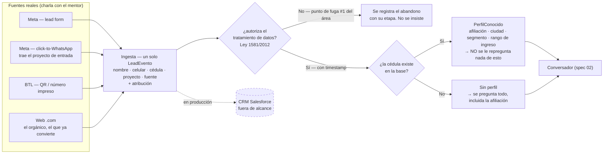

# Spec 01 — Ingesta y enriquecimiento

> Borrador v1 · lee primero las [convenciones](README.md#las-dos-capas-de-cada-spec-leer-esto-antes-que-nada): el **QUÉ** va firme con su fuente, el **CÓMO** es propuesta.

## Qué cubre

Todo lo que pasa **antes del primer mensaje**: cómo entra un lead desde cualquier canal, qué se registra de él, cómo se pide la autorización de datos, y qué sabemos de esa persona sin haberle preguntado nada.

**No cubre:** la conversación (spec [02](02-conversador.md)) ni la calificación (spec [03](03-scoring.md)).

## Contrato

### D1 · Un solo evento de entrada, venga de donde venga · [CERRADA — `spec.md §4` paso 1]

Cualquier canal emite el mismo `LeadEvento` ([`lib/types.ts`](../../lib/types.ts)): `lead_id`, `nombre`, `celular`, `cedula`, `proyecto_interes?`, `fuente`.

Esto es lo que el mentor pidió literalmente: [*"un centralizador que me vaya filtrando todo independientemente de dónde entre"*](../reto/charla-mentor.md#lo-que-ve-el-asesor). El multi-canal se demuestra **por diseño**, no construyendo cuatro canales — construir más de un canal conversacional está fuera de alcance (`spec.md §2`).

### D2 · Los cuatro canales reales · [CERRADA — charla con el mentor]

La operación de hoy, tal como la describió ([detalle](../reto/charla-mentor.md#fuentes-y-canales)):

| Canal real | Cómo entra hoy | Quién atiende hoy |
|---|---|---|
| Meta — lead forms | Formulario dentro de Meta | Contact Center telefónico |
| Meta — click-to-WhatsApp | El anuncio abre WhatsApp | Flujo automático; humano si escala |
| BTL | QR / número en material físico | Igual que click-to-WhatsApp |
| Web (.com) | Landing de proyecto o de subsidio | **Directo a sala de ventas** |

**El .com convierte mejor porque es orgánico** — nadie pauta hacia allá. Esa brecha es el reto entero.

### D3 · Cómo mapeamos esos cuatro a nuestro `fuente` · [PROPUESTA]

Hoy el tipo acepta `"meta" | "google" | "web"`. Contra la realidad que describió el mentor, eso no cuadra: **Google Ads no apareció en la charla** y en cambio **BTL y la separación lead-form / click-to-WhatsApp sí son distinciones que ellos hacen**.

Propuesta de mapeo, para reaccionar:

```
meta_leadform      → el formulario de Meta
meta_whatsapp      → click-to-WhatsApp
btl                → QR o número impreso
web                → landing .com (el orgánico, el estándar a alcanzar)
```

Cambiarlo toca `lib/types.ts`, las fixtures, el `CHECK` de la columna `fuente` en Supabase y la métrica por canal del tablero. **Es un cambio barato hoy y caro el sábado**, así que si se va a hacer, se decide en esta reunión.

### D4 · Atribución de canal como campo de primera clase · [PROPUESTA]

El mentor puso la atribución entre [las métricas que quiere y no tiene](../reto/charla-mentor.md#metricas), y explicó por qué se le pierde: identifican el origen por el **mensaje personalizado** que el QR o el botón flotante pre-cargan en WhatsApp, y **si el usuario lo borra antes de enviarlo, la atribución desaparece**. Preguntó abiertamente cómo resolverlo.

Propuesta: el `LeadEvento` lleva un campo de atribución (de dónde salió el clic: anuncio, QR, botón flotante, link directo) que **no depende de que el usuario conserve un texto**. En nuestro MVP eso es trivial porque el lead entra por nuestra propia ingesta; en producción sería un parámetro en el deep link.

**Ojo con el alcance:** resolver esto de verdad en WhatsApp real es un problema de plataforma, no nuestro. Lo que sí podemos hacer es **diseñarlo bien y decir en el pitch que el dato no se pierde por diseño**. Que el equipo decida si eso entra al demo o solo al pitch.

### D5 · La autorización de datos va primero y no se negocia · [CERRADA — `spec.md §6` + mentor + Ley 1581 de 2012]

Antes de preguntar nada. El consentimiento se registra con marca de tiempo. Si el lead no autoriza, ahí se acaba.

Dos cosas que agregó el mentor y que sí cambian el diseño:

1. **Es su punto de fuga #1.** Ahí se les cae la gente ([detalle](../reto/charla-mentor.md#puntos-de-fuga)).
2. **Están arreglando la redacción, no el requisito:** cambiar *"¿autorizas?"* por *"compártenos la autorización"*. Palabras que le cambian la intención al usuario.

**Propuesta derivada:** adoptamos la redacción amable y **el abandono en autorización se registra como evento**, porque es exactamente la métrica de fuga que el mentor no tiene (ver spec [06](06-dashboard-asesor.md) D3 y spec [05](05-nutricion-reenganche.md) D2).

### D6 · La cédula es la llave, y el mentor lo confirmó · [CERRADA — charla con el mentor]

[Textual](../reto/charla-mentor.md#autorizacion-de-datos): necesitan la cédula para identificar si eres afiliado. **Si eres afiliado no te piden nada más** porque ya tienen la data; si no lo eres, piden nombre, cédula, correo y teléfono.

Esto **cierra hacia el sí** el supuesto que [`spec.md §7`](../spec.md) tenía abierto ("¿un lead form de pauta puede pedir la cédula?"). El equipo marca el checkbox cuando lo ratifique; este spec solo trae la evidencia.

Es también el fundamento del **criterio de aceptación 1**: no repreguntar lo que ya se sabe.

### D7 · Qué devuelve el enriquecimiento · [CERRADA — `spec.md §6`]

Con la cédula: afiliación, ciudad, segmento y rango de ingreso, desde una **base sintética de identidades** generada con las distribuciones reales del Excel. La data real es anónima (no trae cédulas), así que el "ya te conocemos" del demo se simula — y eso se dice, no se esconde.

### D8 · Qué pasa cuando no hay match · [PROPUESTA]

Hoy: `{ match: false }` y se pregunta todo. Es el caso que hace visible la conversación adaptativa, así que **conviene que exista en el demo**.

Lo que **no** está definido y hay que decidir: si a un lead sin match se le pregunta explícitamente si es afiliado. El contrato de tipos tiene el campo `afiliado_autoreportado` con el comentario "solo se pregunta si `perfil.match = false`" — **y esa pregunta no existe en el código** (ver spec [02](02-conversador.md) D8). Mientras tanto el motor asume **no afiliado** ([`afiliadoEfectivo()`](../../lib/scoring/index.ts)), que es el caso conservador pero puede estar mal.

### D9 · Salesforce se nombra, no se integra · [CERRADA — brief, no-goal]

Todo aterriza hoy en su CRM y el asesor ve el resumen ahí. La integración real está **fuera de alcance** ([brief:47-50](../reto/perfilamiento-leads-03.md)). Se dibuja punteado en el diagrama unificado como el enchufe a producción.

## Estado hoy vs contrato

| Qué | Hoy | Brecha |
|---|---|---|
| `LeadEvento` | Existe y se registra con su fuente | — |
| Fuente visible al asesor | Sí, en la ficha | — |
| Enriquecimiento | 🟢 **Cerrado el 2026-07-24.** [`lib/enriquecimiento.ts`](../../lib/enriquecimiento.ts) resuelve las **303 identidades** de [`identidades.json`](../../data/sintetica/identidades.json) más los 3 personajes canónicos, servido por `GET /api/enriquecer` (del lado del servidor: el JSON pesa ~100 KB y no tiene por qué viajar al navegador). Un rango "no disponible (no afiliado)" **no** se toma como rango, así que a esa persona sí se le pregunta el ingreso | Ticket [003](../tasks/003-enriquecimiento-por-cedula.md) hecho |
| Autorización | Primera burbuja del chat, con Ley 1581 citada y la redacción amable de D5 ("¿me compartes la autorización?") | — |
| Atribución de canal | No existe | D4, sin ticket |
| Proyecto de entrada | 🟢 **Cerrado el 2026-07-24.** Los 3 personajes entran por proyectos del catálogo REAL (LA ARBOLEDA · PAYANDÉ · LA MACARENA) y sus ciudades existen. Ya no hay Medellín | Ticket [001](../tasks/001-personajes-canonicos.md) hecho |

## Diagrama



## Preguntas al TEAM

1. **¿Cambiamos los valores de `fuente`?** (D3) Los actuales (`meta/google/web`) no reflejan lo que describió el mentor. Barato hoy, caro el sábado.
2. **¿La atribución de canal entra al demo o solo al pitch?** (D4) Es una métrica que el mentor pidió expresamente y que hoy se les pierde.
3. **¿Aplicamos la redacción amable de la autorización?** (D5) Es un cambio de una frase y ataca su fuga #1.
4. **¿Registramos el abandono en autorización como evento?** (D5) Sin eso, la métrica de fuga del tablero no tiene de dónde salir.
5. **¿Al lead sin match se le pregunta la afiliación, o se asume no afiliado?** (D8) Hoy se asume, y eso lo manda al cupo del 10% sin que él haya dicho nada.
6. **¿Cuánto vale conectar las 303 identidades?** Sin eso el "soy yo" del jurado nunca ve el momento de "ya te conocemos", que es el criterio 1.
7. **Vacío sin respuesta en el canon:** ¿qué campos trae **de verdad** un lead form de Meta en la operación de Colsubsidio? El mentor confirmó que la cédula se pide, pero no en qué momento exacto del recorrido. Si la piden ya dentro de WhatsApp y no en el formulario, nuestro paso 1 y nuestro paso 2 son en realidad el mismo.

## Fuentes

- [`spec.md §4` paso 1-2 y `§6`](../spec.md) — el lead-evento, el enriquecimiento, el consentimiento.
- [Charla con el mentor](../reto/charla-mentor.md#fuentes-y-canales) — los canales; [autorización y cédula](../reto/charla-mentor.md#autorizacion-de-datos); [atribución](../reto/charla-mentor.md#metricas).
- [brief:47-50](../reto/perfilamiento-leads-03.md) — CRM fuera de alcance.
- Código: [`lib/types.ts`](../../lib/types.ts), [`lib/enriquecimiento.ts`](../../lib/enriquecimiento.ts) (las 303 identidades + los 3 canónicos), [`app/api/enriquecer/route.ts`](../../app/api/enriquecer/route.ts) (server-side: el JSON pesa 100 KB).
