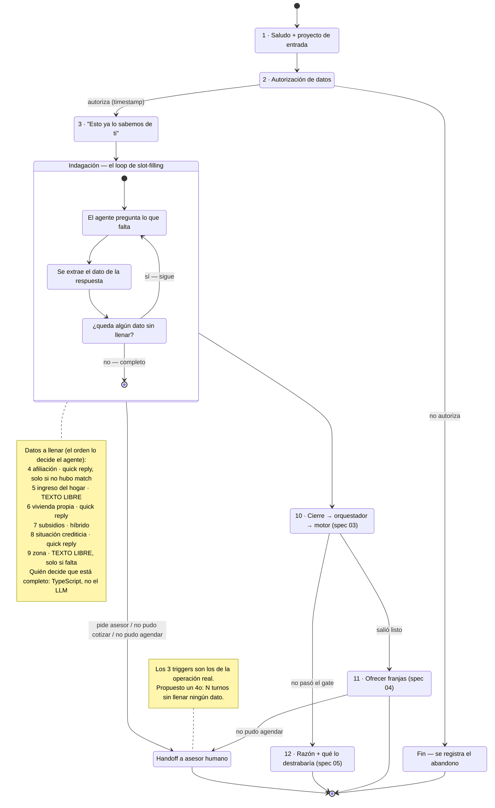

# Spec 02 — Conversador (el workflow de WhatsApp y el agente)

> Borrador v1 · lee primero las [convenciones](README.md#las-dos-capas-de-cada-spec-leer-esto-antes-que-nada).
>
> **Este es el spec donde el equipo quiere entrar a decidir.** Todo lo que sigue sobre nodos, orden, contexto del agente y redacciones es **straw proposal**: existe para que haya algo concreto sobre lo cual discutir encima del diagrama, no para cerrar nada. Su sección [Preguntas al TEAM](#preguntas-al-team) es la más larga del paquete a propósito.

## Qué cubre

El workflow completo de la conversación: qué pasos tiene, quién responde qué, qué ramas existen, cuándo entra un humano, qué sabe el agente y qué significa que "aprenda".

**No cubre:** cómo entra el lead (spec [01](01-ingesta-enriquecimiento.md)), cómo se califica lo que se recogió (spec [03](03-scoring.md)), ni qué proyectos se ofrecen (spec [04](04-match-agenda.md)).

## El QUÉ — lo que la conversación tiene que lograr

Esto sí va firme, porque no lo decidimos nosotros:

| # | Obligación | Fuente |
|---|---|---|
| 1 | Pedir autorización de tratamiento de datos **antes de cualquier otra cosa**, y registrarla con timestamp | Ley 1581 de 2012 · `spec.md §6` · [mentor](../reto/charla-mentor.md#autorizacion-de-datos) |
| 2 | **No repreguntar** ningún dato que el enriquecimiento ya trajo, y decir en voz alta qué se sabe | Criterio de aceptación 1 (`spec.md §5`) |
| 3 | Recoger lo necesario para calificar: ingreso del hogar, vivienda propia, subsidios, situación crediticia, zona | `spec.md §6` (los 4 del [brief:20](../reto/perfilamiento-leads-03.md) + zona para el matcher) |
| 4 | **No sonar a robot ni a formulario.** Que capte la información y filtre hacia la decisión de compra | [Mentor, textual](../reto/charla-mentor.md#conversacion-deseada) |
| 5 | Ser **híbrida**: opciones donde ayudan, texto libre donde la lista sesga | [Mentor](../reto/charla-mentor.md#conversacion-deseada) |
| 6 | Escalar a humano cuando el lead lo pide o cuando la autogestión falla | [Mentor](../reto/charla-mentor.md#click-to-whatsapp) |
| 7 | No inventar nada: ni precios, ni subsidios, ni características de proyectos | `AGENTS.md` (cero caja negra) · [`prompt-experto.ts`](../../lib/matching/prompt-experto.ts) |
| 8 | Primer token en menos de 2s, en streaming | [ADR 0002](../adr/0002-stack-mvp.md) |

Todo lo demás de este documento es el **CÓMO**, y es discutible.

## El CÓMO — straw proposal

### D1 · Quién conduce la conversación · [PROPUESTA — la decisión de arquitectura]

Hay dos formas de construir esto y hoy tenemos una construida:

| | **A — Determinista conduce** (lo que existe) | **B — LLM conduce con guardrails** (propuesta) |
|---|---|---|
| Quién decide el siguiente mensaje | TypeScript, lista fija de preguntas | El LLM, viendo qué datos faltan |
| Rol del LLM | Reescribe el tono de una pregunta ya redactada | Conduce la conversación |
| Quién decide cuándo terminó | TypeScript | TypeScript (mismo validador) |
| Se siente | Correcto pero encuestador | Humano, con riesgo de divagar |
| Si el LLM se cae | No pasa nada, el texto base ya existe | Hay que caer al flujo A |
| Riesgo | Que el mentor diga "esto es lo que ya tengo" | Que se salga del carril delante del jurado |

**Propuesta: B, con el validador determinista intacto.** El LLM decide *cómo y en qué orden* preguntar; TypeScript decide *qué falta* y *cuándo se acabó*. El corte, el puntaje y el match siguen siendo TS puro, así que la restricción de cero caja negra no se toca: el LLM nunca decide si alguien califica.

El argumento a favor es del mentor, no nuestro: rechazó explícitamente *"ese prototipo de chatbot donde la gente se enreda"* y pidió que **enamore**, porque comprar vivienda *"es algo que haces una vez en tu vida"*.

El argumento en contra es el calendario: faltan menos de 48 horas y A ya funciona. **Es una decisión de riesgo, y es del equipo.**

### D2 · Qué sabe el agente al arrancar (el contexto) · [PROPUESTA — tachar o añadir]

Lista para que el equipo la edite en la reunión:

| Entra al contexto | Por qué | ¿Discutible? |
|---|---|---|
| Nombre del lead | Para tutearlo por su nombre | No |
| `PerfilConocido` (afiliación, ciudad, segmento, rango de ingreso) | Para no repreguntarlo — criterio 1 | No |
| Proyecto por el que entró | Colsubsidio ya lo hace: [entraste por Araucaria, te habla de Araucaria](../reto/charla-mentor.md#click-to-whatsapp) | No |
| **Los datos que faltan**, como lista explícita | Es el objetivo del turno | No |
| Ficha del proyecto de entrada (precio desde, ubicación, tipologías) | Para responder "¿cuánto vale?" sin inventar | Sí — ¿el catálogo completo o solo ese proyecto? |
| Tabla de subsidios | Para explicar cuál le puede aplicar | Sí — depende del [ticket 017](../tasks/017-tabla-subsidios.md) |
| Historial, si es re-enganche | Para retomar sin repreguntar (spec [05](05-nutricion-reenganche.md)) | Sí |
| Nada del scoring | El agente **no** sabe el puntaje ni la salida: no es su trabajo y no debe insinuárselo al lead | No |

**Lo que NO entra, y conviene decirlo explícito:** el catálogo completo de 18 proyectos con precios. Si el agente los tiene todos, va a empezar a recomendar en medio de la indagación, y el match es determinista por diseño (spec [04](04-match-agenda.md)).

### D3 · Los nodos del workflow · [PROPUESTA — el straw proposal, nodo por nodo]

Numerados para poder discutirlos uno por uno en la reunión:

| # | Nodo | Quién responde | Tipo de input | Rama |
|---|---|---|---|---|
| 1 | **Saludo + proyecto de entrada** | Agente | — | Si no hay proyecto de entrada, saludo genérico |
| 2 | **Autorización de datos** | Lead | Quick reply sí/no | **No → fin.** Se registra el abandono |
| 3 | **"Esto ya lo sabemos"** | Agente | — | Si no hubo match, lo dice: "no encontramos datos tuyos" |
| 4 | **Afiliación** | Lead | Quick reply sí/no | **Solo si el enriquecimiento no la trajo** |
| 5 | **Ingreso del hogar** | Lead | **Texto libre — obligatorio** | [El mentor lo pidió explícito](../reto/charla-mentor.md#conversacion-deseada): la lista sesga |
| 6 | **¿Vivienda propia?** | Lead | Quick reply sí/no | — |
| 7 | **Subsidios** | Lead | Quick reply + texto | Si dice que sí, se indaga cuál |
| 8 | **Situación crediticia** | Lead | Quick reply (al día / con mora / sin historial) | — |
| 9 | **Zona de interés** | Lead | **Texto libre** | Solo si el enriquecimiento no trajo ciudad |
| 10 | **Cierre** | Agente | — | Llama al orquestador → spec [03](03-scoring.md) |
| 11 | **Oferta de franjas** | Lead | Quick reply | **Solo si salió listo** → spec [04](04-match-agenda.md) |
| 12 | **Nutrición honesta** | Agente | — | Si no pasó: la razón + qué lo destrabaría → spec [05](05-nutricion-reenganche.md) |

**El orden 5→9 no es sagrado.** Es el orden en que hoy están escritas las preguntas. Si el LLM conduce (D1 opción B), el orden lo decide él según cómo fluya la conversación, y esta tabla pasa a ser la lista de *lo que hay que llenar*, no de *en qué orden*.

### D4 · Dónde va cerrado y dónde abierto · [CERRADA — el mentor lo especificó]

Su regla, textual: hay que tener **las dos** opciones porque unas personas prefieren escoger y otras escribir o mandar notas de voz. Y hay puntos donde la lista **sesga**:

> *"si tú dices que ganas 500.000 pesos, el listado no tiene esa opción"* · *"si dice que gana más de 10, ¿cuánto es más de 10?"*

Aplicado a nuestros nodos: **abierto en ingreso (5) y zona (9)**; **quick reply en autorización (2), afiliación (4), vivienda (6) y crediticia (8)**; **híbrido en subsidios (7)**.

### D5 · Qué significa que el agente "aprende" · [PROPUESTA — resuelve una tensión real]

El equipo pidió "aprendizaje autónomo: las conversaciones no son estáticas siempre". Eso choca de frente con la restricción de **cero caja negra** si se entiende como el sistema ajustándose solo. Propuesta de qué significa honestamente, en tres niveles:

1. **Adaptación por conversación** (existe ya): las preguntas dependen de lo que se sabe del lead. Dos personas no viven la misma conversación. *Esto es lo que hoy llamamos "adaptativo" y es real.*
2. **Grounding actualizable** (barato, propuesto): el catálogo, la tabla de subsidios y los textos viven en datos, no en el prompt. Se editan y el agente los usa en el siguiente mensaje, sin tocar código. *Esto es lo que hace que el sistema no envejezca.*
3. **Recalibración offline** (el honesto): un humano revisa transcripts y métricas de conversación —dónde abandonan, qué pregunta cuesta más— y ajusta prompts o pesos **en un commit que se puede leer y revertir**.

**Lo que proponemos NO hacer: aprendizaje en línea.** Que el sistema ajuste solo sus pesos o sus reglas es indefendible ante un jurado que pregunte "¿por qué este lead quedó así?", y rompe la constitución del proyecto. Si el equipo quiere venderlo como "aprende", el nivel 3 es defendible y honesto: **el sistema mejora con el uso, pero cada cambio tiene un autor y una fecha.**

### D6 · Cuándo entra un humano · [CERRADA — mentor, para los tres primeros]

Los tres triggers son literales de la operación de hoy ([detalle](../reto/charla-mentor.md#click-to-whatsapp)):

1. **No pudo agendar.**
2. **No pudo cotizar.**
3. **Pide hablar con un asesor** habiendo explorado las opciones.

**[PROPUESTA]** Un cuarto: **N turnos sin que se llene ningún dato nuevo**. Protege contra el lead que se enreda, que es justo lo que el mentor no quiere. Falta decidir N (¿3?) y qué pasa en el demo, donde no hay humano al otro lado — probablemente un mensaje honesto de "te contacta un asesor" y el lead entra a la cola marcado.

### D7 · El fallback determinista · [HOY — así está construido]

Si el primer token no llega en 3 segundos, [`ChatWhatsApp.tsx`](../../components/chat/ChatWhatsApp.tsx) aborta y pinta el texto determinista. Se puso por el cold start de Vertex (~7s) y **es lo que blinda el demo**.

Si el equipo aprueba D1-B, este flujo **deja de ser el primario y pasa a ser la red**. Eso es un cambio de rol importante: hoy el fallback es idéntico al camino feliz; con B, el fallback es visiblemente más pobre que la conversación buena. Hay que decidir si eso es aceptable en el video.

## Estado hoy vs contrato

Aquí hay tres brechas que **no son de diseño sino de datos que nadie recoge**, y que rompen el motor:

| # | Qué dice el contrato | Qué pasa hoy | Consecuencia |
|---|---|---|---|
| 1 | El motor necesita `ingreso_hogar_mensual` (un **número**) para el gate del 40% | La conversación solo pregunta `rango_ingreso_hogar` (**texto libre**) y nadie lo convierte a número | 🔴 **Un lead que llega por "soy yo" no tiene ingreso numérico → falla el gate → cae a nutrición siempre**, sin importar cuánto gane |
| 2 | El motor resta `subsidio_monto_mensual` de la cuota | Se pregunta qué subsidios tiene, pero nunca el monto | El subsidio **nunca** baja la cuota. El factor existe y no puede cambiar el resultado |
| 3 | `situacion_crediticia` es un enum (`buena`/`regular`/`mala`/`sin_info`) | Se pregunta en texto libre y no se normaliza | El motor recibe una frase donde espera una categoría |

| Otras brechas | Hoy | Dónde |
|---|---|---|
| `afiliado_autoreportado` | El contrato de tipos dice que se pregunta si no hay match; **la pregunta no existe** | D3 nodo 4 |
| Cierre de la conversación | Termina en `console.log` en [`app/page.tsx`](../../app/page.tsx) | Orquestador, [ticket 006](../tasks/006-orquestador.md) |
| Oferta de franjas | El chat nunca la hace, aunque `/api/citas` funciona | [Ticket 005](../tasks/005-agendador.md) |
| Re-enganche | El botón lleva a `/?lead_id=X&reenganche=1` y **nadie lee esos parámetros** | [Ticket 007](../tasks/007-reenganche-nutricion.md) |

## Diagrama

> **Fallback:** en cualquier punto de la indagación, si el LLM no da el primer token en 3s, se sirve el texto determinista y la conversación sigue. No es un estado del diagrama: es una red debajo de todos ellos.

## Preguntas al TEAM

**Sobre la arquitectura**

1. **¿LLM conduce (B) o determinista conduce (A)?** (D1) Es la decisión grande, y tiene calendario encima. Si es B, ¿quién la construye y hasta cuándo se puede volver atrás?
2. **¿Qué entra al contexto del agente?** (D2) Especialmente: ¿le damos el catálogo completo o solo el proyecto de entrada?

**Sobre los nodos**

3. **¿El orden 5→9 se mantiene, o el ingreso se pregunta más tarde?** Es la pregunta más invasiva y va de primera. ¿Enamora primero y pregunta después?
4. **¿Se pregunta la afiliación explícitamente?** (D3 nodo 4) Hoy no se pregunta y el motor asume "no afiliado", lo que manda al lead al cupo del 10% sin que él lo haya dicho.
5. **¿Cuántos turnos puede durar la conversación?** Nadie fijó un techo. El mentor mide la duración promedio como métrica.

**Sobre las tres brechas de datos (lo más urgente)**

6. **¿Cómo obtenemos el ingreso como número?** (brecha 1) Hoy **cualquier lead nuevo cae a nutrición** por esto. Opciones: preguntar un monto en vez de un rango, o convertir el rango a su punto medio. Hay que elegir una hoy.
7. **¿Preguntamos el monto del subsidio?** (brecha 2) Sin eso el subsidio nunca baja la cuota y el factor es decorativo.
8. **¿Quick reply o normalización para la situación crediticia?** (brecha 3)

**Sobre el agente**

9. **¿Estamos de acuerdo con qué significa "aprende"?** (D5) ¿Vendemos el nivel 3 (recalibración offline con autor y fecha) o alguien esperaba algo más?
10. **¿Qué hace el handoff a humano en el demo,** donde no hay humano? (D6)
11. **¿Es aceptable que el fallback se vea más pobre que la conversación buena?** (D7)

**Vacíos que nadie ha respondido**

12. **¿Notas de voz?** El mentor las mencionó como algo que la gente usa. No las tenemos ni en el alcance ni descartadas.
13. **¿Qué pasa si el lead pregunta algo que no sabemos** (una fecha de entrega, un acabado)? No hay política de "no sé" definida, y el prompt del experto prohíbe inventar.

## Fuentes

- [`spec.md §4` paso 3, `§5` criterio 1, `§6`](../spec.md) — la conversación adaptativa, qué se pregunta.
- [Charla con el mentor](../reto/charla-mentor.md#conversacion-deseada) — no robotizado, híbrido, dónde abrir; [handoff](../reto/charla-mentor.md#click-to-whatsapp); [autorización](../reto/charla-mentor.md#autorizacion-de-datos).
- [brief:20](../reto/perfilamiento-leads-03.md) — los 4 datos de capacidad de compra, "sin sentirse como un interrogatorio".
- Código: [`lib/conversacion/preguntas.ts`](../../lib/conversacion/preguntas.ts), [`ChatWhatsApp.tsx`](../../components/chat/ChatWhatsApp.tsx), [`app/api/chat/route.ts`](../../app/api/chat/route.ts).
- [ADR 0002](../adr/0002-stack-mvp.md) — streaming, primer token < 2s.
