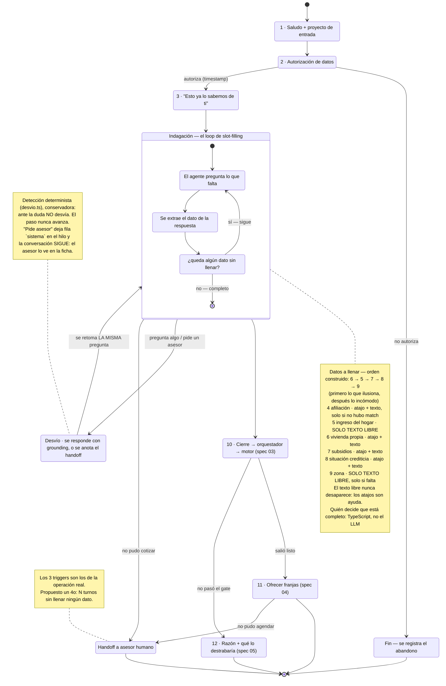

# Spec 02 — Conversador (el workflow de WhatsApp y el agente)

> Borrador v1 · lee primero las [convenciones](README.md#las-dos-capas-de-cada-spec-leer-esto-antes-que-nada).
>
> **Este es el spec donde el equipo quiere entrar a decidir.** Todo lo que sigue sobre nodos, orden, contexto del agente y redacciones es **straw proposal**: existe para que haya algo concreto sobre lo cual discutir encima del diagrama, no para cerrar nada. Su sección [Preguntas al TEAM](#preguntas-al-team) es la más larga del paquete a propósito.

## Qué cubre

El workflow completo de la conversación: qué pasos tiene, quién responde qué, qué ramas existen, cuándo entra un humano, qué sabe el agente y qué significa que "aprenda".

**No cubre:** cómo entra el lead (spec [01](01-ingesta-enriquecimiento.md)), cómo se califica lo que se recogió (spec [03](03-scoring.md)), ni qué proyectos se ofrecen (spec [04](04-match-agenda.md)).

## El QUÉ — lo que la conversación tiene que lograr

Esto sí va firme, porque no lo decidimos nosotros:

| # | Obligación | Fuente |
|---|---|---|
| 1 | Pedir autorización de tratamiento de datos **antes de cualquier otra cosa**, y registrarla con timestamp | Ley 1581 de 2012 · `spec.md §6` · [mentor](../reto/charla-mentor.md#autorizacion-de-datos) |
| 2 | **No repreguntar** ningún dato que el enriquecimiento ya trajo, y que el lead **sepa** que no se lo van a hacer repetir — lo cual no es recitarle su ficha (ver nodo 3) | Criterio de aceptación 1 (`spec.md §5`) |
| 3 | Recoger lo necesario para calificar: ingreso del hogar, vivienda propia, subsidios, situación crediticia, zona | `spec.md §6` (los 4 del [brief:20](../reto/perfilamiento-leads-03.md) + zona para el matcher) |
| 4 | **No sonar a robot ni a formulario.** Que capte la información y filtre hacia la decisión de compra | [Mentor, textual](../reto/charla-mentor.md#conversacion-deseada) |
| 5 | Ser **híbrida**: opciones donde ayudan, texto libre donde la lista sesga | [Mentor](../reto/charla-mentor.md#conversacion-deseada) |
| 6 | Escalar a humano cuando el lead lo pide o cuando la autogestión falla | [Mentor](../reto/charla-mentor.md#click-to-whatsapp) |
| 7 | No inventar nada: ni precios, ni subsidios, ni características de proyectos | `AGENTS.md` (cero caja negra) · [`prompt-experto.ts`](../../lib/matching/prompt-experto.ts) |
| 8 | Primer token en menos de 2s, en streaming | [ADR 0002](../adr/0002-stack-mvp.md) |

Todo lo demás de este documento es el **CÓMO**, y es discutible.

## El CÓMO — straw proposal

### D1 · Quién conduce la conversación · [CERRADA — sala del sábado 25, decisión 1: se queda A]

> **Decidido el 2026-07-25: conduce el código, no el LLM.** A ~30 horas del cierre, con el flujo determinista probado y el tono ya reescrito (los acuses, el "para qué sirve" antes de cada pregunta, el híbrido chips+texto), saltar a B es riesgo puro sin ganancia visible en un video de 2 minutos. La propuesta B se conserva abajo porque es la respuesta correcta si esto sigue después del domingo.

Hay dos formas de construir esto y hoy tenemos una construida:

| | **A — Determinista conduce** (lo que existe) | **B — LLM conduce con guardrails** (propuesta) |
|---|---|---|
| Quién decide el siguiente mensaje | TypeScript, lista fija de preguntas | El LLM, viendo qué datos faltan |
| Rol del LLM | Reescribe el tono de una pregunta ya redactada | Conduce la conversación |
| Quién decide cuándo terminó | TypeScript | TypeScript (mismo validador) |
| Se siente | Correcto pero encuestador | Humano, con riesgo de divagar |
| Si el LLM se cae | No pasa nada, el texto base ya existe | Hay que caer al flujo A |
| Riesgo | Que el mentor diga "esto es lo que ya tengo" | Que se salga del carril delante del jurado |

**Propuesta: B, con el validador determinista intacto.** El LLM decide *cómo y en qué orden* preguntar; TypeScript decide *qué falta* y *cuándo se acabó*. El corte, el puntaje y el match siguen siendo TS puro, así que la restricción de cero caja negra no se toca: el LLM nunca decide si alguien califica.

El argumento a favor es del mentor, no nuestro: rechazó explícitamente *"ese prototipo de chatbot donde la gente se enreda"* y pidió que **enamore**, porque comprar vivienda *"es algo que haces una vez en tu vida"*.

El argumento en contra es el calendario: faltan menos de 48 horas y A ya funciona. **Es una decisión de riesgo, y es del equipo.**

### D2 · Qué sabe el agente al arrancar (el contexto) · [CERRADA — Mani, 2026-07-25]

| Entra al contexto | Por qué | Estado |
|---|---|---|
| Nombre del lead | Para tutearlo por su nombre | Construido |
| `PerfilConocido` (afiliación, ciudad, segmento, rango de ingreso) | Para no repreguntarlo — criterio 1 | Construido, **solo en modo tono** (ver abajo) |
| Proyecto por el que entró | Colsubsidio ya lo hace: [entraste por Araucaria, te habla de Araucaria](../reto/charla-mentor.md#click-to-whatsapp) | Construido — `fichaDeEntrada()` |
| **Los datos que faltan**, como lista explícita | Es el objetivo del turno | Lo lleva TypeScript, no el prompt (D1 = A) |
| Ficha del proyecto de entrada (precio desde, ubicación, VIS) | Para responder "¿cuánto vale?" sin inventar | Construido |
| **Catálogo de los 18 proyectos**, como líneas de consulta | Para responder por CUALQUIER proyecto que la persona nombre, no solo por el de entrada | Construido — `catalogoParaPrompt()` |
| Tabla de subsidios, con su fuente | Para decir la verdad sobre cuál aplica hoy | Construido — [`subsidios.ts`](../../lib/conversacion/subsidios.ts) |
| Historial, si es re-enganche | Para retomar sin repreguntar (spec [05](05-nutricion-reenganche.md)) | Construido |
| Nada del scoring | El agente **no** sabe el puntaje ni la salida: no es su trabajo y no debe insinuárselo al lead | Construido |

**El catálogo completo SÍ entra, y la regla que lo hace seguro no es esconderlo: es prohibir recomendar.** Este párrafo decía lo contrario ("lo que NO entra: el catálogo completo de 18 proyectos"), y el miedo era legítimo — un agente con todos los precios se pone a recomendar en medio de la indagación, y el match es determinista por diseño (spec [04](04-match-agenda.md)). Pero esconderle el catálogo no evita que recomiende: solo lo obliga a decir *"no sé"* cuando alguien pregunta por un proyecto que sí tenemos, que es peor. La frontera quedó en el verbo, no en el dato: **Sara puede CONSULTAR el catálogo (qué vale, dónde queda); comparar, sugerir o decir cuál le conviene está prohibido explícitamente en el prompt.** Recomendar necesita la capacidad de pago ya calculada, y eso no lo tiene ni lo va a tener.

**El perfil del lead NO viaja en modo duda.** El historial sí (es la conversación), pero el `PerfilConocido` no se manda: no hace falta para responder cuánto cuesta un proyecto, y no mandarlo vuelve **imposible** —no solo prohibida— la regla de que nunca le recite sus datos de vuelta. El dato que no está no se filtra. Detalle en [`prompt-maestro.ts`](../../lib/conversacion/prompt-maestro.ts) y en el [ADR 0006](../adr/0006-prompt-maestro-y-desvio.md).

### D3 · Los nodos del workflow · [PROPUESTA — el straw proposal, nodo por nodo]

Numerados para poder discutirlos uno por uno en la reunión:

| # | Nodo | Quién responde | Tipo de input | Rama |
|---|---|---|---|---|
| 1 | **Saludo + proyecto de entrada** | Agente | — | Si no hay proyecto de entrada, saludo genérico |
| 2 | **Autorización de datos** | Lead | Quick reply sí/no | **No → fin.** Se registra el abandono |
| 3 | **"No te voy a hacer repetir"** | Agente | — | Si no hubo match, lo dice: "no encontramos datos tuyos" |
| 4 | **Afiliación** | Lead | Quick reply sí/no | **Solo si el enriquecimiento no la trajo** |
| 5 | **Ingreso del hogar** | Lead | **Texto libre — obligatorio** | [El mentor lo pidió explícito](../reto/charla-mentor.md#conversacion-deseada): la lista sesga |
| 6 | **¿Vivienda propia?** | Lead | Quick reply sí/no | — |
| 7 | **Subsidios** | Lead | Quick reply + texto | Si dice que sí, se indaga cuál |
| 8 | **Situación crediticia** | Lead | Quick reply (al día / con mora / sin historial) | — |
| 9 | **Zona de interés** | Lead | **Texto libre** | Solo si el enriquecimiento no trajo ciudad |
| 10 | **Cierre** | Agente | — | Llama al orquestador → spec [03](03-scoring.md) |
| 11 | **Oferta de franjas** | Lead | Quick reply | **Solo si salió listo** → spec [04](04-match-agenda.md) |
| 12 | **Nutrición honesta** | Agente | — | Si no pasó: la razón + qué lo destrabaría → spec [05](05-nutricion-reenganche.md) |

**El orden 5→9 no es sagrado.** Al reescribir la conversación (2026-07-24) el orden construido pasó a **6 → 5 → 7 → 8 → 9**: primero lo que ilusiona (¿es tu primera vivienda?) y después lo incómodo (ingreso, crédito). Es la respuesta provisional a la pregunta 3 de abajo — *enamora primero, pregunta después* — y el TEAM la puede revertir cambiando el orden de los `pasos.push` en [`preguntas.ts`](../../lib/conversacion/preguntas.ts). Si el LLM conduce (D1 opción B), el orden lo decide él según cómo fluya la conversación, y esta tabla pasa a ser la lista de *lo que hay que llenar*, no de *en qué orden*.

**[HOY — nodo 3, cambiado el 2026-07-24] El agente dice que no repreguntará, pero NO le recita al lead su propia ficha.** La primera versión enumeraba: *"ya sé que eres afiliada a Colsubsidio, estás en Bogotá y tu hogar tiene ingresos entre 3 y 5 SMMLV"*. Suena a expediente y asusta justo en el mensaje que tiene que generar confianza — y el ingreso es el dato que más incomoda oír de vuelta. Ahora el mensaje **dice que sus datos ya están y que no se los vamos a repreguntar**, y **usa** la ciudad en lugar de recitarla (*"empiezo por buscarte opciones en Bogotá"*), que demuestra lo mismo sin sonar a base de datos hablando. El criterio de aceptación 1 se sigue cumpliendo y verificando igual: lo que exige es que el lead **sepa** que no le harán repetir, no que le lean su ficha. La ficha completa la ve **el asesor**, que es para quien es. Hay tests que impiden que el rango de ingreso vuelva a colarse en ese mensaje.

### D4 · Dónde va cerrado y dónde abierto · [CERRADA — el mentor lo especificó]

Su regla, textual: hay que tener **las dos** opciones porque unas personas prefieren escoger y otras escribir o mandar notas de voz. Y hay puntos donde la lista **sesga**:

> *"si tú dices que ganas 500.000 pesos, el listado no tiene esa opción"* · *"si dice que gana más de 10, ¿cuánto es más de 10?"*

Aplicado a nuestros nodos: **abierto en ingreso (5) y zona (9)**; **quick reply en autorización (2), afiliación (4), vivienda (6) y crediticia (8)**; **híbrido en subsidios (7)**.

**[HOY — 2026-07-25] El acuse de la zona responde a lo que la persona dijo, no una plantilla.** Era uno fijo (*"esa zona la tengo bien mapeada"*) y quedaba absurdo cuando nadie había nombrado una zona: a *"espero que tenga excelentes zonas comunes"* le contestaba que la tenía bien mapeada. Ahora se distinguen cuatro casos, con datos que ya tenemos: **ciudad del catálogo** → se le dice cuántos proyectos hay ahí y se guarda la ciudad **limpia** (no la frase entera, que es lo que el matcher filtra); **barrio conocido** → se nombra; **ciudad donde no hay proyectos** → se dice de frente y se listan las que sí; **un deseo en vez de un lugar** → se le acusa el deseo y se explica que se buscará en todas. Además es el único acuse que **pasa por el LLM** (`Respuesta.pulir`), porque es la respuesta más impredecible del set y ahí sí vale la latencia — con el mismo blindaje de 3s, que cae a este texto.

**[HOY — así está construido, desde 2026-07-24]** Se implementó más literal que la línea de arriba: salvo la autorización (que es un acto jurídico y va solo por botón), **todos los pasos aceptan texto libre siempre** y los chips quedan como atajo visible al lado del input. Escribir *"ya tengo apartamento"* vale exactamente lo mismo que tocar el chip: los dos caminos entran por el mismo `Respuesta { patch, acuse }`, así que nadie queda atrapado porque su caso no estaba en la lista. Ingreso y zona siguen sin chips a propósito. Cubierto por [`preguntas.test.ts`](../../lib/conversacion/preguntas.test.ts).

### D5 · Qué significa que el agente "aprende" · [PROPUESTA — resuelve una tensión real]

El equipo pidió "aprendizaje autónomo: las conversaciones no son estáticas siempre". Eso choca de frente con la restricción de **cero caja negra** si se entiende como el sistema ajustándose solo. Propuesta de qué significa honestamente, en tres niveles:

1. **Adaptación por conversación** (existe ya): las preguntas dependen de lo que se sabe del lead. Dos personas no viven la misma conversación. *Esto es lo que hoy llamamos "adaptativo" y es real.*
2. **Grounding actualizable** (barato, propuesto): el catálogo, la tabla de subsidios y los textos viven en datos, no en el prompt. Se editan y el agente los usa en el siguiente mensaje, sin tocar código. *Esto es lo que hace que el sistema no envejezca.*
3. **Recalibración offline** (el honesto): un humano revisa transcripts y métricas de conversación —dónde abandonan, qué pregunta cuesta más— y ajusta prompts o pesos **en un commit que se puede leer y revertir**.

**Lo que proponemos NO hacer: aprendizaje en línea.** Que el sistema ajuste solo sus pesos o sus reglas es indefendible ante un jurado que pregunte "¿por qué este lead quedó así?", y rompe la constitución del proyecto. Si el equipo quiere venderlo como "aprende", el nivel 3 es defendible y honesto: **el sistema mejora con el uso, pero cada cambio tiene un autor y una fecha.**

### D6 · Cuándo entra un humano · [CERRADA — mentor, para los tres primeros]

Los tres triggers son literales de la operación de hoy ([detalle](../reto/charla-mentor.md#click-to-whatsapp)):

1. **No pudo agendar.** 🟢 Construido: si `/api/citas` no da franjas, se dice y se pasa a asesor, sin fingir la cita.
2. **No pudo cotizar.**
3. **Pide hablar con un asesor** habiendo explorado las opciones. 🟢 **Construido el 2026-07-25.**

**[HOY — trigger 3, 2026-07-25]** Lo detecta [`detectarDesvio()`](../../lib/conversacion/desvio.ts) sobre lo que la persona teclea, con una heurística **determinista y conservadora**: la palabra *asesor*, *humano*, *persona real*, o una forma explícita de pedir que la llamen. Ante la duda no desvía — desviar de más rompe la conversación (le consume el paso a alguien que sí estaba contestando), desviar de menos deja el comportamiento de antes. Lo que pasa cuando se dispara:

- se le responde que sí, y el hilo guarda una fila **`sistema`** con la petición, así que **el asesor la ve en la ficha** (ADR 0003) — el handoff no depende de que alguien lea el chat;
- **la conversación sigue**, y esto es deliberado: en el demo no hay humano al otro lado (pregunta 10), y cada dato que se alcance a saber antes de la llamada es un dato que la persona no repetirá. Cortar ahí le costaría a ella, no a nosotros;
- el paso pendiente **no se pierde**: lo retoma el código, no el modelo.

**[PROPUESTA]** Un cuarto: **N turnos sin que se llene ningún dato nuevo**. Protege contra el lead que se enreda, que es justo lo que el mentor no quiere. Falta decidir N (¿3?) y qué pasa en el demo, donde no hay humano al otro lado — probablemente un mensaje honesto de "te contacta un asesor" y el lead entra a la cola marcado.

### D7 · El fallback determinista · [HOY — así está construido]

Si el primer token no llega en 3 segundos, [`ChatWhatsApp.tsx`](../../components/chat/ChatWhatsApp.tsx) aborta y pinta el texto determinista. Se puso por el cold start de Vertex (~7s) y **es lo que blinda el demo**.

Si el equipo aprueba D1-B, este flujo **deja de ser el primario y pasa a ser la red**. Eso es un cambio de rol importante: hoy el fallback es idéntico al camino feliz; con B, el fallback es visiblemente más pobre que la conversación buena. Hay que decidir si eso es aceptable en el video.

## Estado hoy vs contrato

De las tres brechas de datos que rompían el motor, **dos se cerraron el 2026-07-24** al reescribir la conversación (rama `feat/conversacion-humana`); la tercera sigue abierta, y el 2026-07-25 apareció una cuarta:

| # | Qué dice el contrato | Qué pasa hoy | Consecuencia |
|---|---|---|---|
| 1 | El motor necesita `ingreso_hogar_mensual` (un **número**) para el gate del 40% | 🟡 **Cerrada con las dos opciones de la pregunta 6, a falta de ratificar:** el texto libre se parsea a monto (`parsearIngresoMensual` entiende "4.500.000", "2 millones y medio", "3 salarios mínimos", "entre 2 y 3"), y cuando el enriquecimiento trajo el rango se usa su **punto medio** sin repreguntar. Si la frase queda ambigua ("depende del mes") no se adivina: se guarda solo el texto | Deja de caer todo el mundo a nutrición. **El TEAM aún decide si el punto medio es aceptable** o prefiere preguntar el monto también a quien ya tiene rango |
| 2 | El motor resta `subsidio_monto_mensual` de la cuota | 🔴 **Abierta.** Se pregunta qué subsidios tiene, pero nunca el monto (es la pregunta 7 al TEAM) | El subsidio **nunca** baja la cuota. El factor existe y no puede cambiar el resultado |
| 3 | `situacion_crediticia` es un enum (`buena`/`regular`/`mala`/`sin_info`) | 🟢 **Cerrada.** Cuatro chips que llevan el enum en el valor, y el texto libre se normaliza contra los mismos cuatro casos | El motor recibe la categoría que espera, venga de chip o de texto |

| 4 | El ingreso que entra al gate tiene que ser el que la persona **quiso decir** | 🔴 **Abierta (hallada el 2026-07-25).** No se valida ni se confirma: `2+2` → **$2.000.000**, `-3` → $3.000.000, `999999999999` pasa entero, y `no sé` / `depende del mes` **no se repregunta**. Encima el acuse contesta *"con eso ya puedo calcular con números reales"*. ⚠️ **No lo arregla el system prompt** (existe, son 28 líneas y es estricto): el parseo es TS puro y el LLM no está en ese camino | Es el insumo del **único gate legal** del sistema: un número mal entendido cambia el veredicto y nadie se entera → [ticket 024](../tasks/024-confirmacion-del-ingreso.md) |

| Otras brechas | Hoy | Dónde |
|---|---|---|
| `afiliado_autoreportado` | 🟢 **Resuelto por decisión, no por código (2026-07-25): la afiliación NUNCA se pregunta.** Sale de la cédula, que es lo que hace Colsubsidio en la vida real; sin match se asume no afiliado, que es el caso conservador. El campo queda en el tipo sin que nadie lo escriba | D3 nodo 4 |
| Cierre de la conversación | 🟢 **Cerrado el 2026-07-24.** Llama a [`/api/curar`](../../app/api/curar/route.ts): califica con el motor, matchea y persiste el lead **con su hilo completo** en Supabase | [Ticket 006](../tasks/006-orquestador.md) |
| Oferta de franjas | 🟢 **Cerrado el 2026-07-24.** Al cerrar, el chat ofrece 3 franjas de la sala de ventas del proyecto recomendado y persiste la elegida (`POST /api/citas`). Si fallan, lo dice y pasa a asesor humano — no finge una cita | [Ticket 005](../tasks/005-agendador.md) |
| Re-enganche | 🟢 **Cerrado el 2026-07-24.** El chat lee `?lead_id=`, retoma nombrando la razón original y pregunta solo lo que pudo cambiar | [Ticket 007](../tasks/007-reenganche-nutricion.md) |

## Diagrama

> **Fallback:** en cualquier punto de la indagación, si el LLM no da el primer token en 3s, se sirve el texto determinista y la conversación sigue. No es un estado del diagrama: es una red debajo de todos ellos.

## Preguntas al TEAM

**Sobre la arquitectura**

1. ~~**¿LLM conduce (B) o determinista conduce (A)?**~~ (D1) **Resuelto (sala del sábado 25, decisión 1): se queda A.** No gastar reunión aquí.
2. ~~**¿Qué entra al contexto del agente?**~~ (D2) **Cerrada (Mani, 2026-07-25): entra el catálogo completo, como consulta.** La regla que lo hace seguro no es esconder el dato sino prohibir el verbo — Sara consulta precios y ubicaciones, y tiene prohibido recomendar o comparar. Ver D2 y el [ADR 0006](../adr/0006-prompt-maestro-y-desvio.md).

**Sobre los nodos**

3. **¿El orden 5→9 se mantiene, o el ingreso se pregunta más tarde?** El orden vigente ya pone primero lo que ilusiona (¿primera vivienda?) y después lo incómodo (ingreso, crédito). Confirmar que así se queda.
4. ~~**¿Se pregunta la afiliación explícitamente?**~~ (D3 nodo 4) **Resuelto (sala del sábado 25, decisión 6): NO se pregunta nunca.** La cédula es la fuente — es lo que hace Colsubsidio en la vida real, y el mentor lo describió así: si eres afiliado *no te piden nada más* porque ya tienen la data. Sin match se asume no afiliado (caso conservador) y el asesor lo ve en la ficha.
5. **¿Cuántos turnos puede durar la conversación?** Nadie fijó un techo. El mentor mide la duración promedio como métrica.

**Sobre las brechas de datos**

6. ~~**¿Cómo obtenemos el ingreso como número?**~~ (brecha 1) **Cerrada el 2026-07-24:** `parsearIngresoMensual()` entiende montos, millones y salarios mínimos; a quien ya trajo rango del enriquecimiento se le toma el punto medio.
7. **🔴 ABIERTA — ¿preguntamos el monto del subsidio?** (brecha 2) Es la única de las tres que sigue viva: sin monto, el subsidio nunca baja la cuota y el factor aporta 0 a todo lead real (15 puntos que nadie puede ganar). Es el ticket [017](../tasks/017-tabla-subsidios.md).
8. ~~**¿Quick reply o normalización para la situación crediticia?**~~ (brecha 3) **Cerrada el 2026-07-24:** chips con el enum + normalización del texto libre.

**Sobre el agente**

9. **¿Estamos de acuerdo con qué significa "aprende"?** (D5) ¿Vendemos el nivel 3 (recalibración offline con autor y fecha) o alguien esperaba algo más?
10. **¿Qué hace el handoff a humano en el demo,** donde no hay humano? (D6)
11. **¿Es aceptable que el fallback se vea más pobre que la conversación buena?** (D7)

**Vacíos que nadie ha respondido**

12. ~~**¿Notas de voz?**~~ **[CERRADA — 2026-07-25: se contesta hablando.]** El mentor las había puesto sobre la mesa (*"unas personas prefieren escoger y otras escribir o mandar notas de voz"*, D4). Hay un botón de micrófono al lado del campo: el navegador transcribe en vivo (Web Speech API, `es-CO`) y el texto cae en el input, donde la persona lo puede corregir antes de enviar. Entra por el **mismo** `interpretarTexto` que una respuesta escrita — el motor no se entera de que fue dictada.
    - **Cómo se dice sin sobrevender:** es **dictado transcrito en el navegador**, no una nota de voz almacenada. Ningún audio se sube ni se guarda. En producción, WhatsApp entrega el audio y se transcribe igual, así que el punto de entrada al flujo es el mismo — eso es lo honesto que se puede afirmar en el pitch.
    - **Degrada sin ruido:** si el navegador no soporta la API (Firefox) el botón no se pinta, y si la persona niega el micrófono no se insiste. El campo de texto siempre está — es la regla del repo, y aquí también manda.
    - **Por qué vale más que un adorno:** el brief es de propósito social. Alguien en una obra, manejando, o con poca práctica escribiendo, puede contestar hablando. Cubierto por [`dictado.test.tsx`](../../components/chat/dictado.test.tsx).
13. ~~**¿Qué pasa si el lead pregunta algo que no sabemos** (una fecha de entrega, un acabado)?~~ **[CERRADA — 2026-07-25: decir "no sé" es la respuesta correcta, no un fracaso.]** Antes ni siquiera llegaba a ser un problema de política: la pregunta se consumía como respuesta al paso actual y se parseaba como si fuera el dato pedido. Ahora se detecta como desvío y se responde, y la política vive en dos sitios que dicen lo mismo:
    - **En el prompt** (`promptDuda`, [`prompt-maestro.ts`](../../lib/conversacion/prompt-maestro.ts)): un bloque *SI NO SABES* explícito — *"esa no la tengo a la mano y prefiero no inventarte nada; el asesor te la confirma"* vale más que un dato inventado. Se prohíbe nombrar fechas de entrega, acabados, áreas, tasas y plazos, porque nada de eso está en el grounding.
    - **Sin LLM**, en `respuestaDeterministaDuda()`: lo que se puede afirmar sale del catálogo real (precio *desde*, ciudad, zona) o de la tabla de subsidios con fuente; **el resto se contesta con un "no te la puedo confirmar sin inventarte nada", y queda anotada para el asesor.** El subsidio es el caso ejemplar: se responde para qué sirve y quién lo puede pedir, **sin monto**, porque las fuentes públicas se contradicen ([`subsidios.ts`](../../lib/conversacion/subsidios.ts)).

## Fuentes

- [`spec.md §4` paso 3, `§5` criterio 1, `§6`](../spec.md) — la conversación adaptativa, qué se pregunta.
- [Charla con el mentor](../reto/charla-mentor.md#conversacion-deseada) — no robotizado, híbrido, dónde abrir; [handoff](../reto/charla-mentor.md#click-to-whatsapp); [autorización](../reto/charla-mentor.md#autorizacion-de-datos).
- [brief:20](../reto/perfilamiento-leads-03.md) — los 4 datos de capacidad de compra, "sin sentirse como un interrogatorio".
- Código: [`lib/conversacion/preguntas.ts`](../../lib/conversacion/preguntas.ts), [`ChatWhatsApp.tsx`](../../components/chat/ChatWhatsApp.tsx), [`app/api/chat/route.ts`](../../app/api/chat/route.ts).
- [ADR 0002](../adr/0002-stack-mvp.md) — streaming, primer token < 2s.
