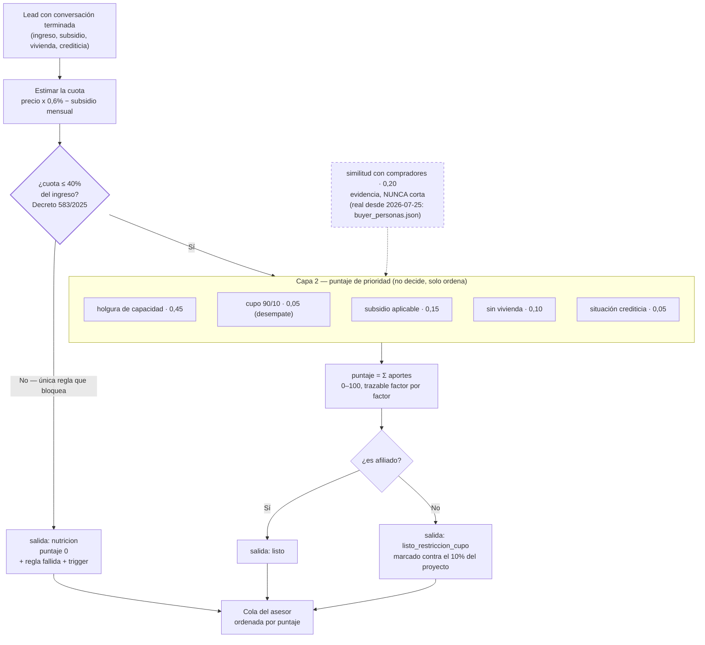

# Spec 03 — Motor de scoring y corte

> Borrador v1 · lee primero las [convenciones](README.md#las-dos-capas-de-cada-spec-leer-esto-antes-que-nada): el **QUÉ** va firme con su fuente, el **CÓMO** es propuesta.
> Este spec se escribió primero porque fija el vocabulario que usan los demás: **factor**, **gate**, **salida**, **puntaje**.

## Qué cubre

Lo que pasa entre "la conversación terminó" y "el lead tiene una etiqueta y un orden en la cola": los factores que se evalúan, cuál bloquea y cuál solo pesa, y en qué salida cae cada lead.

**No cubre:** qué se le pregunta al lead (spec [02](02-conversador.md)), qué proyectos se le recomiendan (spec [04](04-match-agenda.md)), ni cómo se presenta en pantalla (spec [06](06-dashboard-asesor.md)).

## Contrato

### D1 · El motor tiene dos capas y solo una bloquea · [CERRADA — `spec.md §4` + Decreto 583 de 2025]

**Capa 1, el gate legal.** La primera cuota estimada no puede superar el **40% del ingreso del hogar**. No es criterio del equipo: el [Decreto 583 de 2025](https://minvivienda.gov.co/normativa/decreto-0583-2025) modificó el art. 2.1.11.1 del Decreto 1077 de 2015 y lo fijó ahí, sin distinción VIS / no VIS. Si se supera, el banco legalmente no puede prestar. **Es lo único que manda a alguien a nutrición.**

**Capa 2, el puntaje.** Para quien pasa el gate, un compuesto ponderado 0–100 que **ordena** la cola del asesor. El puntaje **no decide nada**: no cambia la salida, no descarta, no bloquea.

Ejemplo completo, para que se vea que no hay caja negra (lead con ingreso $4.000.000, proyecto de $149.000.000, sin subsidio):

```
cuota estimada = 149.000.000 × 0,6%  = 894.000
cuota / ingreso = 894.000 / 4.000.000 = 22,4%   ≤ 40%  → pasa el gate
holgura = (40% − 22,4%) / (40% − 20%) = 0,88     → aporta 0,45 × 0,88 × 100 = 39,6 puntos
```

### D2 · Cómo se estima la cuota · [HOY — así está construido, ratificar]

`cuota estimada = precio × 0,6% − subsidio mensual`. El 0,6% aproxima una cuota de crédito hipotecario a 20 años sobre el 70% del valor. Está declarado en el código como heurística, no como fórmula bancaria certificada ([`lib/scoring/config.ts`](../../lib/scoring/config.ts)).

**Esto necesita un sí o un no del equipo**, idealmente contra alguien que sepa de crédito hipotecario. Es el número del que cuelga el gate entero.

### D3 · Siete factores visibles, seis con peso · [CERRADA — `spec.md §4`]

Todos los factores que el motor evalúa se muestran. Ninguno se filtra de la pantalla — ese es el criterio de aceptación 2.

| # | Factor | Qué es | Peso | Bloquea? |
|---|---|---|---|---|
| 1 | `afiliacion` | Afiliado o no. Determina **cuál** de las dos salidas de "listo" | sin peso propio | No |
| 2 | `cuota_ingreso_40` | El gate legal + la holgura como señal | **0,45** | **Sí** |
| 3 | `cupo_90_10` | Cupo de no afiliados que le queda al proyecto | **0,05** — desempate | No |
| 4 | `similitud_compradores_reales` | Parecido con quienes ya compraron ahí | 0,20 | No |
| 5 | `subsidio_aplicable` | Cuánto de la cuota cubre el subsidio | 0,15 | No |
| 6 | `ya_tiene_vivienda` | Propósito social: prioriza a quien no tiene | 0,10 | No |
| 7 | `situacion_crediticia` | Autorreportada. Señal, no verificación (DataCrédito está fuera de alcance) | 0,05 | No |

La afiliación **no tiene peso propio a propósito**: su efecto en el puntaje viaja dentro de `cupo_90_10`. Si tuviera peso además, contaría doble.

La similitud **nunca corta**. `spec.md §4` la define como *evidencia de respaldo*, no como criterio. Un lead no se cae por no parecerse a los compradores de un proyecto.

### D4 · Los pesos son propuestos, no ratificados · [PROPUESTA — TEAM decide]

Los seis pesos (0,45 / 0,20 / 0,15 / 0,10 / 0,05 / 0,05) suman 1,0 y están escritos en [`config.ts`](../../lib/scoring/config.ts) con el comentario "PROPUESTOS, no definitivos". [`spec.md §7`](../spec.md) lo tiene como supuesto abierto: *"el qué se evalúa está cerrado; el cuánto pesa y dónde cae la línea, no"*.

**Este spec es donde el equipo los firma o los cambia.** El orden actual dice, en palabras: *primero, y por encima de todo, cuánto margen le sobra para pagar; después si se parece a quienes ya compraron ahí; después el subsidio; y de últimas, empatadas y casi sin peso, su situación crediticia autorreportada —porque nadie la verificó— y su afiliación*. Si el equipo no está de acuerdo con esa frase, el que cambia es el peso.

**[CERRADA — Mani, 2026-07-24] La afiliación pasó de 0,20 a 0,05: es desempate, no criterio.** Con 0,20 era el segundo factor más pesado y un afiliado arrancaba **18 puntos** arriba, así que la afiliación reordenaba la cola por sí sola. Contradice al mentor, textual: *"la prioridad siempre son los afiliados, PERO siempre va a ser la prioridad de los ingresos"* ([detalle](../reto/charla-mentor.md#90-10-e-ingresos)); a Colsubsidio le interesa cerrar la venta. Los 0,15 liberados se fueron íntegros a la holgura de capacidad. Medido después del cambio: dos perfiles idénticos que solo difieren en afiliación quedan a **4,5 puntos** (75 vs 71), y un no afiliado con $12M le gana a un afiliado con $2,6M (71 vs 42).

### D5 · Dos observaciones aritméticas que el equipo debería conocer · [HOY — verificable sumando]

1. **[SUPERADA el 2026-07-25 — la similitud es real.]** ~~Nadie puede sacar 100: la similitud está fija en 0,5.~~ El [ticket 016](../tasks/016-distribuciones-por-proyecto.md) se cerró: `similitudCon()` ([`lib/scoring/similitud.ts`](../../lib/scoring/similitud.ts)) compara al lead contra las distribuciones reales por proyecto (`data/sintetica/buyer_personas.json`, derivado del PPT de buyer personas) en afiliación, banda SMLV, edad y composición del hogar, y **cita sus % en el factor**. Sigue sin cortar jamás. Solo cae al 0,5 neutro cuando el proyecto no tiene distribución confiable (Zarzal sin slide; Abeto/Vibonce/Araucaria/Los Nogales/Karakali marcados `confiable: false` por la nota de extracción del md) — un lead nunca se castiga por un hueco del PPT.
2. **Un no afiliado tiene techo 87,5.** `cupo_90_10` para un no afiliado da como máximo señal 0,5, o sea 2,5 de sus 5 puntos. Un afiliado y un no afiliado idénticos en todo lo demás quedan separados por **2,5 a 4,5 puntos** según el cupo que le quede al proyecto — el desempate que pidió el mentor, no una condena (antes eran 10 a 18 puntos).

Ninguna de las dos es un bug: la primera es un provisional declarado, la segunda es la regla 90/10 expresándose en la prioridad. **Pero las dos son decisiones**, y hoy nadie las ratificó. Con ellas encima, la pregunta al equipo es si el techo móvil confunde al asesor.

### D6 · Una sola escala de puntaje · [CERRADA — 2026-07-24 15:20, ya no hay decisión que tomar]

> ⚠️ **Esta decisión aparecía como "la más urgente del spec" y ya estaba resuelta en el código.** Se dejó aquí escrita como pendiente y el equipo iba a gastar reunión en ella. Lo verificó la auditoría del 2026-07-24: `lib/scoring/puntaje.ts` **no existe**.

Convivieron dos cálculos para el mismo lead —`Score.puntaje` (continuo, pesos de `config.ts`, el que guarda Supabase) y `calcularPuntaje()` de `puntaje.ts` (binario sobre `factor.cumple`, pesos propios, el que veía **toda la UI**)— y el asesor veía en pantalla un número que el motor nunca calculó.

**Se cerró borrando el binario.** La escala canónica es la del motor: continua, porque distingue "apenas pasa" de "pasa con mucho margen", que es justo lo que sirve para priorizar una cola. Hoy `agrupadores.ts::puntajeDe`, `FilaLeadPuntaje.tsx`, `FichaLead.tsx` y `TablaPuntaje.tsx` leen `curado.score.puntaje` directo, y `TablaPuntaje` pinta `peso% × señal%` en vez de "cumple / no cumple".

Por qué el binario además era *peor* y no solo distinto: `cuota_ingreso_40` (35 de sus 100 puntos) y `cupo_90_10` (10) leían `factor.cumple`, que el motor deja **siempre en `true`** para quien ya pasó el gate. O sea 45 de 100 puntos no diferenciaban entre ningún lead "listo": la holgura real no pesaba nada en el número que ordenaba la cola.

### D7 · Las tres salidas · [CERRADA — `spec.md §4`]

| Salida | Quién cae ahí | Qué pasa |
|---|---|---|
| `listo` | Afiliado que pasa el gate | Match + cita + tope de la cola |
| `listo_restriccion_cupo` | No afiliado que pasa el gate | Igual, marcado contra el 10% del proyecto |
| `nutricion` | Quien no pasa el gate | Razón + trigger de recontacto (spec [05](05-nutricion-reenganche.md)) |

**No existe "descartado".** Contradice el propósito social del reto.

### D8 · Propenso / no propenso como capa de presentación · [PROPUESTA]

El mentor pidió dos categorías para el asesor: [propenso a comprar o no](../reto/charla-mentor.md#lo-que-ve-el-asesor). Nuestras tres salidas mapean así:

```
propenso     = listo + listo_restriccion_cupo
no propenso  = nutricion
```

**Es solo vocabulario de pantalla; el motor no cambia.** La propuesta es adoptar las palabras del mentor arriba y conservar las tres salidas como sub-secciones (ver spec [06](06-dashboard-asesor.md) D1). Riesgo que el equipo debe sopesar: "no propenso" suena a descarte y nuestro discurso entero es que nadie se descarta.

### D9 · El 90/10 se marca en el motor y bloquea en el matcher · [HOY — así está construido]

El motor **nunca** bloquea por cupo: `cupo_90_10` siempre marca `cumple: true` y solo baja la señal. Quien deja a un no afiliado sin proyectos es el matcher (spec [04](04-match-agenda.md) D2).

Es coherente con lo que dijo el mentor: [la prioridad son los afiliados, pero "siempre va a ser la prioridad de los ingresos"](../reto/charla-mentor.md#90-10-e-ingresos). El motor mide capacidad; el cupo es una restricción de inventario que se aplica después.

### D10 · El LLM nunca puntúa · [CERRADA — `AGENTS.md` + ADR 0002]

El motor es TypeScript puro, determinista, sin red. La IA solo **redacta** explicaciones sobre números ya calculados. Un puntaje que salga de un modelo no se puede auditar y rompe la restricción de cero caja negra.

## Estado hoy vs contrato

| Qué | Hoy | Brecha |
|---|---|---|
| Gate del 40% | Funciona, con la norma citada en el texto del factor | — |
| 7 factores visibles | Los 7 se emiten y la ficha los recorre con `.map()` | — |
| Similitud real | 🟢 **Encendida (2026-07-25):** compara contra las distribuciones reales por proyecto y el factor cita sus % ("Fit 74% … el 91% gana hasta 2 SMLV, como tu hogar"). Neutra 0,5 solo sin distribución confiable, y lo dice | [016](../tasks/016-distribuciones-por-proyecto.md) y [018](../tasks/018-similitud-en-explicacion.md) done |
| Escala del puntaje | 🟢 **Una sola** (D6) | — |
| Pesos ratificados | No | Kickoff |
| Subsidio | El motor resta `subsidio_monto_mensual`, pero nadie lo llena. **El factor ya no dice "Aplica" con aporte 0 en silencio:** dice "Declarado … sin monto verificado todavía, así que NO baja la cuota estimada ni suma puntos" | Tabla de subsidios, [017](../tasks/017-tabla-subsidios.md) |
| Regla fallida | 🟢 Se guarda **redactada** (`"Tope del 40% (Decreto 583 de 2025) — Cuota estimada $… = …% del ingreso"`), no con el nombre técnico del factor, que es lo que el asesor leía crudo en la ficha | — |
| Trigger de nutrición | 🟢 Trae **el número que lo destraba**: a cuánto tiene que llegar el ingreso del hogar y cuánto le falta, derivado del gate — no una condición genérica | — |

## Diagrama



Leer el diagrama: **solo el rombo del 40% tiene poder de decisión.** Todo lo demás produce un número que ordena. La similitud entra punteada porque es evidencia y porque hoy es provisional.

## Preguntas al TEAM

1. **¿Ratificamos el 0,6% como estimador de la cuota?** (D2) Es el número del que depende todo el gate. ¿Alguien puede validarlo con un asesor financiero antes del domingo?
2. ~~**¿Cuál escala de puntaje es la canónica?**~~ (D6) **Ya no es pregunta: hay una sola desde el 2026-07-24.** No gastar reunión aquí.
3. **¿Los pesos quedan como están?** (D4) Si alguien no está de acuerdo con la frase "la situación crediticia es lo que menos pesa porque nadie la verificó", hay que cambiarla.
4. **¿Molesta que el techo del puntaje sea 90 (y 80 para no afiliados)?** (D5) ¿Se normaliza sobre lo evaluable, se declara en pantalla, o se deja así?
5. **¿Adoptamos "propenso / no propenso"?** (D8) Son las palabras del mentor, pero chocan con "nadie se descarta".
6. **¿Qué pasa con un lead que pasa el gate contra un proyecto y no contra otro?** El motor califica `(lead, proyecto)`, o sea el puntaje depende del proyecto contra el que se corra. Hoy nadie definió cuál es "el" proyecto de referencia cuando el lead no preguntó por ninguno. **Vacío real, sin respuesta en el canon.**
7. **¿El asesor puede ver el puntaje sin su desglose en algún lado?** Hoy no, y `DESIGN.md` lo prohíbe. Confirmar que nadie quiere un "score grande" en la bandeja.

## Fuentes

- [`spec.md §4`](../spec.md) — las 3 salidas, la tabla de factores, la similitud como evidencia.
- [`spec.md §7`](../spec.md) — umbral y pesos, marcados como supuesto por validar.
- [Decreto 583 de 2025](https://minvivienda.gov.co/normativa/decreto-0583-2025) — el tope del 40%.
- [Charla con el mentor](../reto/charla-mentor.md#90-10-e-ingresos) — la prioridad de los ingresos; [las dos categorías](../reto/charla-mentor.md#lo-que-ve-el-asesor).
- Código: [`lib/scoring/index.ts`](../../lib/scoring/index.ts), [`config.ts`](../../lib/scoring/config.ts), [`puntaje.ts`](../../lib/scoring/puntaje.ts).
- [`AGENTS.md`](../../AGENTS.md) — cero caja negra; [ADR 0002](../adr/0002-stack-mvp.md) — scoring sin LLM.
