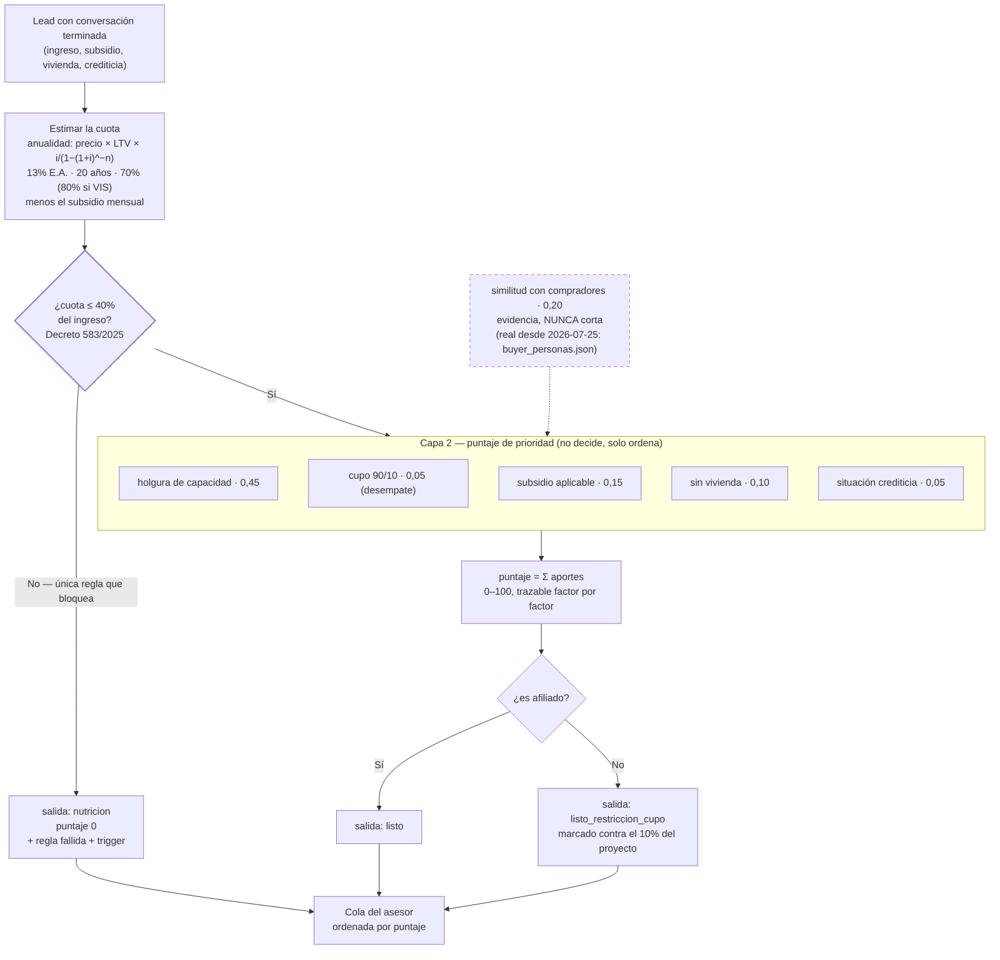

# Spec 03 — Motor de scoring y corte

> Borrador v1 · lee primero las [convenciones](README.md#las-dos-capas-de-cada-spec-leer-esto-antes-que-nada): el **QUÉ** va firme con su fuente, el **CÓMO** es propuesta.
> Este spec se escribió primero porque fija el vocabulario que usan los demás: **factor**, **gate**, **salida**, **puntaje**.

## Qué cubre

Lo que pasa entre "la conversación terminó" y "el lead tiene una etiqueta y un orden en la cola": los factores que se evalúan, cuál bloquea y cuál solo pesa, y en qué salida cae cada lead.

**No cubre:** qué se le pregunta al lead (spec [02](02-conversador.md)), qué proyectos se le recomiendan (spec [04](04-match-agenda.md)), ni cómo se presenta en pantalla (spec [06](06-dashboard-asesor.md)).

## Contrato

### D1 · El motor tiene dos capas y solo una bloquea · [CERRADA — `spec.md §4` + Decreto 583 de 2025]

**Capa 1, el gate legal.** La primera cuota estimada no puede superar el **40% del ingreso del hogar**. No es criterio del equipo: el [Decreto 583 de 2025](https://minvivienda.gov.co/normativa/decreto-0583-2025) modificó el art. 2.1.11.1 del Decreto 1077 de 2015 y lo fijó ahí, sin distinción VIS / no VIS. Si se supera, el banco legalmente no puede prestar. **Es lo único que manda a alguien a nutrición.**

**Capa 2, el puntaje.** Para quien pasa el gate, un compuesto ponderado 0–100 que **ordena** la cola del asesor. El puntaje **no decide nada**: no cambia la salida, no descarta, no bloquea.

Ejemplo completo, para que se vea que no hay caja negra (lead con ingreso $4.000.000, proyecto de $149.000.000, sin subsidio):

```
capital        = 149.000.000 × 80%            = 119.200.000   (VIS financia el 80%)
tasa mensual   = (1 + 13% E.A.)^(1/12) − 1    = 1,0237%
cuota estimada = capital × i / (1 − (1+i)^−240) = 1.336.291
cuota / ingreso = 1.336.291 / 4.000.000        = 33,4%   ≤ 40%  → pasa el gate
holgura = (40% − 33,4%) / (40% − 30%) = 0,66    → aporta 0,45 × 0,66 × 100 = 29,7 puntos
```

### D2 · Cómo se estima la cuota · [CERRADA — 2026-07-25, con fuentes]

**Se calcula la cuota de verdad, con la fórmula de anualidad:**

```
cuota = precio × LTV × i / (1 − (1+i)^−n)      menos el subsidio mensual
```

Cada parámetro tiene fuente ([investigación completa](../credito-y-subsidios.md)), y vive en [`config.ts`](../../lib/scoring/config.ts) → `CREDITO`:

| Parámetro | Valor | De dónde sale |
|---|---|---|
| Tasa | **13% E.A.** | Promedio del mercado colombiano 2026. La ponderada de no VIS que reporta la Superfinanciera es 15,18%; el rango va de 10,93% a 17,75%. Se toma el promedio, no el extremo bajo |
| Plazo | **20 años** | El estándar de un crédito hipotecario |
| LTV | **70% / 80% VIS** | **El mismo Decreto 583 de 2025** que fija el tope del 40%. No es supuesto nuestro |

> 🔴 **Antes esto era `precio × 0,6%` y estaba mal.** Aquel número decía aproximar "20 años sobre el 70% del valor" y no daba: con la anualidad, el 0,6% equivale a una tasa del **8,66% E.A.**, que no existe hoy en el mercado —ni estirando el plazo a 30 años se llega—. Subestimaba la cuota entre 25% y 45%, así que **el motor aprobaba a quien el banco iba a rechazar**: el error más caro que puede tener un producto cuya promesa es "capacidad validada contra reglas explícitas".

**Ojo con la consecuencia contraintuitiva del LTV:** una VIS financia **más** (80%), así que a igual precio **su cuota mensual es más alta** y el techo del lead es más bajo. Por eso el filtro del matcher calcula el máximo **por proyecto** y no con un número plano (spec 04, obligación 3).

**Lo que sigue siendo aproximación, y se dice:** la cuota **no incluye los seguros** de vida deudor e incendio/terremoto, que el banco cobra en el mismo recibo. La cuota real es algo mayor que la estimada.

### D3 · Siete factores visibles, seis con peso · [CERRADA — `spec.md §4`]

Todos los factores que el motor evalúa se muestran. Ninguno se filtra de la pantalla — ese es el criterio de aceptación 2.

| # | Factor | Qué es | Peso | Bloquea? |
|---|---|---|---|---|
| 1 | `afiliacion` | Afiliado o no. Determina **cuál** de las dos salidas de "listo" | sin peso propio | No |
| 2 | `cuota_ingreso_40` | El gate legal + la holgura como señal | **0,45** | **Sí** |
| 3 | `cupo_90_10` | Cupo de no afiliados que le queda al proyecto | **0,05** — desempate | No |
| 4 | `similitud_compradores_reales` | Parecido con quienes ya compraron ahí | 0,20 | No |
| 5 | `subsidio_aplicable` | Cuánto de la cuota cubre el subsidio | 0,15 | No |
| 6 | `ya_tiene_vivienda` | Propósito social: prioriza a quien no tiene | 0,10 | No |
| 7 | `situacion_crediticia` | Autorreportada. Señal, no verificación (DataCrédito está fuera de alcance) | 0,05 | No |

La afiliación **no tiene peso propio a propósito**: su efecto en el puntaje viaja dentro de `cupo_90_10`. Si tuviera peso además, contaría doble.

**[HOY — 2026-07-25] Tres de los siete son INFORMATIVOS y la ficha los muestra como tales.** `afiliacion`, `cupo_90_10` y `similitud_compradores_reales` no tienen sentido de cumple / no cumple: informan. Llevaban `cumple: true` para decir "no bloquea", y la ficha lo pintaba como un **"✓ Cumple" verde al lado de "No afiliado a Colsubsidio"** — una contradicción en la pantalla que sostiene la restricción de cero caja negra. Ahora `FactorScore` tiene `informativo?: boolean` y esos tres se rinden como *"Informativo"*, neutro. Los que sí evalúan (cuota, subsidio, vivienda, crediticia) conservan su cumple / no cumple, y el conteo *"X de Y factores cumplen"* de la ficha ya no los infla.

**Y la fuente de la afiliación dice la verdad.** Cuando el enriquecimiento no encuentra la cédula, el motor **asume** no afiliado (`afiliadoEfectivo`) porque la pregunta no existe (spec 02 D3 nodo 4). Antes ese factor se marcaba `fuente: "conversacion"` y la ficha lo mostraba como *"Lo dijo en el chat"*: le atribuía a la persona algo que nunca dijo. `FactorScore.fuente` ganó el valor **`supuesto`** ("Lo asumió el motor") y el valor del factor lo declara — *"No afiliado (asumido: su cédula no está en la base y no se le preguntó)"*. Ojo: para un lead **con** match que no es afiliado —como Carlos— sigue siendo `enriquecimiento`, porque ahí sí es un dato.

La similitud **nunca corta**. `spec.md §4` la define como *evidencia de respaldo*, no como criterio. Un lead no se cae por no parecerse a los compradores de un proyecto.

> **[HOY — 2026-07-25, ADR 0005]** Estos mismos factores alimentan una segunda cosa además del puntaje: la **capa de recursos**. Cada factor desfavorable (no afiliado, crediticia mala/regular, sin subsidio declarado) mapea a un recurso que se le recomienda al lead — derivado de los factores que el motor ya emite, sin tocar el motor ni el `Score`. **El gate del 40% (`cuota_ingreso_40`) NO dispara recurso directo:** esa cuota se deriva del precio, no de deudas ni ahorro, así que un recurso que dijera atenderla sería caja negra; lo que mueve el gate es la afiliación (→ subsidio). Es ortogonal a la salida: un `listo` recibe recurso igual. Detalle en [ADR 0005](../adr/0005-capa-de-recursos.md) y [`lib/recursos/`](../../lib/recursos/).

### D4 · Los pesos son propuestos, no ratificados · [ABIERTA A PROPÓSITO — Mani, 2026-07-25]

> **Sala del sábado 25, decisión 8: se deja abierta.** Palabras de Mani: *"lo de los pesos no es algo absoluto ahorita"*. Los valores de hoy son una propuesta con su razón escrita abajo, defendible ante el jurado, y **siguen calibrables** — cambiarlos es tocar dos números de `config.ts`. Lo que **no** está abierto es la línea listo / nutrición: la fija el gate legal del 40%, no un umbral elegido.


Los seis pesos (0,45 / 0,20 / 0,15 / 0,10 / 0,05 / 0,05) suman 1,0 y están escritos en [`config.ts`](../../lib/scoring/config.ts) con el comentario "PROPUESTOS, no definitivos". [`spec.md §7`](../spec.md) lo tiene como supuesto abierto: *"el qué se evalúa está cerrado; el cuánto pesa y dónde cae la línea, no"*.

**Este spec es donde el equipo los firma o los cambia.** El orden actual dice, en palabras: *primero, y por encima de todo, cuánto margen le sobra para pagar; después si se parece a quienes ya compraron ahí; después el subsidio; y de últimas, empatadas y casi sin peso, su situación crediticia autorreportada —porque nadie la verificó— y su afiliación*. Si el equipo no está de acuerdo con esa frase, el que cambia es el peso.

**[CERRADA — Mani, 2026-07-24] La afiliación pasó de 0,20 a 0,05: es desempate, no criterio.** Con 0,20 era el segundo factor más pesado y un afiliado arrancaba **18 puntos** arriba, así que la afiliación reordenaba la cola por sí sola. Contradice al mentor, textual: *"la prioridad siempre son los afiliados, PERO siempre va a ser la prioridad de los ingresos"* ([detalle](../reto/charla-mentor.md#90-10-e-ingresos)); a Colsubsidio le interesa cerrar la venta. Los 0,15 liberados se fueron íntegros a la holgura de capacidad. Medido después del cambio: dos perfiles idénticos que solo difieren en afiliación quedan a **4,5 puntos** (75 vs 71), y un no afiliado con $12M le gana a un afiliado con $2,6M (71 vs 42).

### D5 · El techo del puntaje ya no es un número fijo · [HOY — verificable sumando]

> ⚠️ **Dos correcciones el 2026-07-25, en el mismo día.** Primero se descubrió que este bloque no descontaba el subsidio (un lead que sale 74 no estaba "a 26 puntos de lo ideal", estaba a uno del máximo alcanzable). Después se cerró el [ticket 016](../tasks/016-distribuciones-por-proyecto.md): la similitud **dejó de estar fija en 0,5**, así que la tabla de techos por perfil de abajo (75 / 72,5 / 70,5) **ya no aplica tal cual** — el techo real hoy varía por lead y por proyecto, según qué tan parecido sea a los compradores históricos.

1. **La similitud ya es real, no un piso parejo.** `similitudCon()` ([`lib/scoring/similitud.ts`](../../lib/scoring/similitud.ts)) compara al lead contra las distribuciones reales por proyecto (`data/sintetica/buyer_personas.json`, derivado del PPT de buyer personas) en afiliación, banda SMLV, edad y composición del hogar, y **cita sus % en el factor**. Sigue sin cortar jamás (spec §4). Solo cae al 0,5 neutro cuando el proyecto no tiene distribución confiable (Zarzal sin slide; Abeto/Vibonce/Araucaria/Los Nogales/Karakali marcados `confiable: false` por la nota de extracción del md) — un lead nunca se castiga por un hueco del PPT. Consecuencia: el "techo teórico" de 20 puntos de este factor ahora sí se puede acercar, si el lead se parece de verdad a quienes ya compraron ahí.
2. **El subsidio sigue aportando 0 a casi todo lead real.** Nadie pregunta `subsidio_monto_mensual` como monto verificado, así que la cobertura da 0 salvo que el asesor lo valide: se pierden los **15 puntos** completos. Sigue siendo el ticket [017](../tasks/017-tabla-subsidios.md).
3. **Un no afiliado tiene el cupo tope en 2,5 de sus 5 puntos.** `cupo_90_10` para un no afiliado da como máximo señal 0,5. Un afiliado y un no afiliado idénticos en todo lo demás quedan separados por **2,5 a 4,5 puntos** según el cupo que le quede al proyecto — el desempate que pidió el mentor, no una condena (antes eran 10 a 18 puntos).

**La tabla de techos por perfil queda obsoleta y no se reemplaza por otra fija a propósito:** con similitud real, el máximo depende de cuánto se parece CADA lead a los compradores de CADA proyecto, así que ya no hay un solo número por perfil. Para ver el techo real de un caso, correr `npx tsx scripts/demo-motor.ts` o mirar el seed regenerado (`db/seed.sql`) — no se documentan aquí números que el motor puede recalcular distinto la próxima vez que cambie una calibración.

> **Calibración del 2026-07-25, en dos pasos.** Al reemplazar el 0,6% por la cuota real los puntajes cayeron (Diana quedó en 51), porque con `RATIO_HOLGURA_PLENA` en 20% "holgura plena" exigía que la cuota fuera la **mitad** del tope legal — casi inalcanzable con cuotas de verdad. Mani lo movió a **30%**, que no es un número a dedo: **era el tope legal anterior** (Decreto 145 de 2000, hasta que el 583 lo subió al 40%). Ahora "holgura plena" significa algo defendible: *la cuota le cabría incluso bajo la norma más estricta que regía hasta el año pasado*.
>
> ⚠️ **El efecto secundario, dicho:** la banda quedó estrecha (30%–40%), así que **todo el que esté por debajo del 30% satura en 45 puntos**. Diana, con 24,8%, es una de esas. El factor deja de distinguir entre "cómodo" y "muy cómodo" — a cambio de distinguir muy bien entre "apenas pasa" y "pasa con aire", que es la decisión que el asesor toma al elegir a quién llamar.

⚠️ **Ojo con el tablero:** los 57 leads sintéticos de [`cola-historica.ts`](../../lib/fixtures/cola-historica.ts) **sí traen `subsidio_monto_mensual`**, así que pueden pasar de 75. El "puntaje promedio" y el ranking mezclan dos techos, y el aviso de datos simulados no lo dice.

### D6 · Una sola escala de puntaje · [CERRADA — 2026-07-24 15:20, ya no hay decisión que tomar]

> ⚠️ **Esta decisión aparecía como "la más urgente del spec" y ya estaba resuelta en el código.** Se dejó aquí escrita como pendiente y el equipo iba a gastar reunión en ella. Lo verificó la auditoría del 2026-07-24: `lib/scoring/puntaje.ts` **no existe**.

Convivieron dos cálculos para el mismo lead —`Score.puntaje` (continuo, pesos de `config.ts`, el que guarda Supabase) y `calcularPuntaje()` de `puntaje.ts` (binario sobre `factor.cumple`, pesos propios, el que veía **toda la UI**)— y el asesor veía en pantalla un número que el motor nunca calculó.

**Se cerró borrando el binario.** La escala canónica es la del motor: continua, porque distingue "apenas pasa" de "pasa con mucho margen", que es justo lo que sirve para priorizar una cola. Hoy `agrupadores.ts::puntajeDe`, `FilaLeadPuntaje.tsx`, `FichaLead.tsx` y `TablaPuntaje.tsx` leen `curado.score.puntaje` directo, y `TablaPuntaje` pinta `peso% × señal%` en vez de "cumple / no cumple".

Por qué el binario además era *peor* y no solo distinto: `cuota_ingreso_40` (35 de sus 100 puntos) y `cupo_90_10` (10) leían `factor.cumple`, que el motor deja **siempre en `true`** para quien ya pasó el gate. O sea 45 de 100 puntos no diferenciaban entre ningún lead "listo": la holgura real no pesaba nada en el número que ordenaba la cola.

### D7 · Las tres salidas · [CERRADA — `spec.md §4`]

| Salida | Quién cae ahí | Qué pasa |
|---|---|---|
| `listo` | Afiliado que pasa el gate | Match + cita + tope de la cola |
| `listo_restriccion_cupo` | No afiliado que pasa el gate | Igual, marcado contra el 10% del proyecto |
| `nutricion` | Quien no pasa el gate | Razón + trigger de recontacto (spec [05](05-nutricion-reenganche.md)) |

**No existe "descartado".** Contradice el propósito social del reto.

### D8 · Propenso / no propenso — descartado como vocabulario · [CERRADA — sala del sábado 25, decisión 10]

El mentor pidió dos categorías para el asesor: [propenso a comprar o no](../reto/charla-mentor.md#lo-que-ve-el-asesor). Nuestras tres salidas mapean así:

```
propenso     = listo + listo_restriccion_cupo
no propenso  = nutricion
```

**Se adopta la agrupación, no las palabras.** El corte en dos es exactamente lo que el mentor pidió y así está la bandeja; pero los rótulos son **"Pueden comprar hoy" / "Todavía no pueden comprar"**, porque "no propenso" suena a descarte y el discurso entero del reto es que nadie se descarta. El motor no cambia en ninguna de las dos versiones: esto siempre fue vocabulario de pantalla (ver spec [06](06-dashboard-asesor.md) D1).

### D9 · El 90/10 se marca en el motor y el matcher lo advierte · [HOY — así está construido]

El motor **nunca** bloquea por cupo: `cupo_90_10` siempre marca `cumple: true` y solo baja la señal. El matcher tampoco descarta desde el 2026-07-24: los proyectos con el cupo copado **se recomiendan igual, de últimos y con la advertencia encima** para que el asesor valide cupo antes de separar (spec [04](04-match-agenda.md) D3).

Es coherente con lo que dijo el mentor: [la prioridad son los afiliados, pero "siempre va a ser la prioridad de los ingresos"](../reto/charla-mentor.md#90-10-e-ingresos). El motor mide capacidad; el cupo es una restricción de inventario que se aplica después.

### D10 · El LLM nunca puntúa · [CERRADA — `AGENTS.md` + ADR 0002]

El motor es TypeScript puro, determinista, sin red. La IA solo **redacta** explicaciones sobre números ya calculados. Un puntaje que salga de un modelo no se puede auditar y rompe la restricción de cero caja negra.

## Estado hoy vs contrato

| Qué | Hoy | Brecha |
|---|---|---|
| Gate del 40% | Funciona, con la norma citada en el texto del factor | — |
| 7 factores visibles | Los 7 se emiten y la ficha los recorre con `.map()` | — |
| Similitud real | 🟢 **Encendida (2026-07-25):** compara contra las distribuciones reales por proyecto y el factor cita sus % ("Fit 74% … el 91% gana hasta 2 SMLV, como tu hogar"). Neutra 0,5 solo sin distribución confiable, y lo dice | [016](../tasks/016-distribuciones-por-proyecto.md) y [018](../tasks/018-similitud-en-explicacion.md) done |
| Escala del puntaje | 🟢 **Una sola** (D6) | — |
| Pesos ratificados | No | Kickoff |
| Subsidio | El motor resta `subsidio_monto_mensual`, pero nadie lo llena. **El factor ya no dice "Aplica" con aporte 0 en silencio:** dice "Declarado … sin monto verificado todavía, así que NO baja la cuota estimada ni suma puntos" | Tabla de subsidios, [017](../tasks/017-tabla-subsidios.md) |
| Regla fallida | 🟢 Se guarda **redactada** (`"Tope del 40% (Decreto 583 de 2025) — Cuota estimada $… = …% del ingreso"`), no con el nombre técnico del factor, que es lo que el asesor leía crudo en la ficha | — |
| Trigger de nutrición | 🟢 Trae **el número que lo destraba**: a cuánto tiene que llegar el ingreso del hogar y cuánto le falta, derivado del gate — no una condición genérica | — |

## Diagrama



Leer el diagrama: **solo el rombo del 40% tiene poder de decisión.** Todo lo demás produce un número que ordena. La similitud entra punteada porque es evidencia y porque hoy es provisional.

## Preguntas al TEAM

1. **🔴 ABIERTA — ¿ratificamos el 0,6% como estimador de la cuota?** (D2) Es el número del que depende todo el gate. Significa: se financia el 70% del valor y la mensualidad es el 0,6% de eso (≈20 años a tasas colombianas típicas). Es supuesto nuestro, no dato de Colsubsidio, y así se declara. Quedó pendiente en la sala del sábado (decisión 7).
2. ~~**¿Cuál escala de puntaje es la canónica?**~~ (D6) **Ya no es pregunta: hay una sola desde el 2026-07-24.** No gastar reunión aquí.
3. **🟡 ABIERTA A PROPÓSITO — ¿los pesos quedan como están?** (D4) Mani los dejó calibrables el 2026-07-25 (decisión 8): la frase que los defiende está escrita, los números no son absolutos.
4. ~~**¿Molesta que el techo del puntaje sea 90?**~~ (D5) **La premisa estaba mal: el techo es 75.** Corregido el 2026-07-25. Sigue en pie la pregunta menor de si se declara en pantalla, pero ya no es material de reunión.
5. ~~**¿Adoptamos "propenso / no propenso"?**~~ (D8) **Resuelto: no.** Se adopta la agrupación en dos, con rótulos que no suenan a descarte.
6. ~~**¿Qué pasa con un lead que pasa el gate contra un proyecto y no contra otro?**~~ **Ya tiene respuesta en código:** `resolverProyectoDeReferencia()` ([`lib/curar.ts`](../../lib/curar.ts)) usa el proyecto de entrada del lead y, si no trajo ninguno, **el más económico del catálogo** — el caso más favorable, para no mandar a nutrición a alguien que sí podía con otra opción.
7. **¿El asesor puede ver el puntaje sin su desglose en algún lado?** Hoy no, y `DESIGN.md` lo prohíbe. Confirmar que nadie quiere un "score grande" en la bandeja.

## Fuentes

- [`spec.md §4`](../spec.md) — las 3 salidas, la tabla de factores, la similitud como evidencia.
- [`spec.md §7`](../spec.md) — umbral y pesos, marcados como supuesto por validar.
- [Decreto 583 de 2025](https://minvivienda.gov.co/normativa/decreto-0583-2025) — el tope del 40%.
- [Charla con el mentor](../reto/charla-mentor.md#90-10-e-ingresos) — la prioridad de los ingresos; [las dos categorías](../reto/charla-mentor.md#lo-que-ve-el-asesor).
- Código: [`lib/scoring/index.ts`](../../lib/scoring/index.ts), [`config.ts`](../../lib/scoring/config.ts), [`capacidad.ts`](../../lib/scoring/capacidad.ts) (el precio máximo: el gate despejado al revés), [`lib/curar.ts`](../../lib/curar.ts) (encadena motor → matcher → explicación).
- [`AGENTS.md`](../../AGENTS.md) — cero caja negra; [ADR 0002](../adr/0002-stack-mvp.md) — scoring sin LLM.
