# Spec 04 — Match de proyectos y agenda

> Borrador v1 · lee primero las [convenciones](README.md#las-dos-capas-de-cada-spec-leer-esto-antes-que-nada).

## Qué cubre

Qué proyectos se le recomiendan a un lead que pasó el corte, con qué porqué, y cómo se convierte eso en una cita en sala de ventas.

**No cubre:** la calificación (spec [03](03-scoring.md)) ni qué pasa con quien no pasó (spec [05](05-nutricion-reenganche.md)).

## El QUÉ

| # | Obligación | Fuente |
|---|---|---|
| 1 | Recomendar **2-3 proyectos, no el catálogo entero**, con el porqué en lenguaje natural | [brief:21](../reto/perfilamiento-leads-03.md) · criterio de aceptación 4 |
| 2 | El porqué **cita factores reales** y no inventa precios, subsidios ni características | `AGENTS.md` · [`prompt-experto.ts`](../../lib/matching/prompt-experto.ts) |
| 3 | Ningún proyecto por encima de lo que el lead puede pagar (tope del 40%) | Decreto 583 de 2025 |
| 4 | La regla 90/10 se respeta y **se hace visible** | `spec.md §6` |
| 5 | El lead sale con una **cita agendada** | Criterio de aceptación 4 · [brief:42](../reto/perfilamiento-leads-03.md) |
| 6 | Autogestión primero: que agende solo, sin humano | [Mentor](../reto/charla-mentor.md#click-to-whatsapp) |

## El CÓMO

### D1 · El match es determinista; el LLM solo redacta · [HOY — así está construido]

[`lib/matching/`](../../lib/matching/) elige los proyectos con reglas de TypeScript y deja una **traza** de por qué entró cada uno. El LLM recibe esa traza y la convierte en prosa. Nunca elige.

Es la misma razón que en el scoring: una recomendación que no se puede justificar con factores visibles no entra al demo.

### D2 · El orden de las reglas · [HOY — así está construido, ratificar el ranking]

```
1. Si el lead cayó en nutrición → cero proyectos.
   (no se le ofrece lo que no puede pagar)
2. Descartar todo proyecto con precio_desde > precio máximo del lead.
   ES EL ÚNICO DESCARTE.
3. Si hay 2+ candidatos en su zona → quedarse solo con esos.
4. Ordenar: proyecto por el que preguntó → coincide la zona →
   (si no afiliado) más cupo libre → precio ascendente.
5. Tomar los 3 primeros.
```

Los pasos 1-3 son filtros (el QUÉ). **El paso 4 es una opinión** y es lo que hay que ratificar: dice que preferimos el proyecto que le interesa sobre el más barato, y la cercanía sobre el precio. Puede estar bien; nadie lo ha discutido.

**[PROPUESTA]** El proyecto por el que entró va de primero **siempre que pase los filtros**, porque es lo que Colsubsidio ya hace hoy: [entraste por Araucaria, te habla de Araucaria](../reto/charla-mentor.md#click-to-whatsapp). Hoy el ranking lo favorece pero un filtro previo puede haberlo eliminado — y si lo eliminó por precio o cupo, **hay que decirlo**, no omitirlo en silencio.

### D3 · El cupo 90/10 marca, ya no descarta · [CERRADA — Mani, 2026-07-24, con el mentor de respaldo]

En [`data/sintetica/proyectos.json`](../../data/sintetica/proyectos.json), **los 18 proyectos ya tienen el cupo de no afiliados superado**. Con la regla dura anterior, un no afiliado que pasaba el corte financiero recibía **cero proyectos**: salía del flujo con las manos vacías aunque pudiera comprar.

**Se cambió.** El cupo dejó de descartar: ahora los proyectos se muestran, ordenados por cupo libre (los copados al final) y **cada recomendación lleva la advertencia encima** — *"⚠️ el cupo de no afiliados de este proyecto ya está copado: lleva 82 de 37 permitidos (regla 90/10), así que el asesor tiene que validar cupo antes de separar"*. No se le promete la unidad al lead ni se le esconde el límite al asesor.

El argumento es del mentor: a Colsubsidio **le interesa cerrar la venta**, y la afiliación solo debe pesar entre dos perfiles parecidos ([detalle](../reto/charla-mentor.md#90-10-e-ingresos)). La operación real ya funciona así — el 27,1% de los compradores históricos no son afiliados, muy por encima del 10% regulatorio.

**El hallazgo del reto no se pierde, cambia de lugar:** en vez de manifestarse como un lead vacío, se dice en cada recomendación y se mide en el tablero. La decisión anterior (conservar la regla dura para no esconder el vacío, [handoff 2026-07-24 13:50](../agents/handoff.md)) queda superada por esta.

**[PROPUESTA, sigue abierta] Ofrecerle la afiliación como camino.** Es un producto real de Colsubsidio y sería la salida más útil para ese lead. Nadie ha escrito ese mensaje todavía.

### D4 · Los IDs de proyecto no coinciden entre catálogos · [PROPUESTA + brecha real]

Conviven dos espacios de identificadores:

| Fuente | IDs | Quién la usa |
|---|---|---|
| [`data/sintetica/proyectos.json`](../../data/sintetica/proyectos.json) | slugs (`abeto`, `araucaria`…) | El matcher, en producción |
| [`data/sintetica/slots.json`](../../data/sintetica/slots.json) | `p-03`, `p-07`, `p-09`, `p-12` | El agendador |
| [`lib/matching/fixtures.ts`](../../lib/matching/fixtures.ts) | `p-0X` | Solo los tests |

**Las franjas de cita están colgadas de IDs que el catálogo real no tiene.** En cuanto el chat pida franjas para un proyecto real, va a recibir una lista vacía — y no va a fallar, simplemente no habrá horarios. Es exactamente el bug que ya se cazó una vez ([handoff, 2026-07-23 22:50](../agents/handoff.md)) y volvió por el cambio de catálogo.

Propuesta: **un solo espacio de IDs, los slugs del catálogo real**, y `slots.json` se regenera contra ellos. Necesita ticket.

Ojo también: las salas de venta de `slots.json` incluyen **Medellín**, y el catálogo real de 18 proyectos **no tiene Medellín**.

### D5 · Hay un tercer catálogo, y es documental · [HOY — aclaración para que nadie lo cablee]

[`docs/proyectos/proyectos-colsubsidio.json`](../proyectos/proyectos-colsubsidio.json) tiene los 18 proyectos con tipologías, áreas, zonas sociales y links de brochure, extraídos del material comercial público. **Ningún código lo consume**, y está bien así: casi no trae precios, y los precios salen del Excel.

Su valor es alimentar el **porqué** del match con detalle real (alcobas, m², zonas sociales) en vez de solo precio y ubicación. **[PROPUESTA]** Que el experto lo use como grounding. Hoy no lo hace.

### D6 · Cuándo y cómo se ofrece la cita · [PROPUESTA]

`GET /api/citas` devuelve franjas y `POST /api/citas` persiste la elegida. **El chat nunca las ofrece.**

Propuesta de secuencia: el lead ve sus 2-3 proyectos → elige uno → se le ofrecen 3 franjas de la sala de ventas de ese proyecto → elige → queda la cita. Si no logra agendar, **handoff a humano** ([trigger real del mentor](../reto/charla-mentor.md#click-to-whatsapp)).

Falta decidir: ¿se puede agendar sin elegir proyecto? ¿qué pasa si ninguna franja le sirve?

### D7 · La cita es nuestro proxy de la separación · [PROPUESTA — honestidad de alcance]

El mentor fue claro: [el objetivo real del funnel es la **separación**](../reto/charla-mentor.md#dolor-y-funnel), el primer cierre de venta, que puede ser menos de $1M. La escrituración es otra área y puede tardar 3 años.

Nuestro MVP llega hasta la **cita en sala de ventas**, que es el paso inmediatamente anterior. Propuesta: **decirlo así en el pitch** — el sistema entrega el lead en la puerta de la sala de ventas con capacidad validada, y de ahí a la separación el trabajo es del asesor. Es más creíble que insinuar que cerramos ventas.

## Estado hoy vs contrato

| Qué | Hoy | Brecha |
|---|---|---|
| Matcher determinista | Funciona, con traza citable | — |
| Catálogo real cableado | Sí, los 18 proyectos ([ticket 010](../tasks/010-fallback-conversador.md)) | — |
| Explicación del porqué | `/api/explicacion` en streaming, con fallback determinista para los 3 personajes | El "soy yo" degrada a 503 |
| `precio_maximo` | Viaja como parámetro; para los personajes sale de una fixture | [Ticket 002](../tasks/002-contratos-capacidad-en-score.md) |
| Franjas en el chat | No se ofrecen | [Ticket 005](../tasks/005-agendador.md) |
| IDs de slots | No coinciden con el catálogo (D4) | Sin ticket |
| Similitud en el porqué | No se cita | [Ticket 018](../tasks/018-similitud-en-explicacion.md), bloqueado por [016](../tasks/016-distribuciones-por-proyecto.md) |

## Diagrama

```mermaid
flowchart LR
    IN["Lead calificado<br/>+ precio máximo"] --> NUT{"¿cayó en<br/>nutrición?"}

    NUT -->|"Sí"| CERO["Cero proyectos<br/>no se ofrece lo que no puede pagar"]
    CERO --> SPEC05["→ spec 05 · nutrición"]

    NUT -->|"No"| PRECIO["Filtro 1 — precio<br/>descarta precio_desde > máximo"]
    PRECIO --> CUPO{"¿es afiliado?"}

    CUPO -->|"Sí"| ZONA
    CUPO -->|"No"| CUPO2["Marca de cupo 90/10<br/>NO descarta: baja en el orden<br/>y avisa que hay que validar cupo"]
    CUPO2 --> VACIO{"¿quedó<br/>alguno?"}

    VACIO -->|"No — hoy, los 18"| SINCUPO["Cero proyectos<br/>el bloqueo es de CUPO, no del lead<br/>se le dice, no se esconde"]
    SINCUPO --> SPEC05

    VACIO -->|"Sí"| ZONA

    ZONA["Filtro 3 — zona<br/>si hay 2+ en su zona, solo esos"] --> RANK

    RANK["Ranking<br/>1 proyecto que preguntó · 2 zona<br/>3 más cupo libre · 4 precio ascendente"] --> TOP

    TOP["Top 3 + traza de por qué entró cada uno"] --> EXP

    EXP["El experto redacta el porqué<br/>solo con datos de la traza — prohibido inventar"] --> ELIGE

    ELIGE["El lead elige un proyecto"] --> FRANJAS

    FRANJAS["Se ofrecen 3 franjas<br/>de la sala de ventas de ese proyecto"] --> AGENDO{"¿agendó?"}

    AGENDO -->|"Sí"| CITA["Cita registrada"]
    AGENDO -->|"No"| HUMANO["Handoff a asesor humano<br/>trigger real de la operación"]

    CITA --> COLA["Cola del asesor · spec 06"]
    HUMANO --> COLA
```



## Preguntas al TEAM

1. **¿Le ofrecemos la afiliación como camino al no afiliado que califica?** (D3) Ya no se queda sin proyectos —ahora los recibe marcados—, pero ofrecerle afiliarse sigue sin escribirse y es un producto real de Colsubsidio.
2. **¿Ratificamos el ranking?** (D2) Hoy dice: primero lo que te interesa, después lo cercano, después lo barato.
3. **¿Arreglamos los IDs de `slots.json`?** (D4) Sin eso, la cita no funciona con proyectos reales. ¿Quién y cuándo?
4. **¿Las salas de venta ficticias de Medellín se quedan?** (D4) El catálogo real no tiene Medellín, y uno de los 3 personajes del demo sí.
5. **¿El experto usa los brochures como grounding?** (D5) Haría el porqué mucho más concreto (alcobas, m², zonas sociales).
6. **¿Se puede agendar sin elegir proyecto?** (D6) Y si ninguna franja le sirve, ¿qué?
7. **¿Vendemos la cita como proxy de la separación?** (D7) Es lo honesto, y hay que decirlo con las palabras correctas en el pitch.
8. **Vacío del canon:** ¿2 o 3 proyectos? El brief dice "no todo el catálogo", el criterio de aceptación dice "entre 2 y 3", y el matcher devuelve **hasta** 3 — o sea puede devolver 1. Un lead con un solo proyecto viable **incumple el criterio 4** tal como está escrito.

## Fuentes

- [`spec.md §4` paso 4, `§5` criterio 4, `§6`](../spec.md) — match, cita, catálogo de 18 proyectos.
- [Charla con el mentor](../reto/charla-mentor.md#click-to-whatsapp) — autogestión y handoff; [el funnel hasta separación](../reto/charla-mentor.md#dolor-y-funnel).
- [handoff 2026-07-24 13:50](../agents/handoff.md) — la decisión de conservar el 90/10 duro.
- Código: [`lib/matching/`](../../lib/matching/), [`app/api/citas/route.ts`](../../app/api/citas/route.ts), [`data/sintetica/slots.json`](../../data/sintetica/slots.json).
