# Spec 04 — Match de proyectos y agenda

> Borrador v1 · lee primero las [convenciones](README.md#las-dos-capas-de-cada-spec-leer-esto-antes-que-nada).

## Qué cubre

Qué proyectos se le recomiendan a un lead que pasó el corte, con qué porqué, y cómo se convierte eso en una cita en sala de ventas.

**No cubre:** la calificación (spec [03](03-scoring.md)) ni qué pasa con quien no pasó (spec [05](05-nutricion-reenganche.md)).

## El QUÉ

| # | Obligación | Fuente |
|---|---|---|
| 1 | Recomendar **2-3 proyectos, no el catálogo entero**, con el porqué en lenguaje natural | [brief:21](../reto/perfilamiento-leads-03.md) · criterio de aceptación 4 |
| 2 | El porqué **cita factores reales** y no inventa precios, subsidios ni características | `AGENTS.md` · [`prompt-experto.ts`](../../lib/matching/prompt-experto.ts) |
| 3 | Ningún proyecto por encima de lo que el lead puede pagar (tope del 40%) | Decreto 583 de 2025 |
| 4 | La regla 90/10 se respeta y **se hace visible** | `spec.md §6` |
| 5 | El lead sale con una **cita agendada** | Criterio de aceptación 4 · [brief:42](../reto/perfilamiento-leads-03.md) |
| 6 | Autogestión primero: que agende solo, sin humano | [Mentor](../reto/charla-mentor.md#click-to-whatsapp) |

## El CÓMO

### D1 · El match es determinista y el porqué también · [CERRADA — sala del sábado 25, decisión 5]

[`lib/matching/`](../../lib/matching/) elige los proyectos con reglas de TypeScript y deja una **traza** de por qué entró cada uno. Nunca elige un modelo.

**Y el porqué que ve el asesor también se redacta determinista**, desde los `valor` que el motor ya calculó (`explicacionDeterminista()` en [`lib/curar.ts`](../../lib/curar.ts)). Decidido el 2026-07-25, y **se dice como ventaja en el pitch**: *el porqué no depende de que un modelo esté vivo*. Es la respuesta directa a la pregunta del jurado "¿qué pasa si el LLM se cae?".

[`/api/explicacion`](../../app/api/explicacion/route.ts) (el experto LLM, con su prompt grounded y su fallback) **sigue existiendo y ninguna pantalla lo llama**: queda como pulido opcional fuera del camino crítico, no como deuda.

Es la misma razón que en el scoring: una recomendación que no se puede justificar con factores visibles no entra al demo.

### D2 · El orden de las reglas · [HOY — así está construido, ratificar el ranking]

```
1. Si el lead cayó en nutrición → cero proyectos.
   (no se le ofrece lo que no puede pagar)
2. Descartar todo proyecto con precio_desde > precio máximo del lead.
   ES EL ÚNICO DESCARTE.
3. Si hay 2+ candidatos en su zona → quedarse solo con esos.
4. Ordenar: proyecto por el que preguntó → coincide la zona →
   (si no afiliado) más cupo libre → precio ascendente.
5. Tomar los 3 primeros.
```

Los pasos 1-3 son filtros (el QUÉ). **El paso 4 es una opinión** y es lo que hay que ratificar: dice que preferimos el proyecto que le interesa sobre el más barato, y la cercanía sobre el precio. Puede estar bien; nadie lo ha discutido.

> 🔴 **Defecto abierto en el paso 1 (hallado el 2026-07-25, [discusión de workflow](../agents/discusion-workflow-2026-07-25.md) §2.1).** "Cayó en nutrición" hoy se decide **contra un solo proyecto**: el de entrada, o el más barato si no hay ([`resolverProyectoDeReferencia`](../../lib/curar.ts)). Así que un lead que eligió un proyecto caro sale con **cero proyectos** aunque el catálogo tenga varios dentro de su techo. Medido: ingreso $4.000.000 + ARAUCARIA → `nutricion`, 0 proyectos, cuando **13 de los 18 le caben**. Es el mismo patrón que ya se corrigió en el cupo (D3): el filtro correcto castigaba al lead equivocado. Se arregla en [`lib/curar.ts`](../../lib/curar.ts), no aquí: el matcher hace bien su trabajo, lo que está mal es contra qué proyecto se calificó antes de llamarlo → [ticket 023](../tasks/023-puente-capacidad-antes-del-proyecto.md).

**[PROPUESTA]** El proyecto por el que entró va de primero **siempre que pase los filtros**, porque es lo que Colsubsidio ya hace hoy: [entraste por Araucaria, te habla de Araucaria](../reto/charla-mentor.md#click-to-whatsapp). Hoy el ranking lo favorece pero un filtro previo puede haberlo eliminado — y si lo eliminó por precio o cupo, **hay que decirlo**, no omitirlo en silencio.

### D3 · El cupo 90/10 marca, ya no descarta · [CERRADA — Mani, 2026-07-24, con el mentor de respaldo]

En [`data/sintetica/proyectos.json`](../../data/sintetica/proyectos.json), **los 18 proyectos ya tienen el cupo de no afiliados superado**. Con la regla dura anterior, un no afiliado que pasaba el corte financiero recibía **cero proyectos**: salía del flujo con las manos vacías aunque pudiera comprar.

**Se cambió.** El cupo dejó de descartar: ahora los proyectos se muestran, ordenados por cupo libre (los copados al final) y **cada recomendación lleva la advertencia encima** — *"⚠️ el cupo de no afiliados de este proyecto ya está copado: lleva 82 de 37 permitidos (regla 90/10), así que el asesor tiene que validar cupo antes de separar"*. No se le promete la unidad al lead ni se le esconde el límite al asesor.

El argumento es del mentor: a Colsubsidio **le interesa cerrar la venta**, y la afiliación solo debe pesar entre dos perfiles parecidos ([detalle](../reto/charla-mentor.md#90-10-e-ingresos)). La operación real ya funciona así — el 27,1% de los compradores históricos no son afiliados, muy por encima del 10% regulatorio.

**El hallazgo del reto no se pierde, cambia de lugar:** en vez de manifestarse como un lead vacío, se dice en cada recomendación y se mide en el tablero. La decisión anterior (conservar la regla dura para no esconder el vacío, [handoff 2026-07-24 13:50](../agents/handoff.md)) queda superada por esta.

**[CERRADA — 2026-07-25] Ofrecerle la afiliación como camino: hecho, y con fundamento nuevo.** El mensaje que "nadie había escrito" ya existe ([`mensajeAfiliacion`](../../lib/conversacion/preguntas.ts)) y lo manda el chat al cerrar, **solo a quien no es afiliado**, con el enlace a la página oficial.

Lo que lo convirtió de cortesía en la salida más útil que tiene ese lead ([investigación](../credito-y-subsidios.md)):

- **Mi Casa Ya no tiene presupuesto en 2026.** El subsidio de vivienda vigente es el de las **cajas de compensación** — o sea el de Colsubsidio — y es **solo para afiliados**.
- Afiliarse además lo saca de la fila del **10%** que la regla 90/10 reserva a los no afiliados, que en los 18 proyectos ya está copada.
- Y **puede hacerlo él mismo**: Colsubsidio tiene modalidad para trabajador independiente, no solo la de empresa.

Tres decisiones de redacción, y las tres importan:

1. **Va de último**, después de resolverle lo que vino a buscar. Si no, se lee como que le vendemos la afiliación en vez de ayudarle.
2. **No lleva cifras.** Las fuentes se contradicen en el monto del subsidio de la caja (30 SMMLV ≈ $52,5M en una, "hasta $30 millones" en otra) y depende de la convocatoria; prometerle un número a alguien que está decidiendo la compra de su vida, con fuentes que no coinciden, es lo que este proyecto no hace. Quien verifique el monto oficial puede agregarlo citando de dónde salió.
3. **Es una sola frase, y no explica el cupo.** La primera versión contaba que afiliarse lo sacaba de la fila del 10% de la regla 90/10. Es cierto y le importa al negocio, pero **el 90/10 es vocabulario interno**: al lead se le dice qué gana, no cómo funciona nuestro inventario. Esa explicación sigue viva donde sí sirve — en la ficha del asesor y en la advertencia de cada proyecto recomendado. Lo protegen tests que fallan si el cupo vuelve al mensaje.

### D4 · Un solo espacio de IDs: los slugs del catálogo real · [CERRADA — 2026-07-24, `slots.json` se genera]

Conviviendo dos espacios de identificadores, las franjas de cita colgaban de IDs (`p-03`, `p-07`…) que el catálogo real no tiene: **el chat pedía franjas de un proyecto real y recibía una lista vacía, sin que nada fallara.** Dos de las cuatro salas eran de **Medellín**, ciudad que el catálogo de 18 proyectos no tiene. Era el mismo bug ya cazado una vez ([handoff, 2026-07-23 22:50](../agents/handoff.md)), que volvió por el cambio de catálogo.

**Se cerró de raíz: `slots.json` ya no se escribe a mano, se GENERA** desde `proyectos.json` (`npx tsx scripts/generar-slots.ts`). Una sala por proyecto real, con su mismo slug y su ciudad real, 3 franjas cada una. Los IDs no pueden volver a desalinearse porque no hay dos listas que mantener, y [`fixtures.test.ts`](../../lib/fixtures/fixtures.test.ts) falla si un proyecto recomendado se queda sin franjas.

El catálogo controlado de [`lib/matching/fixtures.ts`](../../lib/matching/fixtures.ts) (con `p-0X` y la trampa de "Ciudadela del Este") **sigue existiendo y está bien así**: es solo de los tests del matcher, y a propósito no es el catálogo vivo.

### D5 · Hay un tercer catálogo, y es documental · [HOY — aclaración para que nadie lo cablee]

[`docs/proyectos/proyectos-colsubsidio.json`](../proyectos/proyectos-colsubsidio.json) tiene los 18 proyectos con tipologías, áreas, zonas sociales y links de brochure, extraídos del material comercial público. **Ningún código lo consume**, y está bien así: casi no trae precios, y los precios salen del Excel.

Su valor es alimentar el **porqué** del match con detalle real (alcobas, m², zonas sociales) en vez de solo precio y ubicación. **[PROPUESTA]** Que el experto lo use como grounding. Hoy no lo hace.

### D6 · Cómo se ofrece la cita · [HOY — así está construido desde el 2026-07-24]

`GET /api/citas` devuelve franjas y `POST /api/citas` persiste la elegida. **Ahora el chat sí las ofrece**, y con eso el criterio de aceptación 4 se cumple de punta a punta por primera vez (antes el lead listo llegaba al asesor sin cita).

La secuencia construida: la conversación cierra → `/api/curar` califica, matchea y devuelve el **proyecto #1 del match** → el chat pide sus 3 franjas → el lead toca una → `POST /api/citas` la persiste → se le confirma con día y sala.

**Se agenda sobre el proyecto mejor rankeado, sin pedirle antes que elija entre los tres.** Es una decisión, no un olvido: en un chat cada paso extra es gente que se cae, y el asesor puede cambiarlo en la llamada. Los otros dos proyectos igual le llegan al asesor en la ficha. **[PROPUESTA]** Si el equipo prefiere que elija primero, es un paso más en el mismo sitio.

Si las franjas no cargan o el POST falla, **no se finge una cita**: se dice y se pasa a asesor humano, que es uno de los tres triggers reales de handoff ([mentor](../reto/charla-mentor.md#click-to-whatsapp)). Cubierto por [`ChatWhatsApp.test.tsx`](../../components/chat/ChatWhatsApp.test.tsx).

### D7 · La cita es nuestro proxy de la separación · [PROPUESTA — honestidad de alcance]

El mentor fue claro: [el objetivo real del funnel es la **separación**](../reto/charla-mentor.md#dolor-y-funnel), el primer cierre de venta, que puede ser menos de $1M. La escrituración es otra área y puede tardar 3 años.

Nuestro MVP llega hasta la **cita en sala de ventas**, que es el paso inmediatamente anterior. Propuesta: **decirlo así en el pitch** — el sistema entrega el lead en la puerta de la sala de ventas con capacidad validada, y de ahí a la separación el trabajo es del asesor. Es más creíble que insinuar que cerramos ventas.

## Estado hoy vs contrato

| Qué | Hoy | Brecha |
|---|---|---|
| Matcher determinista | Funciona, con traza citable | — |
| Catálogo real cableado | Sí, los 18 proyectos ([ticket 010](../tasks/010-fallback-conversador.md)) | — |
| Explicación del porqué | La que se guarda y se ve en la ficha es **determinista** (`explicacionDeterminista`, armada con los `valor` que ya calculó el motor). `/api/explicacion` sigue existiendo en streaming con su fallback, pero **ninguna pantalla lo llama hoy** | Decidir si la ficha lo consume o si se declara así en el pitch |
| `precio_maximo` | 🟢 Sale de `precioMaximoDe(lead)` — el gate del 40% despejado, la misma aritmética del motor — en `/api/match` y `/api/explicacion`. Ya no hay fixture por personaje | Costura S2 cerrada |
| Franjas en el chat | 🟢 **Se ofrecen y se persisten** (D6) | — |
| IDs de slots | 🟢 Un solo espacio, generado (D4) | — |
| Similitud en el porqué | No se cita | [Ticket 018](../tasks/018-similitud-en-explicacion.md), bloqueado por [016](../tasks/016-distribuciones-por-proyecto.md) |

## Diagrama

```mermaid
flowchart LR
    IN["Lead calificado<br/>+ precio máximo"] --> NUT{"¿cayó en<br/>nutrición?"}

    NUT -->|"Sí"| CERO["Cero proyectos<br/>no se ofrece lo que no puede pagar"]
    CERO --> SPEC05["→ spec 05 · nutrición"]

    NUT -->|"No"| PRECIO["Filtro 1 — precio<br/>descarta precio_desde > máximo"]
    PRECIO --> CUPO{"¿es afiliado?"}

    CUPO -->|"Sí"| ZONA
    CUPO -->|"No"| CUPO2["Marca de cupo 90/10<br/>NO descarta: baja en el orden<br/>y avisa que hay que validar cupo"]
    CUPO2 --> VACIO{"¿quedó<br/>alguno?"}

    VACIO -->|"No — hoy, los 18"| SINCUPO["Cero proyectos<br/>el bloqueo es de CUPO, no del lead<br/>se le dice, no se esconde"]
    SINCUPO --> SPEC05

    VACIO -->|"Sí"| ZONA

    ZONA["Filtro 3 — zona<br/>si hay 2+ en su zona, solo esos"] --> RANK

    RANK["Ranking<br/>1 proyecto que preguntó · 2 zona<br/>3 más cupo libre · 4 precio ascendente"] --> TOP

    TOP["Top 3 + traza de por qué entró cada uno"] --> EXP

    EXP["El experto redacta el porqué<br/>solo con datos de la traza — prohibido inventar"] --> ELIGE

    ELIGE["El lead elige un proyecto"] --> FRANJAS

    FRANJAS["Se ofrecen 3 franjas<br/>de la sala de ventas de ese proyecto"] --> AGENDO{"¿agendó?"}

    AGENDO -->|"Sí"| CITA["Cita registrada"]
    AGENDO -->|"No"| HUMANO["Handoff a asesor humano<br/>trigger real de la operación"]

    CITA --> COLA["Cola del asesor · spec 06"]
    HUMANO --> COLA
```



## Preguntas al TEAM

1. **¿Le ofrecemos la afiliación como camino al no afiliado que califica?** (D3) Ya no se queda sin proyectos —ahora los recibe marcados—, pero ofrecerle afiliarse sigue sin escribirse y es un producto real de Colsubsidio.
2. **¿Ratificamos el ranking?** (D2) Hoy dice: primero lo que te interesa, después lo cercano, después lo barato. ⚠️ Ajustado el 2026-07-25: con **todos** los proyectos del catálogo por encima de su cupo, ordenar por "más cupo libre" equivalía a "el proyecto más pequeño" y tapaba el precio; ahora los copados empatan en 0 y manda el precio.
3. ~~**¿Arreglamos los IDs de `slots.json`?**~~ (D4) **Ya está: el archivo se genera** desde `proyectos.json` (`scripts/generar-slots.ts`), una sala por proyecto real.
4. ~~**¿Las salas ficticias de Medellín se quedan?**~~ (D4) **No existen:** al generarse desde el catálogo real, no hay Medellín.
5. **¿El experto usa los brochures como grounding?** (D5) Haría el porqué mucho más concreto (alcobas, m², zonas sociales). ⚠️ Sin dueño ni bloque asignado para el domingo: hoy es un [PROPUESTA] que el calendario ya cerró.
6. **¿Se puede agendar sin elegir proyecto?** (D6) Y si ninguna franja le sirve, ¿qué?
7. **¿Vendemos la cita como proxy de la separación?** (D7) Es lo honesto, y hay que decirlo con las palabras correctas en el pitch.
8. ~~**Vacío del canon: ¿2 o 3 proyectos?**~~ **Resuelto (sala del sábado 25, decisión 9): hasta 3, y 1 es válido.** El criterio 4 decía "entre 2 y 3" y el CHECK rechazaba exactamente 1: con eso **se perdía el lead entero**, que choca con "nadie se descarta". `spec.md §5` y el [ADR 0003](../adr/0003-esquema-db-leads.md) ya están corregidos.

## Fuentes

- [`spec.md §4` paso 4, `§5` criterio 4, `§6`](../spec.md) — match, cita, catálogo de 18 proyectos.
- [Charla con el mentor](../reto/charla-mentor.md#click-to-whatsapp) — autogestión y handoff; [el funnel hasta separación](../reto/charla-mentor.md#dolor-y-funnel).
- [handoff 2026-07-24 13:50](../agents/handoff.md) — la decisión de conservar el 90/10 duro.
- Código: [`lib/matching/`](../../lib/matching/), [`app/api/citas/route.ts`](../../app/api/citas/route.ts), [`data/sintetica/slots.json`](../../data/sintetica/slots.json).
