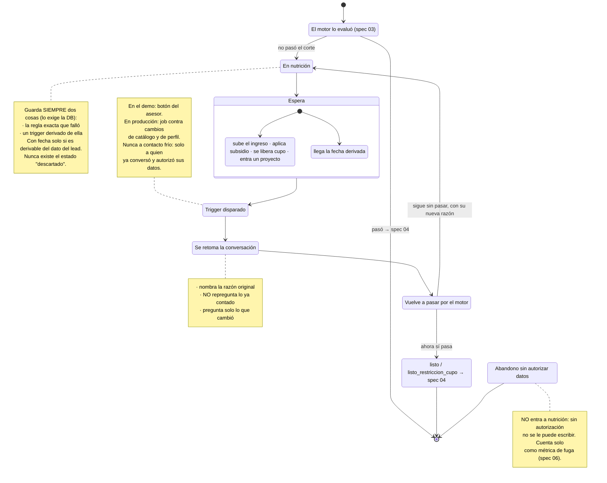

# Spec 05 — Nutrición y re-enganche

> Borrador v1 · lee primero las [convenciones](README.md#las-dos-capas-de-cada-spec-leer-esto-antes-que-nada).

## Qué cubre

Qué pasa con el lead que **todavía** no puede comprar: cómo se guarda, con qué razón, qué lo traería de vuelta y cómo se retoma la conversación cuando eso ocurre.

**No cubre:** por qué no pasó el corte (spec [03](03-scoring.md)) ni cómo se ve en la bandeja (spec [06](06-dashboard-asesor.md)).

## El QUÉ

| # | Obligación | Fuente |
|---|---|---|
| 1 | **Nadie se descarta.** El estado "descartado" no existe | `spec.md §2` y `§5` criterio 3 · [brief:21,35-36](../reto/perfilamiento-leads-03.md) |
| 2 | Todo lead en nutrición tiene **la regla exacta que falló** y **un trigger derivado de ella** | Criterio de aceptación 3. Lo enforcea un `CHECK` de Postgres ([ADR 0003](../adr/0003-esquema-db-leads.md)) |
| 3 | Los triggers **no son solo temporales**: pueden ser condicionales | `mvp-layout.md §2` decisión 3 |
| 4 | La fecha solo se pone si es **derivable del dato del lead**. Cero fechas inventadas | `spec.md §7`, cerrado en el grilling 2026-07-24 |
| 5 | **Nunca contacto frío.** Solo se recontacta a quien ya conversó y autorizó | [Mentor](../reto/charla-mentor.md#remarketing) |

El punto 5 es importante y viene de la operación real: Colsubsidio **nunca compra bases de datos**. Solo escriben a afiliados o a quien ya tuvo contacto. Nuestro re-enganche cumple eso por construcción, porque el lead ya conversó con nosotros.

## El CÓMO

### D1 · Por qué alguien cae en nutrición · [PROPUESTA — hoy solo existe una razón]

El motor solo tiene una regla que bloquea, así que hoy **la única razón posible es la cuota sobre el 40%**. Pero un lead puede quedarse por el camino de otras formas, y esas hoy no se registran:

| # | Razón | ¿Existe hoy? | Trigger propuesto |
|---|---|---|---|
| 1 | La cuota supera el 40% del ingreso | ✅ Sí | Condicional: sube el ingreso, aplica un subsidio, o un proyecto más barato |
| 2 | Califica pero **no hay cupo 90/10** en ningún proyecto | ❌ No, hoy sale "listo" con 0 proyectos | Condicional: se libera cupo, o se afilia |
| 3 | No hay proyecto en su zona o rango | ❌ No | Condicional: entra un proyecto que le sirva |
| 4 | **Abandonó en la autorización de datos** | ❌ No | Ninguno — sin autorización no se le puede escribir |
| 5 | **Abandonó eligiendo proyecto** | ❌ No | Condicional, si alcanzó a autorizar |
| 6 | Abandonó a mitad de la indagación | ❌ No | Condicional |

Las razones 4 y 5 son [los dos puntos de fuga que el mentor mide](../reto/charla-mentor.md#puntos-de-fuga) y no logra explicar. **Si las registramos, le damos exactamente el dato que dijo no tener.**

Ojo con la 4: quien no autorizó **no entra a nutrición** en el sentido de recontacto, porque no se le puede escribir. Entra a la métrica de fuga y nada más. Confundir esas dos cosas sería un problema legal, no de producto.

### D2 · Temporal vs condicional · [CERRADA — grilling 2026-07-24]

- **Trigger temporal:** lleva fecha. Solo cuando la regla que falló es temporal y la fecha se **deriva** de un dato que el lead ya dio (ejemplo: le faltan N meses de afiliación → la fecha exacta se calcula).
- **Trigger condicional:** no lleva fecha, lleva condición. Todo lo demás.

Nunca se inventa una fecha para que se vea bonito. El personaje de nutrición del demo es, a propósito, el caso **con** fecha.

### D3 · Qué se le dice al lead · [PROPUESTA]

Hoy el `trigger_nutricion` está redactado para el asesor. Al lead hay que decírselo distinto, y hay una tensión: **decirle "no calificas" es exactamente lo que el reto no quiere**, pero mentirle es peor.

Propuesta de contenido, no de redacción exacta:
1. Qué sí tiene a favor (que se le reconozca algo real).
2. Cuál es el obstáculo concreto, con la norma citada si aplica.
3. **Qué lo destrabaría**, en acciones que él puede tomar.
4. Que le vamos a escribir cuando eso pase.

El punto 3 es el que convierte esto en nutrición y no en un rechazo.

### D4 · Cómo se retoma la conversación · [PROPUESTA + brecha]

Cuando el trigger se dispara, el lead vuelve a conversar. Contrato propuesto:

- **No se repregunta nada** de lo que ya contó. El guardrail del criterio 1 aplica igual en el re-enganche que en la primera conversación.
- El primer mensaje **nombra la razón original**: *"cuando hablamos, la cuota superaba el tope legal; se abrió un proyecto que sí te cabe"*.
- Solo se pregunta lo que **cambió**.
- Se vuelve a calificar. Puede salir listo, o puede volver a nutrición con otra razón — y eso está bien.

**Brecha:** el botón del asesor marca `re_enganchado_en`, deja una fila de sistema con el trigger exacto, y redirige a `/?lead_id=X&reenganche=1`. **Nadie lee esos parámetros** ([`app/page.tsx`](../../app/page.tsx) no usa `useSearchParams`), así que el clic aterriza en el landing como si fuera un lead nuevo. El criterio de aceptación 3 **no está verificado end-to-end** por esto ([ticket 007](../tasks/007-reenganche-nutricion.md)).

### D5 · El re-enganche no es un cuarto estado · [CERRADA — ADR 0003]

Se guarda como `re_enganchado_en` (una marca de tiempo), no como una salida nueva. `Score.salida` sigue teniendo tres valores. Un lead re-enganchado que sigue sin calificar sigue en `nutricion`, con su badge.

### D6 · Quién dispara el trigger en el demo · [PROPUESTA]

Hoy: un botón "simular trigger" en la ficha del asesor. Es honesto (dice que simula) y le da control al jurado.

Alternativa que alguien podría querer: un proceso que revise periódicamente. **Para el demo no aporta** y cuesta tiempo que no hay. Propuesta: **quedarse con el botón** y explicar en el pitch que en producción sería un job contra los cambios de catálogo y de perfil.

## Estado hoy vs contrato

| Qué | Hoy | Brecha |
|---|---|---|
| Razón + trigger | Se emiten y se muestran; Postgres rechaza un lead de nutrición sin ellos | Solo existe la razón #1 (D1) |
| Trigger híbrido | Solo la redacción condicional del 40% | La rama con fecha no está implementada |
| Marca de re-enganche | `PATCH /api/leads/[id]` funciona y persiste | — |
| Retomar la conversación | 🔴 El chat no lee `?lead_id=` | [Ticket 007](../tasks/007-reenganche-nutricion.md) — criterio 3 sin verificar |
| Fugas como razón | No se registran | D1 razones 4-6 |

## Diagrama

## Preguntas al TEAM

1. **¿Registramos las fugas como razones de nutrición?** (D1) Son las dos que el mentor mide y no explica. Ojo con la distinción legal de la razón 4.
2. **¿El no afiliado sin cupo cae en nutrición o se queda en "listo con 0 proyectos"?** Hoy es lo segundo y es raro: sale "listo" y no tiene nada que ofrecerle. ¿Está bien así, o merece su propia razón?
3. **¿Qué le decimos al lead exactamente?** (D3) Alguien tiene que escribir esas 3 o 4 frases, y son las que deciden si el reto se ve social o se ve como un rechazo con buenos modales.
4. **¿Quién arregla el `?lead_id=`?** (D4) Sin eso, el criterio de aceptación 3 no se puede demostrar en el video.
5. **¿Botón o job?** (D6) Confirmar que el botón basta para el demo.
6. **¿Cuánto dura un lead en nutrición?** Nadie definió si expira. Para el MVP probablemente no importa; para el pitch de implementabilidad puede que sí.
7. **Vacío del canon:** si el trigger se dispara y el lead **no responde**, ¿qué? Hoy no hay reintento ni límite.

## Fuentes

- [`spec.md §2`, `§4` (las 3 salidas), `§5` criterio 3, `§7`](../spec.md) — nadie se descarta, trigger híbrido.
- [brief:21,35-36](../reto/perfilamiento-leads-03.md) — los que aún no pueden comprar entran a nutrición.
- [Charla con el mentor](../reto/charla-mentor.md#remarketing) — nunca contacto frío; [puntos de fuga](../reto/charla-mentor.md#puntos-de-fuga).
- [ADR 0003](../adr/0003-esquema-db-leads.md) — el re-enganche no es un cuarto estado; los `CHECK` que lo enforcean.
- [Ticket 007](../tasks/007-reenganche-nutricion.md).
