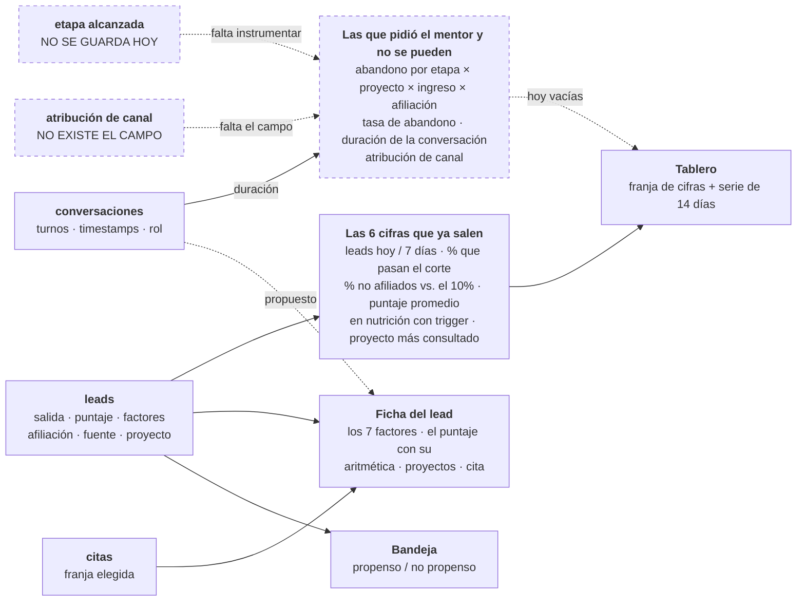

# Spec 06 — Dashboard del asesor

> Borrador v1 · lee primero las [convenciones](README.md#las-dos-capas-de-cada-spec-leer-esto-antes-que-nada).

## Qué cubre

Las tres superficies que ve el asesor: la **bandeja** (a quién llamo ahora), el **tablero** (cómo va la operación) y la **ficha** (por qué este lead está aquí). Y de dónde sale cada número.

**No cubre:** cómo se calcula el score (spec [03](03-scoring.md)).

## El QUÉ

| # | Obligación | Fuente |
|---|---|---|
| 1 | El asesor ve **todos** los factores del score con su valor y su aporte, más la explicación en lenguaje natural | Criterio de aceptación 2 · `AGENTS.md` |
| 2 | El lead listo llega con **proyectos, cita y porqué**, los tres visibles | Criterio de aceptación 4 |
| 3 | Los leads de nutrición **aparecen**, con su razón y su trigger | Criterio de aceptación 3 |
| 4 | Ninguna cifra sin decir de dónde sale | `AGENTS.md` (cero caja negra) |
| 5 | Un puntaje nunca se muestra sin su desglose al lado | [`DESIGN.md`](../../DESIGN.md) |
| 6 | El recorrido se hace **sin narración** | `AGENTS.md` (demo autogestionado) |

## El CÓMO

### D1 · Cómo se agrupa la bandeja · [PROPUESTA — la decisión de vocabulario]

El mentor pidió dos categorías: [propenso a comprar o no propenso](../reto/charla-mentor.md#lo-que-ve-el-asesor). Nosotros tenemos tres salidas. Tres opciones:

| | Qué se ve | A favor | En contra |
|---|---|---|---|
| **A** (hoy) | Tres secciones: listos · listos con restricción de cupo · en nutrición | Ya está construido y probado | No es el idioma del asesor |
| **B** | Dos grupos macro (propenso / no propenso) con las tres salidas como sub-secciones | Habla como el mentor y conserva el detalle | Un poco más de UI |
| **C** | Solo dos grupos | Máxima simplicidad | Pierde la distinción del cupo 90/10, que es el gancho del reto |

**Propuesta: B.** Pero "no propenso" suena a descarte y nuestro discurso entero es que nadie se descarta — puede que la etiqueta correcta sea otra ("todavía no"). **Es una decisión de palabras y la toma el equipo.**

La **similitud con compradores** es columna de evidencia dentro de la fila, **nunca criterio de agrupación** (spec [03](03-scoring.md) D3).

### D2 · Qué muestra la ficha · [HOY — así está construido, y da paridad con lo real]

Orden actual: cabecera → "por qué está aquí" (la explicación) → los factores uno por uno → cómo se arma el puntaje → nutrición o proyectos + cita → datos del perfil + nota de habeas data con timestamp.

Contra lo que [el asesor ve hoy en su plataforma](../reto/charla-mentor.md#lo-que-ve-el-asesor) —conversación completa + resumen con nombre, cédula, correo, celular, proyecto de interés, rango de ingresos y categoría de afiliación— **nos falta una cosa: la conversación completa.** Está en la base de datos (tabla `conversaciones`) y no se muestra.

**[PROPUESTA]** Mostrarla. Es paridad con lo que ya tienen, cuesta poco y es el respaldo de todo lo demás: si el asesor duda de un factor, va y lee dónde lo dijo el lead.

### D3 · Las métricas del mentor y de dónde sale cada número · [PROPUESTA — la decisión gorda]

Esto es lo que pidió y no tiene ([detalle](../reto/charla-mentor.md#metricas)). Para cada una, qué haría falta:

| # | Métrica que pidió | Qué campo la alimenta | ¿Se puede hoy? |
|---|---|---|---|
| 1 | **Abandono por etapa** | La fase que alcanzó cada lead, guardada aunque no termine | ❌ Hoy solo se guardan los leads que **terminan** |
| 1b | Cruzada por **proyecto × rango de ingreso × afiliación** | Los tres campos persistidos incluso en abandono temprano | ❌ Depende de 1 |
| 2 | **Duración promedio de la conversación** | Turnos y minutos, del historial | ⚠️ El historial existe; nadie lo agrega |
| 3 | **Tasa de abandono** | Leads sin fase "terminado" / total | ❌ Depende de 1 |
| 4 | **Proyecto con más interacción** | Conteo de `proyecto_interes` + proyecto de entrada | ✅ Se puede ya |
| 5 | **Atribución de canal** | El campo de atribución de la ingesta (spec [01](01-ingesta-enriquecimiento.md) D4) | ❌ No existe el campo |

**La #1 es la madre de todas y hoy es imposible**, porque solo persistimos leads que llegan al final. Habilitarla implica guardar el lead **desde que autoriza**, no desde que termina. Es un cambio de contrato, no una métrica más.

**Fuera de alcance, declarado sin rodeos:**
- **Duración de la conversación asistida** (humana): en el MVP no hay asesor humano conversando. No la podemos calcular y no vamos a fingirla.
- **Recuperar la atribución que se pierde cuando el usuario borra el mensaje**: es un problema de la plataforma de WhatsApp, no nuestro. Lo que sí podemos mostrar es que **con el lead-evento el dato no depende de eso**.

### D4 · Qué pasa con las 6 métricas que ya existen · [PROPUESTA]

Hoy el tablero muestra: leads de hoy · leads de 7 días · % que pasan el corte · % de no afiliados · puntaje promedio · en nutrición con trigger.

Propuesta: **las 6 se quedan**, con una salvedad. "Puntaje promedio" depende de cuál escala sea la canónica ([spec 03](03-scoring.md) D6) — hoy promedia la escala binaria de la UI, no la del motor. Mientras eso no se decida, **es un promedio de un número que no es el oficial**.

La métrica **% de no afiliados contra el 10%** es la más valiosa del tablero: es la munición del reto hecha operación.

### D5 · Todo agregado lleva a sus leads · [PROPUESTA]

Un número sin poder ver de quién habla también es caja negra. Propuesta: cada cifra es clickeable y filtra la bandeja. Cuesta poco y es lo que convierte el tablero en una herramienta en vez de un adorno.

### D6 · El tablero hoy vive de datos sembrados · [HOY — hay que decirlo]

La cadena no está conectada: el chat termina en `console.log` y el orquestador ([ticket 006](../tasks/006-orquestador.md)) no existe. Lo que se ve viene de los 3 personajes sembrados más **57 leads sintéticos** ([`cola-historica.ts`](../../lib/fixtures/cola-historica.ts)), generados con semilla fija y **pasados por el motor y el matcher reales**. Van marcados `sintetico: true` y **la pantalla lo avisa**.

Existen porque "leads por día" con 3 leads del mismo día no es una serie. Es una decisión honesta y bien ejecutada, pero **el equipo debe saber que ninguna métrica de conversación sale de conversaciones reales todavía.**

### D7 · El puntaje ordena, no decide · [CERRADA — `puntaje.ts` + DESIGN.md]

Quién decide el grupo es `Score.salida`. El puntaje solo ordena **dentro** de un grupo. Y nunca aparece sin la aritmética que lo sostiene.

**[CERRADA — Mani, 2026-07-24] Los dos grupos de "puede comprar" se fundieron en uno.** `listo` y `listo_restriccion_cupo` eran grupos separados, con el no afiliado siempre debajo: un no afiliado con 71 puntos aparecía debajo de un afiliado con 42, o sea que la afiliación decidía a quién llamar primero. El mentor lo puso al revés — *"siempre va a ser la prioridad de los ingresos"* — así que ahora **comparten grupo y dentro manda el puntaje**; la afiliación ya solo pesa como desempate dentro de ese puntaje (0,05, [spec 03](03-scoring.md)). Nutrición sigue de última, y eso no es por afiliación: es que todavía no puede comprar. Vive en [`ordenarCola`](../../lib/types-asesor.ts).

> ⚠️ La vista `cola_asesor` de Supabase todavía trae `orden_prioridad` con tres niveles (1/2/3). No es contradicción sino orden inicial de la consulta: **quien decide el orden que se ve es `ordenarCola` en TypeScript**, que re-ordena lo que llega. Si algún día se pagina en la DB, hay que alinear la vista.

## Estado hoy vs contrato

| Qué | Hoy | Brecha |
|---|---|---|
| Bandeja por salida | 3 secciones con títulos propios y estado vacío explícito | Vocabulario propenso/no propenso (D1) |
| Ficha con todos los factores | Sí, `.map()` sin filtrar, con test que lo protege | La conversación no se muestra (D2) |
| Tablero | 6 métricas + serie de 14 días + grupos por afiliación | Las métricas del mentor (D3) |
| Métricas de conversación | Ninguna | Nadie las instrumenta |
| Origen de los datos | Supabase con fallback a fixtures; el tablero lo avisa | Producción sigue en fixtures (env vars de Vercel) |

## Diagrama — de dónde sale cada número

**Punteado = no existe todavía.** El bloque de la derecha son justamente las métricas que el mentor pidió: sin guardar la etapa que alcanzó cada lead y sin el campo de atribución, no hay de dónde sacarlas. El detalle métrica por métrica está en la tabla de D3.

## Preguntas al TEAM

1. **¿Adoptamos "propenso / no propenso"?** (D1) Y si sí, ¿"no propenso" o algo que no suene a descarte?
2. **¿Mostramos la conversación completa en la ficha?** (D2) Es paridad con lo que el asesor ya tiene hoy.
3. **¿Instrumentamos la etapa de abandono?** (D3) Es la métrica #1 del mentor y hoy es imposible. Implica **guardar el lead desde que autoriza**, no desde que termina — cambio de contrato, no cifra nueva.
4. **¿Cuáles de las métricas del mentor entran al MVP y cuáles solo al pitch?** No van a caber todas antes del domingo. Hay que elegir explícitamente.
5. **¿Las cifras son clickeables?** (D5)
6. **¿Qué hacemos con "puntaje promedio"** mientras no se decida la escala canónica? (D4)
7. **¿Cómo se ve el aviso de datos sintéticos en el video?** (D6) Hoy la pantalla lo dice, que es lo honesto. Confirmar que nadie lo quiere quitar para que se vea "más lleno".
8. **Vacío del canon:** ¿el tablero es parte del demo de 2 minutos o es material de respaldo? [`mvp-layout.md §5`](../mvp-layout.md) mapea el clímax a la **ficha del lead**, no al tablero, y `spec.md §2` dice explícitamente que **no hay dashboard analítico**. El tablero existe y es bueno; falta decidir si aparece en el video.

## Fuentes

- [`spec.md §4` paso 5, `§5` criterios 2, 3 y 4](../spec.md) — lo que ve el asesor.
- `spec.md §2` — no hay dashboard analítico; la franja de impacto es lo único.
- [Charla con el mentor](../reto/charla-mentor.md#metricas) — las 5 métricas; [lo que ve hoy](../reto/charla-mentor.md#lo-que-ve-el-asesor); [su objetivo](../reto/charla-mentor.md#objetivo).
- [`DESIGN.md`](../../DESIGN.md) — nada de un score grande sin su desglose.
- Código: [`lib/tablero/`](../../lib/tablero/), [`app/asesor/`](../../app/asesor/), [`lib/fixtures/cola-historica.ts`](../../lib/fixtures/cola-historica.ts).
