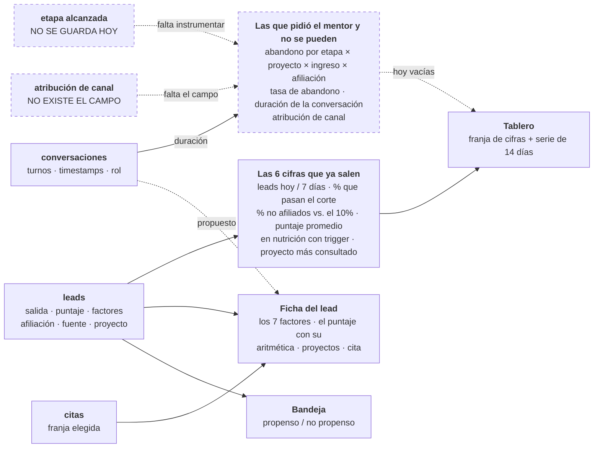

# Spec 06 — Dashboard del asesor

> Borrador v1 · lee primero las [convenciones](README.md#las-dos-capas-de-cada-spec-leer-esto-antes-que-nada).

## Qué cubre

Las tres superficies que ve el asesor: la **bandeja** (a quién llamo ahora), el **tablero** (cómo va la operación) y la **ficha** (por qué este lead está aquí). Y de dónde sale cada número.

**No cubre:** cómo se calcula el score (spec [03](03-scoring.md)).

## El QUÉ

| # | Obligación | Fuente |
|---|---|---|
| 1 | El asesor ve **todos** los factores del score con su valor y su aporte, más la explicación en lenguaje natural | Criterio de aceptación 2 · `AGENTS.md` |
| 2 | El lead listo llega con **proyectos, cita y porqué**, los tres visibles | Criterio de aceptación 4 |
| 3 | Los leads de nutrición **aparecen**, con su razón y su trigger | Criterio de aceptación 3 |
| 4 | Ninguna cifra sin decir de dónde sale | `AGENTS.md` (cero caja negra) |
| 5 | Un puntaje nunca se muestra sin su desglose al lado | [`DESIGN.md`](../../DESIGN.md) |
| 6 | El recorrido se hace **sin narración** | `AGENTS.md` (demo autogestionado) |

## El CÓMO

### D1 · Cómo se agrupa la bandeja · [CERRADA — sala del sábado 25, decisión 10]

El mentor pidió dos categorías: [propenso a comprar o no propenso](../reto/charla-mentor.md#lo-que-ve-el-asesor). Nosotros tenemos tres salidas.

**Quedó en dos grupos, con rótulos que no suenan a descarte:**

| Grupo | Quién cae ahí |
|---|---|
| **Pueden comprar hoy** | `listo` y `listo_restriccion_cupo` juntos; adentro manda el **puntaje**, y la distinción del cupo 90/10 viaja en el badge de cada fila |
| **Todavía no pueden comprar** | `nutricion`, con su razón y su trigger |

Se adopta la agrupación del mentor y se rechaza su vocabulario: "no propenso" suena a descarte y el discurso entero del reto es que nadie se descarta. Fundir los dos grupos de "listos" no es cosmético — apilarlos como secciones separadas volvía a poner al no afiliado debajo del afiliado sin importar el puntaje, que es justo lo que D7 corrigió.

La **similitud con compradores** es columna de evidencia dentro de la fila, **nunca criterio de agrupación** (spec [03](03-scoring.md) D3).

### D2 · Qué muestra la ficha · [HOY — así está construido, y da paridad con lo real]

Orden actual: cabecera → "por qué está aquí" (la explicación) → los factores uno por uno → cómo se arma el puntaje → nutrición o proyectos + cita → datos del perfil + nota de habeas data con timestamp.

Contra lo que [el asesor ve hoy en su plataforma](../reto/charla-mentor.md#lo-que-ve-el-asesor) —conversación completa + resumen con nombre, cédula, correo, celular, proyecto de interés, rango de ingresos y categoría de afiliación— **nos falta una cosa: la conversación completa.** Está en la base de datos (tabla `conversaciones`) y no se muestra.

**[PROPUESTA]** Mostrarla. Es paridad con lo que ya tienen, cuesta poco y es el respaldo de todo lo demás: si el asesor duda de un factor, va y lee dónde lo dijo el lead.

### D3 · Las métricas del mentor y de dónde sale cada número · [PROPUESTA — la decisión gorda]

Esto es lo que pidió y no tiene ([detalle](../reto/charla-mentor.md#metricas)). Para cada una, qué haría falta:

| # | Métrica que pidió | Qué campo la alimenta | ¿Se puede hoy? |
|---|---|---|---|
| 1 | **Abandono por etapa** | La fase que alcanzó cada lead, guardada aunque no termine | ❌ Hoy solo se guardan los leads que **terminan** |
| 1b | Cruzada por **proyecto × rango de ingreso × afiliación** | Los tres campos persistidos incluso en abandono temprano | ❌ Depende de 1 |
| 2 | **Duración promedio de la conversación** | Turnos y minutos, del historial | ⚠️ El historial existe; nadie lo agrega |
| 3 | **Tasa de abandono** | Leads sin fase "terminado" / total | ❌ Depende de 1 |
| 4 | **Proyecto con más interacción** | Conteo de `proyecto_interes` + proyecto de entrada | ✅ Se puede ya |
| 5 | **Atribución de canal** | El campo de atribución de la ingesta (spec [01](01-ingesta-enriquecimiento.md) D4) | ❌ No existe el campo |

**La #1 es la madre de todas y hoy es imposible**, porque solo persistimos leads que llegan al final. Habilitarla implica guardar el lead **desde que autoriza**, no desde que termina. Es un cambio de contrato, no una métrica más.

**Fuera de alcance, declarado sin rodeos:**
- **Duración de la conversación asistida** (humana): en el MVP no hay asesor humano conversando. No la podemos calcular y no vamos a fingirla.
- **Recuperar la atribución que se pierde cuando el usuario borra el mensaje**: es un problema de la plataforma de WhatsApp, no nuestro. Lo que sí podemos mostrar es que **con el lead-evento el dato no depende de eso**.

### D4 · Qué pasa con las 6 métricas que ya existen · [PROPUESTA]

Hoy el tablero muestra: leads de hoy · leads de 7 días · % que pasan el corte · % de no afiliados · puntaje promedio · en nutrición con trigger.

Propuesta: **las 6 se quedan.** ~~"Puntaje promedio" promedia la escala binaria de la UI, no la del motor.~~ **Ya no: desde el 2026-07-24 hay una sola escala** y `PUNTAJE_PROMEDIO` lee `score.puntaje` del motor ([spec 03](03-scoring.md) D6).

⚠️ **Lo que sí sigue abierto de esa cifra:** promedia leads reales (techo alcanzable **75**) con los 57 sintéticos, que traen monto de subsidio y pueden pasar de 75 ([spec 03](03-scoring.md) D5). Son dos techos en un mismo promedio y la pantalla no lo dice.

La métrica **% de no afiliados contra el 10%** es la más valiosa del tablero: es la munición del reto hecha operación.

### D5 · Todo agregado lleva a sus leads · [PROPUESTA]

Un número sin poder ver de quién habla también es caja negra. Propuesta: cada cifra es clickeable y filtra la bandeja. Cuesta poco y es lo que convierte el tablero en una herramienta en vez de un adorno.

### D6 · El telón del tablero es sintético, pero la cadena sí corre · [HOY — hay que decirlo]

> ⚠️ **Corregido el 2026-07-25.** Este bloque decía *"la cadena no está conectada: el chat termina en `console.log` y el orquestador no existe"*. **Falso desde el 2026-07-24 18:10:** existe [`/api/curar`](../../app/api/curar/route.ts) sobre [`lib/curar.ts`](../../lib/curar.ts), el chat lo llama al terminar y el lead queda en Supabase con su hilo. El ticket [006](../tasks/006-orquestador.md) está cerrado.

Lo que sí sigue siendo cierto: **el volumen que llena el tablero es sembrado.** Son los 3 personajes canónicos más **57 leads sintéticos** ([`cola-historica.ts`](../../lib/fixtures/cola-historica.ts)), con semilla fija y **pasados por el motor y el matcher reales**. Van marcados `sintetico: true` y la pantalla lo avisa.

Existen porque "leads por día" con 3 leads del mismo día no es una serie. **Y ninguna métrica de conversación sale de conversaciones reales todavía**, porque nadie lee la tabla `conversaciones` (D2 y D3).

### D7 · El puntaje ordena, no decide · [CERRADA — `lib/scoring/` + DESIGN.md]

Quién decide el grupo es `Score.salida`. El puntaje solo ordena **dentro** de un grupo. Y nunca aparece sin la aritmética que lo sostiene.

**[CERRADA — Mani, 2026-07-24] Los dos grupos de "puede comprar" se fundieron en uno.** `listo` y `listo_restriccion_cupo` eran grupos separados, con el no afiliado siempre debajo: un no afiliado con 71 puntos aparecía debajo de un afiliado con 42, o sea que la afiliación decidía a quién llamar primero. El mentor lo puso al revés — *"siempre va a ser la prioridad de los ingresos"* — así que ahora **comparten grupo y dentro manda el puntaje**; la afiliación ya solo pesa como desempate dentro de ese puntaje (0,05, [spec 03](03-scoring.md)). Nutrición sigue de última, y eso no es por afiliación: es que todavía no puede comprar. Vive en [`ordenarCola`](../../lib/types-asesor.ts).

> ⚠️ La vista `cola_asesor` de Supabase todavía trae `orden_prioridad` con tres niveles (1/2/3). No es contradicción sino orden inicial de la consulta: **quien decide el orden que se ve es `ordenarCola` en TypeScript**, que re-ordena lo que llega. Si algún día se pagina en la DB, hay que alinear la vista.

### D8 · El tablero cabe en una pantalla, en cortes · [CERRADA — Alejandro, 2026-07-25]

La consola tiene **dos vistas**, elegibles desde la barra lateral: **Métricas** (`/asesor/tablero`) y **Leads** (`/asesor`). Los rótulos nombran el contenido, no el mueble.

**Métricas no se desplaza.** El shell es de altura fija y las cifras se parten en tres **cortes** que se eligen con un selector, como el "diario / mensual" de una gráfica — son vistas del mismo dato, no secciones distintas:

| Corte | Qué muestra |
|---|---|
| **Resumen** | Las 6 cifras, cada una con la fuente de la que sale |
| **Entrada diaria** | La serie de 14 días, ahora en columnas en vez de renglones apilados |
| **Reparto** | Los grupos del agrupador activo, lado a lado |

**Esto no recorta datos, los descomprime.** Al mover el scroll dentro del panel, el tope de 12 leads por grupo dejó de ser necesario: **se listan todos** (62 hoy, contra 24 antes). El corte que no cabe se recorre por dentro; la página no se mueve.

La serie diaria conserva su `<table>` completa, ahora en `sr-only`: la gráfica es `aria-hidden` y quien usa lector de pantalla recibe los tres números de cada día en mejor orden que antes.

> La **ficha** sí se desplaza, y es deliberado: sus factores no se recortan por razones visuales.

## Estado hoy vs contrato

| Qué | Hoy | Brecha |
|---|---|---|
| Bandeja | 🟢 **DOS secciones desde el 2026-07-24: "Pueden comprar hoy" y "Todavía no pueden comprar".** La página seguía re-partiendo por estado y deshacía en pantalla la decisión de D7 (un no afiliado con 71 aparecía debajo de un afiliado con 42). Ahora `listo` y `listo_restriccion_cupo` comparten sección, adentro manda el puntaje, y la distinción del cupo viaja en el badge de cada fila | Vocabulario propenso/no propenso (D1) |
| Ficha con todos los factores | Sí, `.map()` sin filtrar, con test que lo protege | La conversación no se muestra (D2) |
| Métricas | 🟢 **Desde el 2026-07-25 cabe sin scroll**, en 3 cortes (Resumen · Entrada diaria · Reparto) elegibles con selector. El reparto lista los 62 leads, no los 24 que dejaba ver el tope viejo | Las métricas del mentor (D3) |
| Métricas de conversación | Ninguna | Nadie las instrumenta |
| Origen de los datos | 🟢 **Producción lee Supabase** desde el 2026-07-24 (medido: `GET /api/leads` en la URL pública responde `origen: supabase`). El fallback a fixtures sigue existiendo para correr sin `.env`, y la pantalla avisa cuál está sirviendo | — |

## Diagrama — de dónde sale cada número

**Punteado = no existe todavía.** El bloque de la derecha son justamente las métricas que el mentor pidió: sin guardar la etapa que alcanzó cada lead y sin el campo de atribución, no hay de dónde sacarlas. El detalle métrica por métrica está en la tabla de D3.

> ⚠️ **Dos etiquetas del diagrama quedaron viejas y se corrigen al reexportar el PNG** (pendiente de P3; se cambian en este archivo **y** en su [narrado](diagramas/06-dashboard-asesor.md), que `check_diagramas.py` compara): el nodo de la bandeja dice *"propenso / no propenso"* — el vocabulario que D1 descartó — y la lista de las 6 cifras incluye *"proyecto más consultado"*, que **no es una de las 6**. Las seis son: leads hoy · leads 7 días · % que pasan el corte · % de no afiliados vs. el 10% · puntaje promedio · en nutrición con trigger.

## Preguntas al TEAM

1. ~~**¿Adoptamos "propenso / no propenso"?**~~ (D1) **Resuelto (sala del sábado 25, decisión 10): no.** Dos grupos, rótulos que no suenan a descarte.
2. **🔴 ABIERTA — ¿mostramos la conversación completa en la ficha?** (D2) Es paridad con lo que el asesor ya tiene hoy, y la brecha más barata de cerrar: el hilo **ya se guarda** en la tabla `conversaciones` y **nadie lo lee**.
3. **¿Instrumentamos la etapa de abandono?** (D3) Es la métrica #1 del mentor y hoy es imposible. Implica **guardar el lead desde que autoriza**, no desde que termina — cambio de contrato, no cifra nueva. `plan-sabado-25.md` ya lo puso fuera de alcance para el domingo.
4. **¿Cuáles de las métricas del mentor entran al MVP y cuáles solo al pitch?** Hoy van 0 de 5. Hay que elegir explícitamente cuál (si alguna) cabe antes del freeze.
5. **¿Las cifras son clickeables?** (D5)
6. ~~**¿Qué hacemos con "puntaje promedio"?**~~ (D4) **La escala ya es una sola.** Lo que queda es la mezcla de techos entre leads reales y sintéticos, anotada arriba.
7. **¿Cómo se ve el aviso de datos sintéticos en el video?** (D6) Hoy la pantalla lo dice, que es lo honesto. Confirmar que nadie lo quiere quitar para que se vea "más lleno".
8. ~~**¿El tablero es parte del demo o material de respaldo?**~~ **Resuelto (sala del sábado 25, decisión 4): SÍ entra al MVP y al pitch.** `spec.md §2` quedó enmendado — lo que sigue fuera de alcance es la analítica de pauta (funnel, CPL, cohortes), no la vista de métricas operativas. ⚠️ Esto afecta el guion del video: es un plano que antes no existía.

## Fuentes

- [`spec.md §4` paso 5, `§5` criterios 2, 3 y 4](../spec.md) — lo que ve el asesor.
- `spec.md §2` — enmendado el 2026-07-25: la vista de Métricas **sí** es parte del MVP; lo que queda fuera es la analítica de pauta (funnel, CPL, cohortes).
- [Charla con el mentor](../reto/charla-mentor.md#metricas) — las 5 métricas; [lo que ve hoy](../reto/charla-mentor.md#lo-que-ve-el-asesor); [su objetivo](../reto/charla-mentor.md#objetivo).
- [`DESIGN.md`](../../DESIGN.md) — nada de un score grande sin su desglose.
- Código: [`lib/tablero/`](../../lib/tablero/), [`app/asesor/`](../../app/asesor/), [`lib/fixtures/cola-historica.ts`](../../lib/fixtures/cola-historica.ts).
