# Diagrama 00 — El MVP completo

**Responde a:** ¿cómo funciona la solución de punta a punta, desde que alguien ve un anuncio hasta que un asesor lo llama?

Contrato completo en [`00-mvp-unificado.md`](../00-mvp-unificado.md) · imagen en [`00-mvp-unificado.png`](00-mvp-unificado.png)

```mermaid
flowchart LR
    subgraph S1["① Ingesta — spec 01"]
        direction TB
        FUENTES["Meta lead form · click-to-WhatsApp<br/>BTL · web .com"] --> AUTOR{"¿autoriza<br/>sus datos?"}
        AUTOR -->|"no"| FUGA["Fuga registrada<br/>caída #1 del área"]
        AUTOR -->|"sí"| CEDULA{"¿la cédula está<br/>en la base?"}
        CEDULA -->|"sí"| PERFIL["Ya sabemos afiliación,<br/>ciudad, segmento, ingreso"]
        CEDULA -->|"no"| NADA["No sabemos nada:<br/>se pregunta todo"]
    end

    subgraph S2["② Conversación — spec 02"]
        direction TB
        PREG["Pregunta solo lo que falta<br/>y dice en voz alta qué ya sabe"] --> COMPLETO{"¿datos<br/>completos?"}
        COMPLETO -->|"no"| PREG
        COMPLETO -->|"pide asesor · no pudo cotizar<br/>no pudo agendar"| HUMANO["Handoff a<br/>asesor humano"]
    end

    subgraph S3["③ Motor — spec 03"]
        direction TB
        GATE{"¿cuota ≤ 40% del ingreso?<br/>Decreto 583/2025"}
        GATE -->|"sí"| PUNTAJE["Puntaje 0–100<br/>7 factores visibles"]
    end

    subgraph S4["④ Match y agenda — spec 04"]
        direction TB
        FILTRA["Filtra por precio<br/>y por cupo 90/10"] --> HAY{"¿queda algún<br/>proyecto?"}
        HAY -->|"sí"| CITA["2-3 proyectos con su porqué<br/>+ franja agendada"]
    end

    subgraph S5["⑤ Nutrición — spec 05"]
        direction TB
        RAZON["Razón exacta + trigger<br/>fecha solo si es derivable"] --> DISPARO["Trigger disparado<br/>nunca a contacto frío"]
    end

    subgraph S6["⑥ El asesor — spec 06"]
        direction TB
        BANDEJA["Bandeja priorizada<br/>propenso / no propenso"] --> FICHA["Ficha: los 7 factores, el puntaje<br/>con su aritmética, el porqué,<br/>los proyectos y la cita"]
        TABLERO["Tablero de la operación"]
    end

    PERFIL --> PREG
    NADA --> PREG
    COMPLETO -->|"sí"| GATE
    PUNTAJE --> FILTRA
    GATE -->|"no — lo ÚNICO que bloquea"| RAZON
    HAY -->|"no — hoy el cupo está copado en los 18"| RAZON
    DISPARO -->|"retoma sin repreguntar"| PREG

    CITA --> DB
    RAZON --> DB
    HUMANO --> DB
    DB[("DB central<br/>listos y no listos, juntos")]
    DB --> BANDEJA
    DB --> TABLERO

    WA(["WhatsApp Business API<br/>fuera de alcance"]) -.->|"en producción"| PREG
    DB -.->|"en producción"| CRM[("CRM Salesforce<br/>fuera de alcance")]

    classDef futuro stroke-dasharray: 5 5
    class CRM,WA futuro
```

## Cómo se lee

**① Entra el lead.** Alguien ve un anuncio y escribe. Da igual si vino de un formulario de Meta, de un anuncio que abre WhatsApp, de un QR impreso o de la página web: los cuatro canales producen **el mismo evento**. Eso es lo que el mentor pidió cuando dijo que quería "un centralizador que filtre todo independientemente de dónde entre".

Lo primero es **pedirle autorización para tratar sus datos**. No es un trámite que se pueda mover: sin eso no se le puede escribir después. Si dice que no, ahí se acaba y se registra que se cayó en ese punto — que es, según el área, donde más gente se les pierde hoy.

Si autoriza, se consulta su **cédula**. Si está en la base ya sabemos si es afiliado, en qué ciudad vive, su segmento y su rango de ingreso, y **nada de eso se le vuelve a preguntar**. Si no está, no sabemos nada y se pregunta todo.

**② Conversa.** El agente arranca haciéndole saber que no le va a hacer repetir lo que ya dio —sin recitarle sus datos de vuelta, que suena a expediente— y pregunta solo lo que falta. Se queda dando vueltas en ese ciclo hasta completar los datos que el motor necesita. En cualquier momento la conversación puede salirse hacia un **asesor humano**, por los tres motivos que ya existen en la operación real: no pudo agendar, no pudo cotizar, o pidió hablar con alguien.

**③ Se califica.** Con los datos completos entra al motor. Se estima cuánto sería su primera cuota y se compara contra su ingreso. Si esa cuota supera el **40%**, no pasa — y no es criterio nuestro, es el tope que fija el Decreto 583 de 2025, por encima del cual el banco legalmente no puede prestar. Si pasa, se le calcula un puntaje de 0 a 100 con siete factores, todos visibles.

**④ Se le recomiendan proyectos.** Se descartan los que no puede pagar y, si no es afiliado, los que ya tienen copado su cupo del 10%. De los que quedan salen dos o tres, cada uno con su porqué, y se le ofrecen franjas para visitar la sala de ventas.

**⑤ El que no puede todavía, no se pierde.** Cae en nutrición con la regla exacta que no pasó y con qué lo destrabaría. Cuando esa condición se cumple, se le vuelve a escribir y **la conversación se retoma sin repreguntarle lo que ya contó**. Nunca se contacta a alguien que no haya hablado antes con nosotros.

**⑥ Todo aterriza en el asesor.** Listos y no listos caen a la misma base. El asesor abre su bandeja priorizada y, al entrar a un lead, ve los siete factores, la aritmética del puntaje, el porqué en lenguaje natural, los proyectos y la cita.

## Las decisiones del diagrama

| Rombo | Sí | No |
|---|---|---|
| **¿Autoriza sus datos?** | Sigue | Fin. Se registra la fuga, no se insiste |
| **¿La cédula está en la base?** | No se le repregunta nada de lo que ya sabemos | Se pregunta todo, incluida la afiliación |
| **¿Datos completos?** | Pasa al motor | Sigue preguntando |
| **¿Cuota ≤ 40% del ingreso?** | Se le calcula el puntaje | **Nutrición.** Es el único punto del sistema que rechaza |
| **¿Queda algún proyecto?** | Dos o tres, con su porqué | Nutrición, con el cupo como razón |

**Solo un rombo tiene poder de rechazar: el del 40%.** Todos los demás enrutan. Y ninguna salida es la basura — el estado "descartado" no existe.

## Cómo leer las líneas punteadas

Los dos elementos punteados —**WhatsApp Business API** y **el CRM Salesforce**— no son cosas que nos falten: son los dos enchufes a producción, y el brief los excluye explícitamente del reto. Están dibujados para mostrar dónde encajaría esto en la operación real de Colsubsidio.

## Qué no está conectado todavía

- La conversación **no llama al motor**: termina en un `console.log`. Es el orquestador pendiente ([ticket 006](../../tasks/006-orquestador.md)).
- El chat **nunca ofrece franjas**, aunque la API de citas funciona.
- El botón de re-enganche redirige con parámetros **que nadie lee**, así que la flecha de vuelta de ⑤ a ② no se puede demostrar hoy.
- El **monto del subsidio** nunca se pregunta, así que el subsidio todavía no baja la cuota.

**Cerrado el 2026-07-24:** el ingreso ya se obtiene como número y la situación crediticia como la categoría que el motor espera. Antes de eso, todo lead nuevo caía a nutrición sin importar cuánto ganara.
