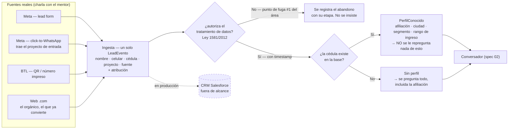

# Diagrama 01 — Ingesta y enriquecimiento

**Responde a:** ¿cómo entra un lead y qué sabemos de esa persona antes de escribirle la primera palabra?

Contrato completo en [`01-ingesta-enriquecimiento.md`](../01-ingesta-enriquecimiento.md) · imagen en [`01-ingesta-enriquecimiento.png`](01-ingesta-enriquecimiento.png)

## Cómo se lee

**Los cuatro canales de la izquierda son los reales**, no una lista genérica: los describió el mentor. Hay dos sabores de Meta que se comportan distinto —el **lead form**, que es un formulario dentro de la plataforma, y el **click-to-WhatsApp**, donde el anuncio abre directamente una conversación—, está el **BTL** (un QR o un número impreso en material físico) y está la **web .com**.

Ese último merece atención: es el **orgánico**, y convierte mucho mejor que todos los demás porque nadie pauta hacia allá — la persona llegó navegando por su cuenta y llega mucho más perfilada. Hacer que los pagos se parezcan a ese es literalmente el reto.

**El click-to-WhatsApp trae un dato que los otros no:** el proyecto por el que entró. Si vio el anuncio de Araucaria, la conversación puede arrancar hablando de Araucaria, que es lo que Colsubsidio ya hace hoy.

**Todo se normaliza a un solo evento.** Sin importar el canal, se produce el mismo paquete de datos: nombre, celular, cédula, proyecto de interés, fuente y atribución. Eso es lo que permite prometer multi-canal sin construir cuatro canales — y es exactamente lo que pidió el mentor cuando habló de un centralizador.

**Después viene la autorización, y no se puede mover de ahí.** Es obligación legal (Ley 1581 de 2012) y también es el punto donde más gente se les cae hoy. Por eso el área está cambiando la redacción: en vez de preguntar "¿autorizas?", pedir "compártenos la autorización". Si la persona no autoriza, no se insiste: se registra que se cayó ahí y ya. Ese registro es el que después alimenta la métrica de fuga que hoy no tienen.

**Con la autorización dada, la cédula decide todo lo demás.** Es la llave que responde si la persona es afiliada. Si está en la base, ya sabemos afiliación, ciudad, segmento y rango de ingreso — y el mentor confirmó que en la operación real, **al afiliado no le piden nada más porque ya tienen su data**. Si no está, se pregunta todo desde cero, incluida la afiliación.

Esa bifurcación es la que hace visible el criterio de aceptación 1: un lead conocido vive una conversación notoriamente más corta que uno desconocido, y el sistema lo dice en voz alta.

## Las decisiones del diagrama

| Rombo | Sí | No |
|---|---|---|
| **¿Autoriza el tratamiento de datos?** | Sigue, con la hora registrada como evidencia | Fin del flujo. Se registra el abandono y su etapa. **No se le puede escribir después** |
| **¿La cédula existe en la base?** | Perfil conocido: afiliación, ciudad, segmento, ingreso. Nada de eso se repregunta | Sin perfil: se pregunta todo |

## Qué no está conectado todavía

- El enriquecimiento **solo resuelve 3 cédulas de prueba**. Las 303 identidades sintéticas ya versionadas no las usa el chat, así que un jurado que entre por "soy yo" nunca ve el momento de "ya te conocemos".
- **La atribución de canal no existe como campo.** Es una de las métricas que el mentor pidió.
- Los valores de `fuente` que acepta el código hoy son `meta / google / web`, que **no coinciden** con los cuatro canales que él describió.
