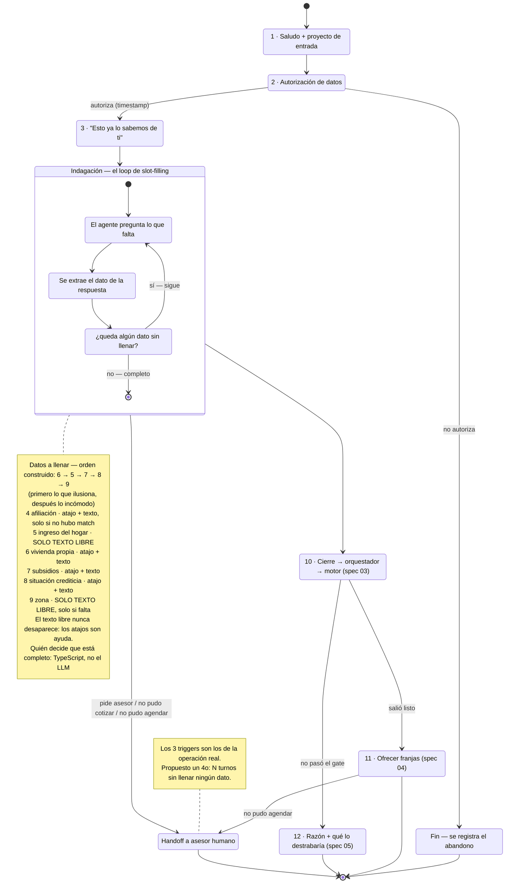

# Diagrama 02 — El conversador

**Responde a:** ¿qué pasos tiene la conversación de WhatsApp, qué se pregunta abierto y qué con botones, y cuándo entra un humano?

Contrato completo en [`02-conversador.md`](../02-conversador.md) · imagen en [`02-conversador.png`](02-conversador.png)

> Este es el diagrama que el equipo va a discutir más. Los nodos son una **propuesta** para reaccionar, no una definición.

## Cómo se lee

**Es una máquina de estados, no una lista de preguntas.** Esa distinción importa: el sistema no recorre un guion fijo, sino que va llenando casillas hasta que no falta ninguna.

**Arranca saludando y, si sabe por qué proyecto entró, habla de ese proyecto** — igual que hace hoy el click-to-WhatsApp de Colsubsidio. El agente tiene nombre (Sara), porque un interlocutor sin nombre no es una conversación. Después pide la autorización de datos. Si la persona dice que no, la conversación termina ahí y queda registrado dónde se cayó.

**El tercer paso es el que gana el criterio de aceptación 1:** antes de preguntar nada, el agente le hace saber que no le va a hacer repetir lo que ya dio — *"lo que ya nos habías dado está acá conmigo, así que no te voy a hacer repetir nada; empiezo por buscarte opciones en Bogotá"*. Es el momento en que el jurado entiende que esto no es un formulario.

**Ojo con la redacción de ese paso, porque es contraintuitiva:** el agente **no le recita al lead su propia ficha**. La primera versión enumeraba afiliación, ciudad e ingreso, y leerle a alguien sus propios datos —sobre todo cuánto gana— suena a expediente y asusta justo donde hay que generar confianza. Lo que el criterio exige es que el lead **sepa** que no le repreguntarán; por eso la ciudad se **usa** en vez de recitarse, y el ingreso no se menciona nunca. Quien ve la ficha completa es el asesor, que es para quien es ([detalle](../02-conversador.md#d3--los-nodos-del-workflow--propuesta--el-straw-proposal-nodo-por-nodo)).

**Después entra al ciclo de indagación**, que es el corazón del diagrama y funciona en tres tiempos que se repiten: el agente pregunta lo que falta, se extrae el dato de lo que respondió la persona, y se revisa si queda algo sin llenar. Si falta algo, vuelve a empezar. Si no, sale.

Lo importante de ese ciclo: **quién decide que la conversación terminó es código, no el modelo**. El agente puede ser libre en cómo conversa; la decisión de "ya tenemos todo" es determinista. Es lo que evita que la conversación se vaya para cualquier lado.

**La nota de la derecha lista los seis datos que hay que llenar**, en el orden en que hoy se preguntan: **primero lo que ilusiona** (¿es tu primera vivienda?) y **después lo incómodo** (el ingreso, el crédito). Comprar vivienda es algo que se hace una vez en la vida; abrir preguntando cuánto ganas es la forma más rápida de que alguien se vaya.

**El texto libre nunca desaparece.** Salvo la autorización —que es un acto jurídico y va solo por botón—, todos los pasos aceptan que la persona escriba, y los atajos quedan al lado como ayuda visible. Escribir *"ya tengo apartamento"* vale exactamente lo mismo que tocar el atajo. Eso es lo que el mentor pidió cuando explicó que una lista sesga: *"si tú dices que ganas 500.000, el listado no tiene esa opción"*, y *"si dice que gana más de 10, ¿cuánto es más de 10?"*. Por eso el ingreso y la zona no tienen atajos: ahí la lista solo estorba.

**Y cada respuesta recibe un acuse antes de la siguiente pregunta** — una reacción a lo que la persona acaba de contar, no un salto seco al siguiente campo. Los acuses no pasan por el modelo, así que son instantáneos: humanizan sin costar latencia.

**Al cerrar, la conversación se bifurca según lo que diga el motor:** si pasó, se le ofrecen franjas para agendar; si no, se le explica la razón y qué lo destrabaría.

**Y en paralelo a todo eso existe la salida hacia un humano.** Los tres motivos son los que ya usa Colsubsidio hoy: la persona no pudo agendar, no pudo cotizar, o pidió hablar con un asesor. Está propuesto un cuarto —que pasen varios turnos sin que se llene ningún dato— para atrapar al lead que se está enredando, que es justo lo que el mentor no quiere.

## Las transiciones

| Desde | Hacia | Cuándo |
|---|---|---|
| Autorización | Fin | No autoriza |
| Autorización | "Esto ya lo sabemos" | Autoriza, y queda la hora registrada |
| Indagación → Indagación | (se repite) | Todavía falta algún dato |
| Indagación | Cierre | No falta ninguno |
| Cierre | Agenda | Pasó el corte |
| Cierre | Nutrición | No pasó |
| **Cualquier punto** | **Humano** | Pide asesor · no pudo cotizar · no pudo agendar |

## La red que no aparece dibujada

En cualquier momento, si el modelo no responde en 3 segundos, se sirve un texto escrito de antemano y la conversación sigue. Se puso porque el arranque en frío de Vertex tarda ~7s y colgaba el chat. No está en el diagrama porque no es un estado: es una red debajo de todos ellos.

## Qué no está conectado todavía

- **El cierre no llama a nadie**: termina en un `console.log`. Los pasos 10, 11 y 12 del diagrama todavía no ocurren.
- **La pregunta de afiliación (paso 4) no existe** en el código, aunque el contrato de datos la contempla. Mientras tanto el motor asume que quien no está en la base no es afiliado.
- **El monto del subsidio nunca se pregunta**, así que el subsidio jamás baja la cuota. Es la única de las tres brechas de datos que sigue abierta.
- Hoy quien conduce la conversación es el código y el modelo solo mejora la redacción. Que el modelo conduzca es la propuesta que el equipo tiene que aprobar o tumbar.

**Cerrado el 2026-07-24** (rama `feat/conversacion-humana`): el ingreso ya se obtiene como número —se parsea el texto libre, y a quien ya trajo un rango se le toma el punto medio sin repreguntarle— y la situación crediticia sale como la categoría que el motor espera. Antes de eso, cualquier lead nuevo caía a nutrición gane lo que gane. **Dos cosas quedaron pendientes de ratificar por el equipo:** el orden nuevo de las preguntas y si el punto medio del rango es un ingreso aceptable.
