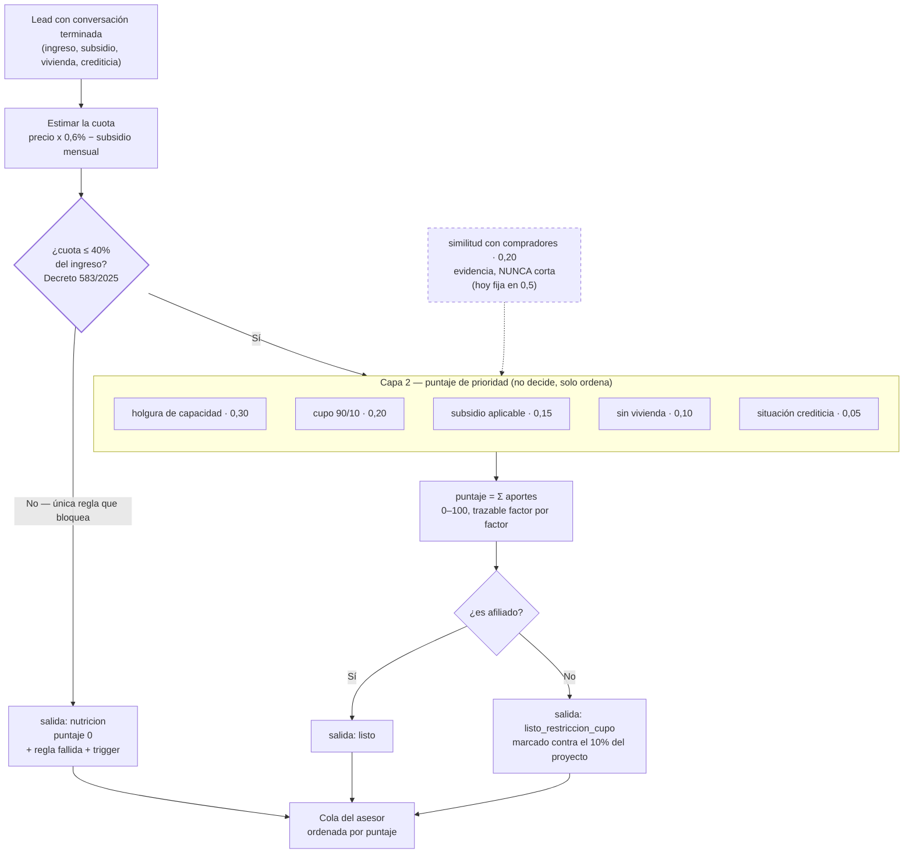

# Diagrama 03 — El motor de scoring

**Responde a:** ¿cómo se decide si alguien puede comprar, y por qué un lead queda antes que otro en la cola?

Contrato completo en [`03-scoring.md`](../03-scoring.md) · imagen en [`03-scoring.png`](03-scoring.png)



## Cómo se lee

**El motor tiene dos capas, y solo la primera rechaza.** Esa es la idea que hay que entender antes que cualquier otra.

**Primero se estima la cuota.** Se toma el precio del proyecto, se calcula qué cuota mensual saldría, y se le resta lo que cubra un subsidio si aplica. Eso da la cuota real que la persona tendría que pagar.

**Después viene el único rombo que puede decir que no:** ¿esa cuota cabe en el 40% de lo que gana el hogar? Y aquí está el punto que hay que saber decir bien: **ese 40% no lo escogimos nosotros**. El Decreto 583 de 2025 lo fijó como techo legal. Si la cuota lo supera, no es que nos parezca arriesgado — es que **el banco legalmente no puede prestarle**. Por eso ese número se cita textualmente cuando se le explica al lead y al asesor.

Quien no pasa ese filtro cae a nutrición con puntaje cero, la regla exacta que falló y qué lo destrabaría.

**Quien pasa entra a la segunda capa, que no decide nada: solo ordena.** Es un puntaje de 0 a 100 armado con factores que tienen peso. El de más peso es cuánto margen le sobra: no es lo mismo alguien cuya cuota es el 39% de su ingreso que alguien en el 22%. Los dos pasan, pero el segundo es mejor lead. Después pesa si hay cupo disponible, cuánto le cubre el subsidio, si no tiene vivienda (propósito social: se prioriza a quien no tiene) y, de últimas y con muy poco peso, su situación crediticia — porque es autorreportada y nadie la verificó.

**La similitud con compradores reales entra punteada por dos razones.** La primera es de diseño: es evidencia de respaldo y **nunca puede cortar**. Que alguien no se parezca a los que ya compraron ahí no es motivo para dejarlo fuera. La segunda es honestidad: hoy está fija en un valor neutro porque todavía no existen las distribuciones por proyecto.

**Al final, un último rombo decide en cuál de las dos salidas de "listo" cae:** si es afiliado va derecho; si no, va marcado contra el 10% que permite la regla 90/10. No es un castigo ni un rechazo, es una marca de inventario.

**Las tres salidas van a la misma cola.** Nadie desaparece.

## Las decisiones del diagrama

| Rombo | Sí | No |
|---|---|---|
| **¿Cuota ≤ 40% del ingreso?** | Se calcula el puntaje | **Nutrición**, con la regla y el trigger. Es lo único que bloquea |
| **¿Es afiliado?** | `listo` | `listo_restriccion_cupo` — mismo tratamiento, marcado contra el cupo |

## Un ejemplo completo, para explicarlo en voz alta

Alguien que gana $4.000.000 mirando un proyecto de $149.000.000, sin subsidio:

```
cuota estimada   = 149.000.000 × 0,6%   = $894.000
cuota / ingreso  = 894.000 / 4.000.000  = 22,4%    ≤ 40% → pasa
holgura          = (40% − 22,4%) / (40% − 20%) = 0,88
aporte al puntaje = 0,30 × 0,88 × 100   = 26,4 puntos
```

Toda la aritmética se muestra en la ficha del asesor. Ese es el sentido de "cero caja negra": no hay un número que salga de un modelo y nadie pueda reconstruir.

## Dos cosas raras que conviene saber antes de que alguien pregunte

- **Nadie puede sacar 100.** Como la similitud está fija en un valor neutro, aporta la mitad de sus puntos siempre. El techo real hoy es 90.
- **Un no afiliado tiene techo 80.** El factor de cupo le da como máximo la mitad de sus puntos. Dos personas idénticas en todo lo demás quedan separadas por 10 puntos según su afiliación. No es un error: es la regla 90/10 expresándose en la prioridad. Pero es una decisión que nadie ha ratificado.

## Qué no está resuelto

- **Hay dos escalas de puntaje conviviendo**, con pesos distintos, y la que ve el asesor en pantalla **no es la que calcula este motor**.
- El 0,6% que estima la cuota es una heurística razonable, no una fórmula bancaria certificada.
- Los pesos siguen marcados como propuestos desde el primer día.
