# Diagrama 04 — Match de proyectos y agenda

**Responde a:** de 18 proyectos, ¿cómo se eligen los 2 o 3 que se le muestran, y cómo termina eso en una cita?

Contrato completo en [`04-match-agenda.md`](../04-match-agenda.md) · imagen en [`04-match-agenda.png`](04-match-agenda.png)

```mermaid
flowchart LR
    IN["Lead calificado<br/>+ precio máximo"] --> NUT{"¿cayó en<br/>nutrición?"}

    NUT -->|"Sí"| CERO["Cero proyectos<br/>no se ofrece lo que no puede pagar"]
    CERO --> SPEC05["→ spec 05 · nutrición"]

    NUT -->|"No"| PRECIO["Filtro 1 — precio<br/>descarta precio_desde > máximo"]
    PRECIO --> CUPO{"¿es afiliado?"}

    CUPO -->|"Sí"| ZONA
    CUPO -->|"No"| CUPO2["Marca de cupo 90/10<br/>NO descarta: baja en el orden<br/>y avisa que hay que validar cupo"]
    CUPO2 --> VACIO{"¿quedó<br/>alguno?"}

    VACIO -->|"No — hoy, los 18"| SINCUPO["Cero proyectos<br/>el bloqueo es de CUPO, no del lead<br/>se le dice, no se esconde"]
    SINCUPO --> SPEC05

    VACIO -->|"Sí"| ZONA

    ZONA["Filtro 3 — zona<br/>si hay 2+ en su zona, solo esos"] --> RANK

    RANK["Ranking<br/>1 proyecto que preguntó · 2 zona<br/>3 más cupo libre · 4 precio ascendente"] --> TOP

    TOP["Top 3 + traza de por qué entró cada uno"] --> EXP

    EXP["El experto redacta el porqué<br/>solo con datos de la traza — prohibido inventar"] --> ELIGE

    ELIGE["El lead elige un proyecto"] --> FRANJAS

    FRANJAS["Se ofrecen 3 franjas<br/>de la sala de ventas de ese proyecto"] --> AGENDO{"¿agendó?"}

    AGENDO -->|"Sí"| CITA["Cita registrada"]
    AGENDO -->|"No"| HUMANO["Handoff a asesor humano<br/>trigger real de la operación"]

    CITA --> COLA["Cola del asesor · spec 06"]
    HUMANO --> COLA
```

## Cómo se lee

**Se lee de izquierda a derecha como un embudo: entran 18 proyectos y salen 3.** Cada paso descarta, y ninguno descarta en silencio.

**Lo primero es una pregunta de decencia:** si el lead no pasó el corte financiero, no se le muestra nada. Ofrecerle proyectos a alguien que acabamos de determinar que no puede pagarlos sería cruel e inútil.

**El primer filtro real es el precio.** Se descarta todo lo que esté por encima de lo que su ingreso soporta bajo el tope del 40%. El tope lo calculó el motor; el matcher no lo recalcula, para que no haya dos versiones de la misma regla.

**La segunda regla solo aplica a los no afiliados: el cupo 90/10, y NO descarta — marca.** Aquí está el momento incómodo y más valioso de todo el reto. La regla permite que máximo el 10% de las ventas sea a no afiliados, y **los 18 proyectos ya tienen ese cupo copado**. Hasta el 2026-07-24 eso dejaba a un no afiliado que pasa el corte financiero con **cero proyectos**; ahora los recibe, ordenados con los copados de último y **cada uno con la advertencia encima**: hay que validar cupo antes de separar.

Eso no es un bug, es el hallazgo del reto apareciendo en la operación: el 27,1% de los compradores históricos no son afiliados, casi el triple de lo que la regla permite. Por eso mismo se cambió — a Colsubsidio **le interesa cerrar la venta**, y castigar al lead con las manos vacías contradice cómo opera de verdad. El hallazgo no se pierde: **se dice en cada recomendación y se mide en el tablero**, en vez de manifestarse como un lead vacío.

**El tercer filtro es la zona**, y está escrito con cuidado: solo se restringe a su zona **si hay al menos dos proyectos ahí**. Si solo hay uno, se le muestran también de otras zonas, porque es mejor darle opciones que encerrarlo.

**Después se ordenan los que quedaron**, con esta prioridad: primero el proyecto por el que preguntó, después los de su zona, después los que tienen más cupo libre, y de últimas el más barato. Se toman los tres primeros.

**Cada proyecto sale con una traza** de por qué entró — cuánto cuesta contra su tope, si es el que preguntó, si coincide la zona, cuántos cupos quedan. Esa traza es lo que el experto convierte en prosa. El modelo **solo redacta sobre esos datos**; tiene prohibido inventar precios, subsidios o características.

**El lead elige uno y se le ofrecen tres franjas** de la sala de ventas de ese proyecto. Si logra agendar, queda la cita. Si no, entra un asesor humano — que es exactamente uno de los tres motivos de escalamiento que ya usa Colsubsidio.

## Las decisiones del diagrama

| Rombo | Sí | No |
|---|---|---|
| **¿Cayó en nutrición?** | Cero proyectos | Sigue al filtro de precio |
| **¿Es afiliado?** | No se le menciona el cupo | Cada proyecto le dice cómo va el cupo 90/10 |
| **¿El proyecto tiene cupo libre?** | Va normal en el ranking | Baja de posición y sale con la advertencia de validar cupo |
| **¿Agendó?** | Cita registrada | Handoff a humano |

## Por qué la cita y no la venta

El mentor explicó que el funnel tiene dos cierres: la **separación** (apartar el inmueble, a veces por menos de $1M) y la **escrituración** (hasta 3 años, otra área). El objetivo real es llegar a la separación.

Nuestro sistema llega hasta el paso inmediatamente anterior: **dejar al lead en la puerta de la sala de ventas con la capacidad ya validada**. De ahí a la separación, el trabajo es del asesor. Decirlo así es más creíble que insinuar que cerramos ventas.

## Qué no está conectado todavía

- **El chat nunca ofrece franjas**, aunque la API de citas funciona.
- **Los identificadores de las franjas no coinciden con los del catálogo real.** Si hoy se pidieran horarios para un proyecto real, la lista llegaría vacía sin que nada falle visiblemente.
- Las salas de venta configuradas incluyen **Medellín**, y el catálogo real de 18 proyectos no tiene Medellín.
- El experto todavía **no usa los brochures**, así que el porqué habla de precio y ubicación pero no de alcobas, metros ni zonas sociales.
