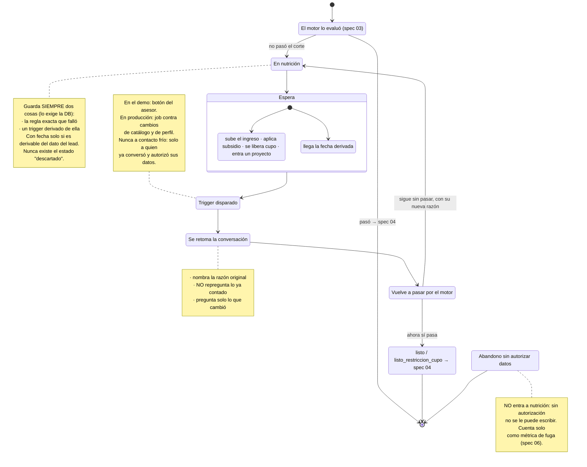

# Diagrama 05 — Nutrición y re-enganche

**Responde a:** ¿qué le pasa a quien todavía no puede comprar, y cómo vuelve?

Contrato completo en [`05-nutricion-reenganche.md`](../05-nutricion-reenganche.md) · imagen en [`05-nutricion-reenganche.png`](05-nutricion-reenganche.png)

## Cómo se lee

**Este diagrama es la respuesta a "¿y qué hacen con los que no califican?".** La respuesta corta es: no los botamos, y podemos decir exactamente qué los traería de vuelta.

**Cuando alguien no pasa el corte, entra a nutrición cargando dos cosas obligatorias:** la regla exacta que no pasó y un trigger derivado de esa misma regla. No es opcional — la base de datos rechaza el registro si falta alguna de las dos. Es la forma de garantizar que ningún lead quede guardado como "no sirve" sin explicación.

**El trigger puede ser de dos tipos, y la diferencia importa.** Si la razón por la que no pasó es **temporal y la fecha se puede derivar de un dato que la persona ya dio** —por ejemplo, le faltan meses de afiliación y la fecha exacta se calcula— entonces el trigger lleva fecha. En todos los demás casos lleva una condición, no una fecha: que suba su ingreso, que aplique un subsidio, que se libere cupo, que entre un proyecto que le sirva.

La regla detrás de eso es dura: **no se inventan fechas para que se vea bonito.** Prometerle a alguien "te escribimos en marzo" cuando no hay forma de saberlo es exactamente el tipo de cosa que este proyecto no hace.

**Cuando la condición se cumple, se dispara el re-enganche.** En el demo lo dispara un botón del asesor —que dice que simula, no engaña—; en producción sería un proceso que revisa los cambios de catálogo y de perfil.

**Y aquí hay una regla que viene de la operación real: nunca se contacta en frío.** Colsubsidio no compra bases de datos. Solo le escriben a afiliados o a quien ya tuvo contacto. Nuestro re-enganche cumple eso por construcción, porque la persona ya conversó con nosotros y ya autorizó sus datos.

**Al retomar, la conversación no empieza de cero.** Nombra la razón original —*"cuando hablamos, la cuota superaba el tope legal; se abrió un proyecto que sí te cabe"*— y pregunta solo lo que cambió. La regla de no repreguntar lo ya conocido vale igual aquí que en la primera conversación.

**Después vuelve a pasar por el motor**, y puede pasar cualquiera de dos cosas: ahora sí califica, o sigue sin calificar y vuelve a nutrición con una razón nueva. Las dos son resultados válidos. El ciclo puede repetirse.

**El estado suelto de abajo a la derecha no está desconectado por error.** Es quien abandonó antes de autorizar sus datos, y está aparte a propósito: **a esa persona no se le puede escribir**. Cuenta como métrica de fuga y nada más. Confundir eso con nutrición sería un problema legal, no de producto.

## Las transiciones

| Desde | Hacia | Cuándo |
|---|---|---|
| Calificado | Nutrición | No pasó el corte |
| Nutrición | Espera | Siempre, con su razón y su trigger |
| Espera | Disparo | Se cumple la condición, o llega la fecha |
| Disparo | Retoma | Se le escribe (solo si ya había autorizado) |
| Recalifica | Listo | Ahora sí pasa |
| Recalifica | Nutrición | Sigue sin pasar, con razón nueva |

## Qué no está conectado todavía

- **Solo existe una razón de nutrición**, la de la cuota sobre el 40%. Las otras (sin cupo, sin proyecto en su zona, abandono a mitad de camino) no se registran.
- **La rama con fecha no está implementada**: hoy todos los triggers son condicionales.
- 🔴 **El re-enganche no se puede demostrar.** El botón marca el lead y redirige al chat con el identificador en la URL, pero nadie lee ese parámetro, así que el clic aterriza en la pantalla de inicio como si fuera alguien nuevo. La flecha de "retoma sin repreguntar" existe en el contrato y no en la pantalla.
- Los dos puntos de fuga que el mentor mide —la autorización y la selección de proyecto— **no se registran** como razones.
