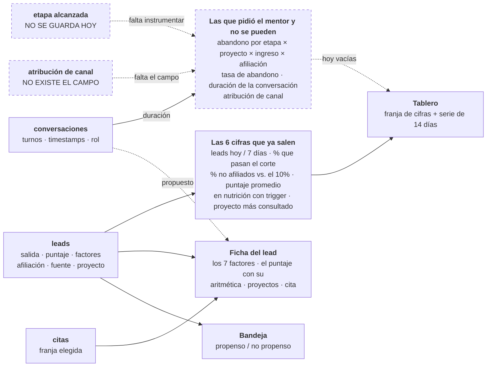

# Diagrama 06 — El dashboard del asesor

**Responde a:** ¿de dónde sale cada número que ve el asesor, y cuáles de las métricas que pidió el mentor podemos dar hoy?

Contrato completo en [`06-dashboard-asesor.md`](../06-dashboard-asesor.md) · imagen en [`06-dashboard-asesor.png`](06-dashboard-asesor.png)

## Cómo se lee

**Este diagrama no muestra un flujo: muestra de dónde sale cada número.** Se lee en tres columnas — a la izquierda lo que se guarda, en el medio las cifras que salen de eso, y a la derecha las tres pantallas que ve el asesor.

**A la izquierda están las fuentes de datos.** Tres existen: los leads (con su salida, su puntaje, sus factores, su afiliación, su canal y su proyecto), las conversaciones (turnos y horas) y las citas. **Dos están punteadas porque no existen:** la etapa que alcanzó cada lead antes de irse, y el canal por el que entró.

**En el medio, las cifras están partidas en dos bloques a propósito**, y esa partición es el mensaje del diagrama.

El bloque de arriba —el punteado— son **las métricas que el mentor pidió expresamente y que hoy no podemos dar**: en qué paso se le cae la gente (cruzado por proyecto, rango de ingreso y afiliación), la tasa de abandono, cuánto dura una conversación en promedio, y por qué canal entró cada quien. Que estén punteadas no es un olvido: **es la consecuencia directa de que las dos fuentes de la izquierda no existan.**

Y de esas, **la más importante es el abandono por etapa**, que es la que él enunció con más frustración: hoy conoce las etapas pero no puede decir *"las personas que seleccionaron tal proyecto con tal rango de ingresos se me están quedando acá"*. Habilitarla no es agregar una cifra: implica **guardar el lead desde que autoriza, no desde que termina**. Es un cambio de contrato.

El bloque de abajo son **las seis cifras que ya salen** con lo que hoy se guarda: cuántos leads entraron hoy y en la semana, qué porcentaje pasa el corte, qué porcentaje son no afiliados (contra el 10% que permite la regla), el puntaje promedio, cuántos están en nutrición con su trigger, y cuál proyecto se consulta más.

De esas seis, **la de los no afiliados contra el 10% es la más valiosa**: es la munición del reto convertida en operación cotidiana.

**A la derecha, las tres pantallas.** La bandeja responde "a quién llamo ahora". La ficha responde "por qué este lead está aquí" y es la que enseña los siete factores con la aritmética completa del puntaje. El tablero responde "cómo va la operación".

**La flecha punteada de las conversaciones hacia la ficha es una propuesta:** mostrarle al asesor la conversación completa. Hoy no se muestra, y es lo único que nos falta para tener paridad con lo que él ya ve en su plataforma actual.

## Qué significa cada línea punteada

| Punteado | Por qué |
|---|---|
| **etapa alcanzada** | Solo guardamos leads que terminan la conversación. Los que se van no dejan rastro |
| **atribución de canal** | El campo no existe. El mentor además tiene el problema de que hoy la pierde si el usuario borra el mensaje pre-cargado |
| **el bloque de métricas** | Consecuencia de los dos anteriores |
| **conversación → ficha** | Propuesta, no construido |

## Una advertencia honesta sobre lo que se ve hoy

El tablero **no vive de conversaciones reales todavía**, porque la cadena no está conectada. Lo que se ve son los 3 personajes sembrados más 57 leads sintéticos generados con semilla fija, que sí pasaron por el motor y el matcher de verdad. Existen porque una serie de "leads por día" con 3 leads del mismo día no es una serie.

**Van marcados como sintéticos y la pantalla lo avisa.** Eso se queda así: es preferible que el jurado vea un aviso honesto a que crea que hay tráfico real.

## Dos reglas que gobiernan estas pantallas

- **El puntaje ordena, nunca decide.** Quién decide el grupo es la salida del motor; el puntaje solo ordena dentro de un grupo. Desde el 2026-07-24 los dos grupos de "puede comprar" (afiliado y no afiliado) son **uno solo**: dentro manda el puntaje, no la afiliación. Antes un no afiliado con 71 puntos salía debajo de un afiliado con 42.
- **Ningún puntaje aparece sin su aritmética al lado.** Un número grande con una barra de progreso sería exactamente la caja negra que el proyecto prohíbe.
